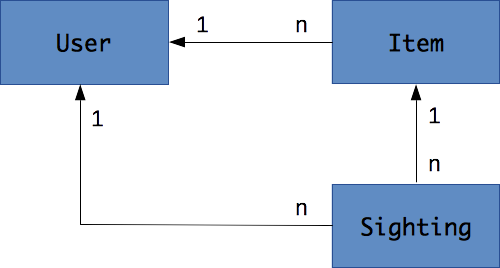
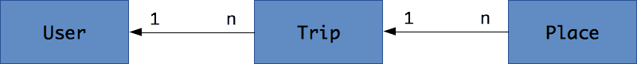
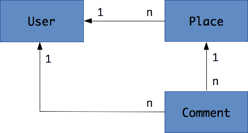

# Projects

These are a few suggestions of projects to develop for the course.

* [Crowdfind](#crowfind)
* [Travel log](#travel-log)
* [Trip advisor](#trip-advisor)
* [Other](#other)

## Crowdfind

Ask the community to find where you can buy something.

* **User**
  * Username and/or email
  * Password
  * Registration date
* **Item**
  * Description
  * Optional picture
  * Creation date
  * Last modification date
* **Sighting**
  * Description
  * Geolocation
  * Picture
  * Optional price
  * Creation date
  * Last modification date

Example of aggregated data:

* The lowest/average/maximum price found for an item.
* The number of sightings for an item.
* The number of items created by a user.

Sensitive data:

* A user should not be able to update another user's item or sighting.

## Travel log

Take pictures of places along your trip.

* **User**
  * Username and/or email
  * Password
  * Registration date
* **Trip**
  * Description
  * Creation date
  * Last modification date
* **Place**
  * Description
  * Geolocation
  * Picture
  * Creation date
  * Last modification date

Examples of aggregated data:

* The number of trips made by a user.
* The number of places in a trip.

Sensitive data:

* A user should not be able to create places linked to another user's trip.
* A user should not be able to update another user's trips or places.

## Trip advisor

Find and rate places to eat, sleep or visit.

* **User**
  * Username and/or email
  * Password
  * Registration date
* **Place**
  * Description
  * Geolocation
  * Picture
  * Creation date
  * Last modification date
* **Comment**
  * Rating
  * Description
  * Optional picture
  * Creation date
  * Last modification date

Examples of aggregated data:

* The lowest/average/maximum rating of a place.
* The number of comments for a place.
* The number of comments made by a user.

Sensitive data:

* A user should not be able to update another user's comments

## Other

Other ideas can be accepted as long as they meet the [evaluation criteria](README.md#evaluation).
You may find inspiration there:

* [Idea Machine](http://www.ideamachine.io/#view-ideas-top)
* [Ideas Watch](https://www.ideaswatch.com/startup-ideas/app)
