# REST exercise

The goal of this exercise is to use a real-world REST API to better understand
how you communicate with REST APIs in general. Here you will use the GitHub REST
API to create repository issues.

<!-- START doctoc -->
<!-- END doctoc -->

## Create a GitHub repository

Start by creating a new repository on GitHub. Or use an existing one if you
prefer.

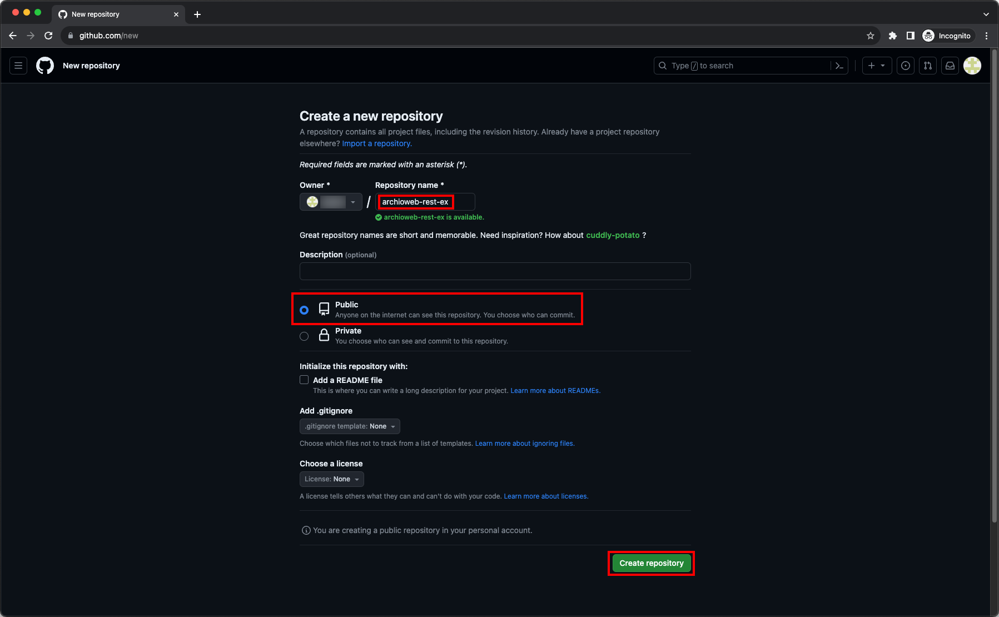

### Enable repository issues

Whether you created a new repository or chose a new one, go to the repository's
settings and make sure Issues are enabled.

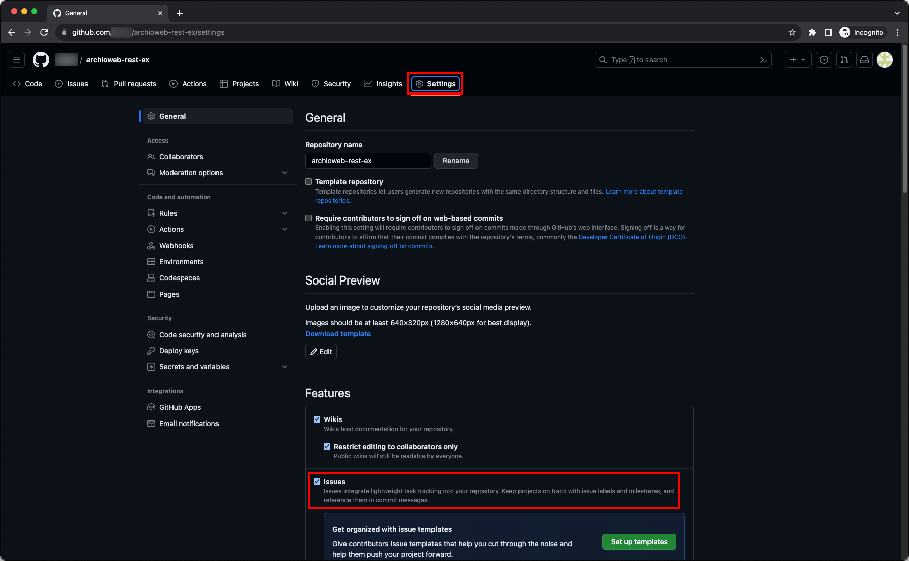

## Create an issue by hand

Issues are problems that can be reported by other GitHub users about a
repository. The owner of the repository can then track progress about these
issues and close them once the problem has been solved.

Issues are one of the resources that can be retrieved or modified by the GitHub
REST API.

Let's create an issue by hand so you can see what this is about.

### Go to the repository issues

First, go to the repository's Issues tab:

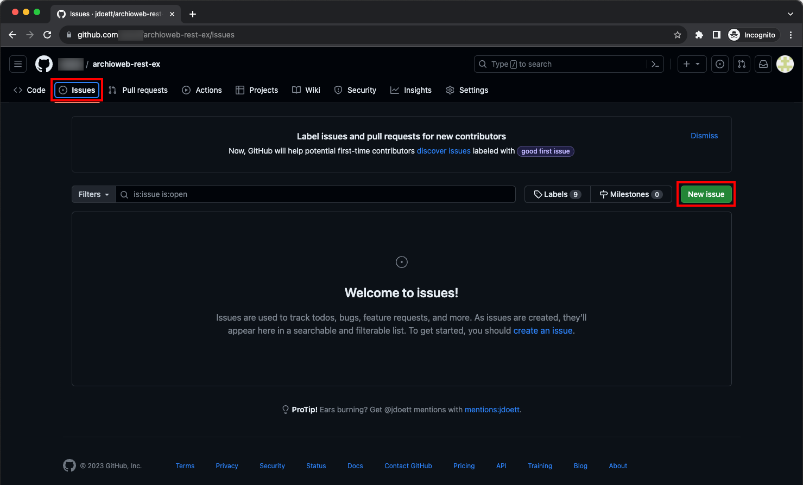

### Create an issue

Create a new issue. Imagine that you are reporting a problem on that project:

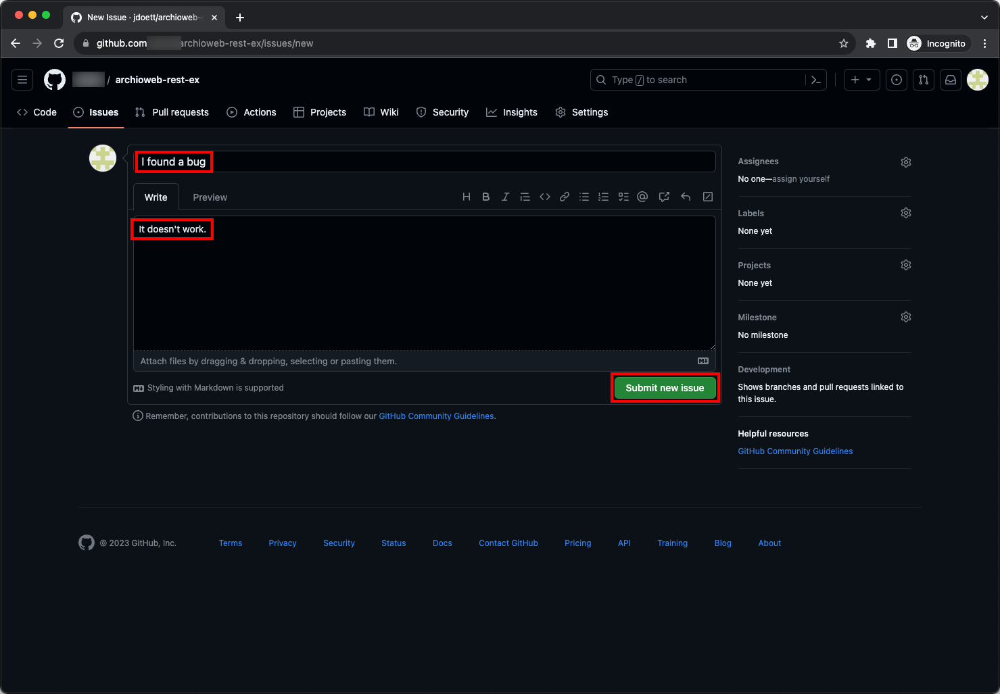

### Show the issue

Once you have created the issue, you can do various things with it:

* See its details.
* Add more comments.
* Close the issue (since in this case you are the owner of the repository).

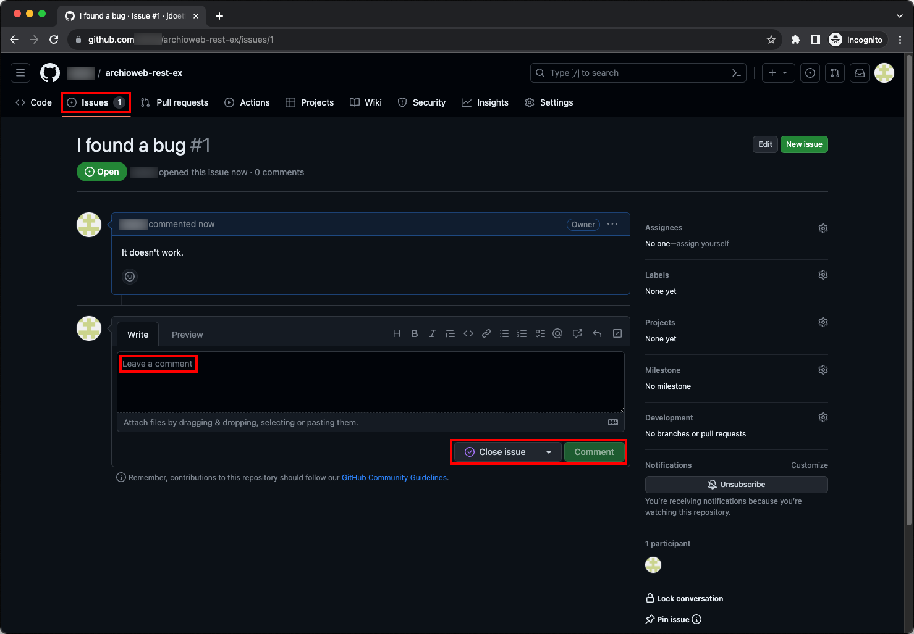

### List all issues

You can also go to the list of issues to see all reported issues. The issue you
created will either be in the Open or the Closed tab depending on whether you
closed it during the previous step.

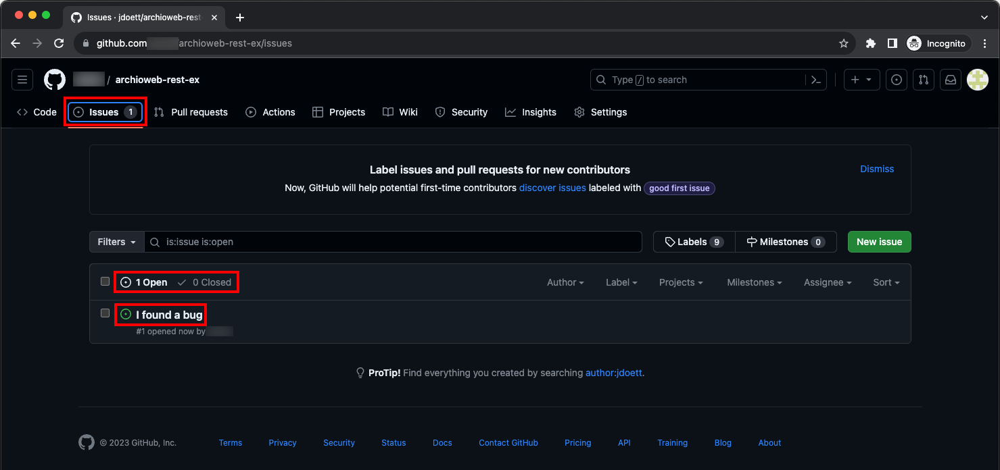

## Do the same thing with the GitHub REST API

Now that you have seen how the GitHub website allows you to manage issues, the
goal of this exercise is to do the same thing with the GitHub REST API:

* Create an issue.
* Retrieve the details of that issue.
* Close the issue.
* List all issues of the repository.

Read the [GitHub REST API documentation](https://docs.github.com/en/rest) and
perform these actions with your new favorite tool: Postman.

### Authenticating

In order to [authenticate to the GitHub REST
API](https://docs.github.com/en/rest/guides/getting-started-with-the-rest-api?apiVersion=2022-11-28#authenticating),
you will need an access token.

To generate one, go to your account's settings:

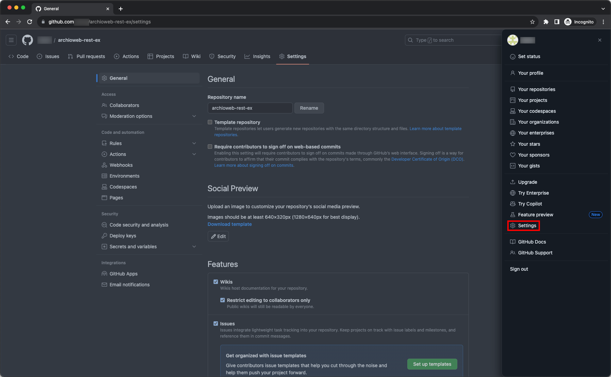

Then go to the Developer settings:

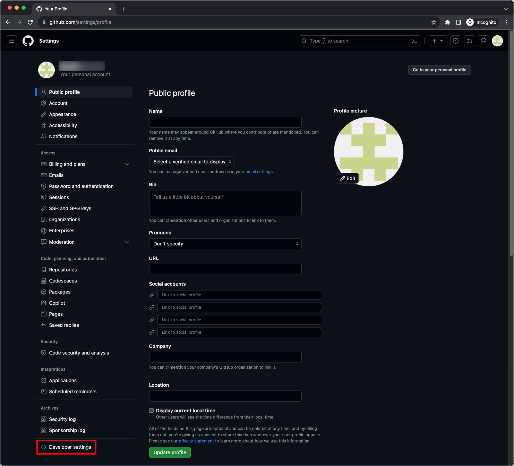

Go to the page for fine-grained personal access tokens:

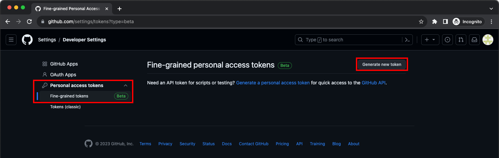

### Create a personal access token

Request the generation of a new token. You can set it to expire soon since you
won't be using it any more after this exercise.

You can limit Repository access to just the repository you created, or allow
access to all repositories as you choose.

Don't create the token right away: you also need to set the appropriate
permissions:

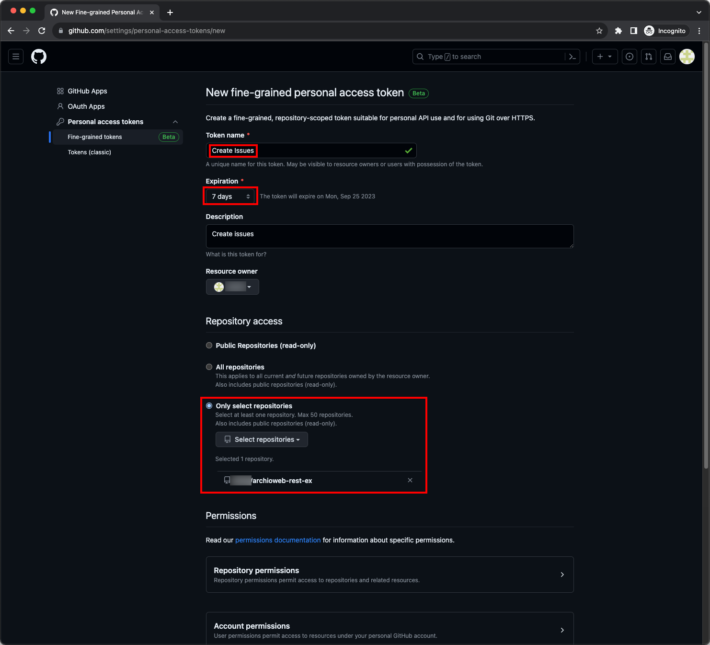

In the Permissions section, make sure to specify that this token should have
Read & Write access to Issues:

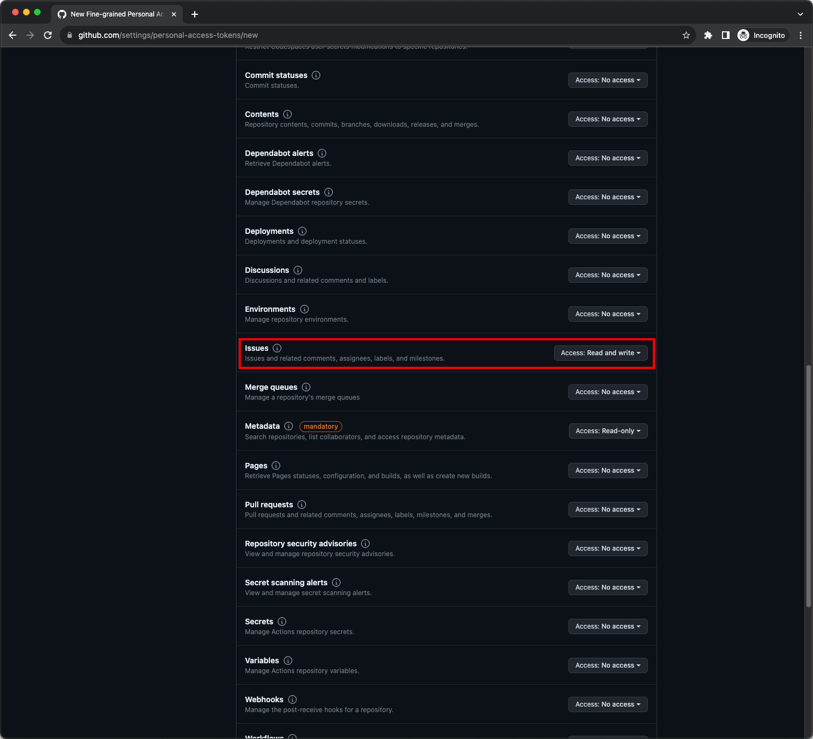

Verify that your token has the correct permissions and create it:

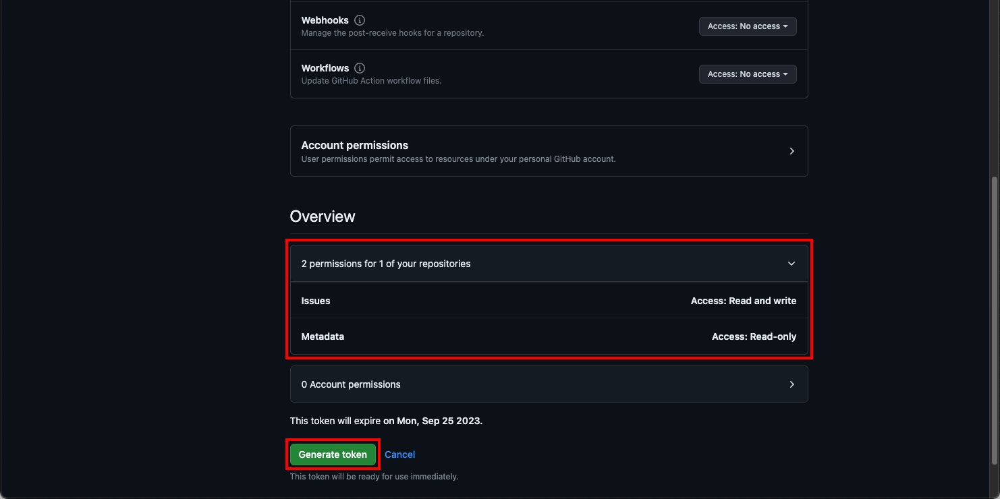

Make sure to **copy the access token** as soon as you've generated it. The token
is not saved by GitHub, so once you close the page, you won't be able to get it
back.

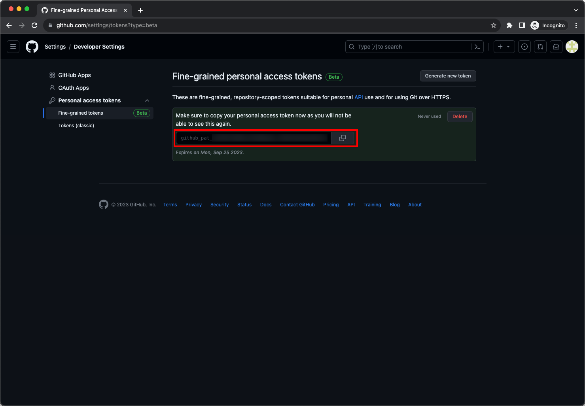

### Use the API

Now play with your new repository's issues with the GitHub REST API:

* Create an issue.
* Retrieve the details of that issue.
* Close the issue.
* List all issues of the repository.

The [GitHub REST API documentation](https://docs.github.com/en/rest)
explains how to use the token and how to make each request.

For example, that's the cURL example for the request to create a repository:

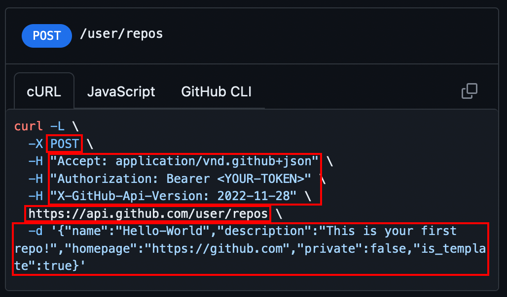

> The [`curl` (**C**lient **URL**) command](https://curl.se/docs/manpage.html)
> is a command line tool that can be used, among other things, to make HTTP
> requests.

It indicates:

* The request method to use with the `-X` option, in this case `POST`.
* The required request headers with the `-H` option, in this case `Accept`,
  `Authorization` and `GitHub-Api-Version`.
* The request URL, in this case `https://api.github.com/user/repos`.
* The JSON to send in the request body with the `-d` option.

It should be easy to adapt this example to Postman. It is recommended that you
perform this exercise with Postman since this will help you understand how to
make requests to your own API later.
