# REST exercise

The goal of this exercise is to use a real-world REST API to better understand
how you communicate with REST APIs in general. Here you will use the GitHub REST
API to create repository issues.

<!-- START doctoc generated TOC please keep comment here to allow auto update -->
<!-- DON'T EDIT THIS SECTION, INSTEAD RE-RUN doctoc TO UPDATE -->

- [Create a GitHub repository](#create-a-github-repository)
  - [Enable repository issues](#enable-repository-issues)
- [Create an issue by hand](#create-an-issue-by-hand)
  - [Go to the repository issues](#go-to-the-repository-issues)
  - [Create an issue](#create-an-issue)
  - [Show the issue](#show-the-issue)
  - [List all issues](#list-all-issues)
- [Do the same thing with the GitHub REST API](#do-the-same-thing-with-the-github-rest-api)
  - [Authenticating](#authenticating)
  - [Create a personal access token](#create-a-personal-access-token)
  - [Use the API](#use-the-api)
    - [How to read the documentation's examples](#how-to-read-the-documentations-examples)
  - [Observe the protocol](#observe-the-protocol)

<!-- END doctoc generated TOC please keep comment here to allow auto update -->

## Create a GitHub repository

Start by creating a new repository on GitHub. Or use an existing one if you
prefer.

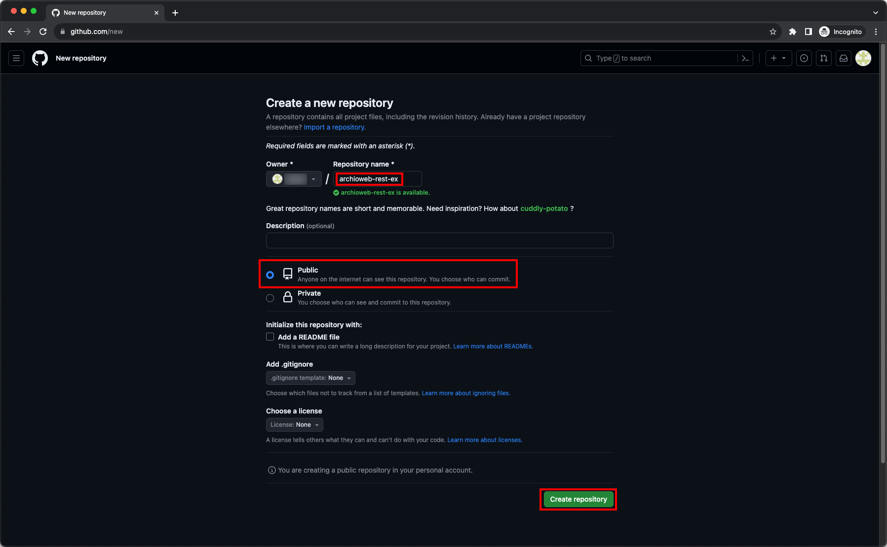

### Enable repository issues

Whether you created a new repository or chose an existing one, go to the
repository's settings and make sure Issues are enabled.

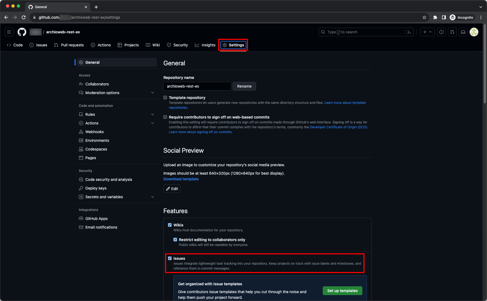

## Create an issue by hand

Issues are problems that can be reported by other GitHub users about a
repository. The owner of the repository can then track progress about these
issues and close them once the problem has been solved.

Issues are one of the resources that can be retrieved or modified by the GitHub
REST API.

Let's create an issue by hand so you can see what this is about.

### Go to the repository issues

First, go to the repository's Issues tab:

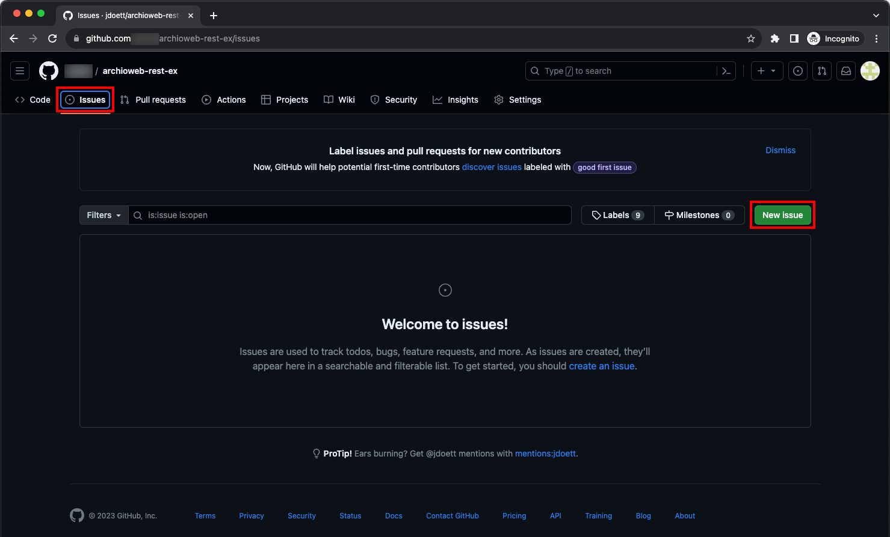

### Create an issue

Create a new issue. Imagine that you are reporting a problem on that project:

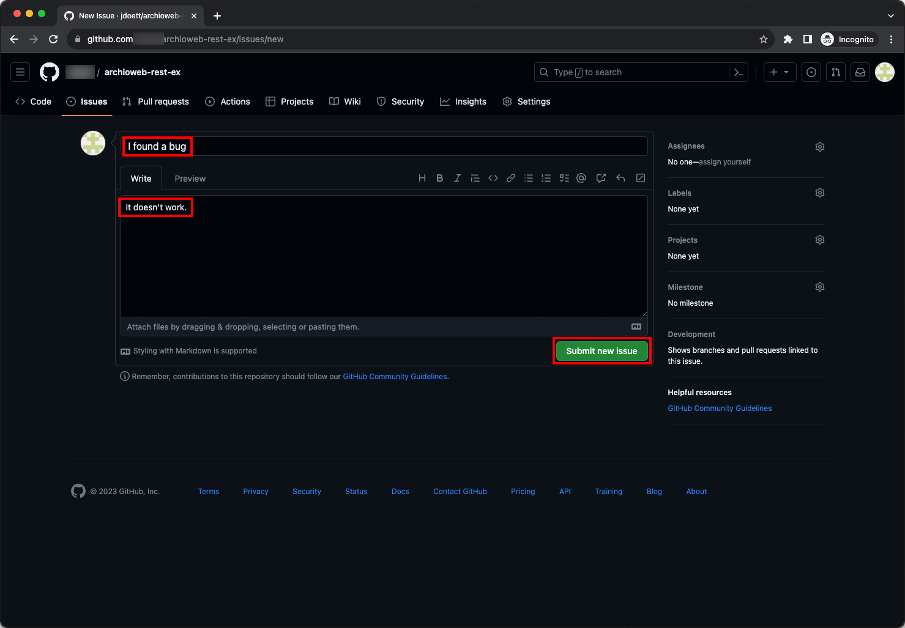

### Show the issue

Once you have created the issue, you can do various things with it:

- See its details.
- Add more comments.
- Close the issue (since in this case you are the owner of the repository).

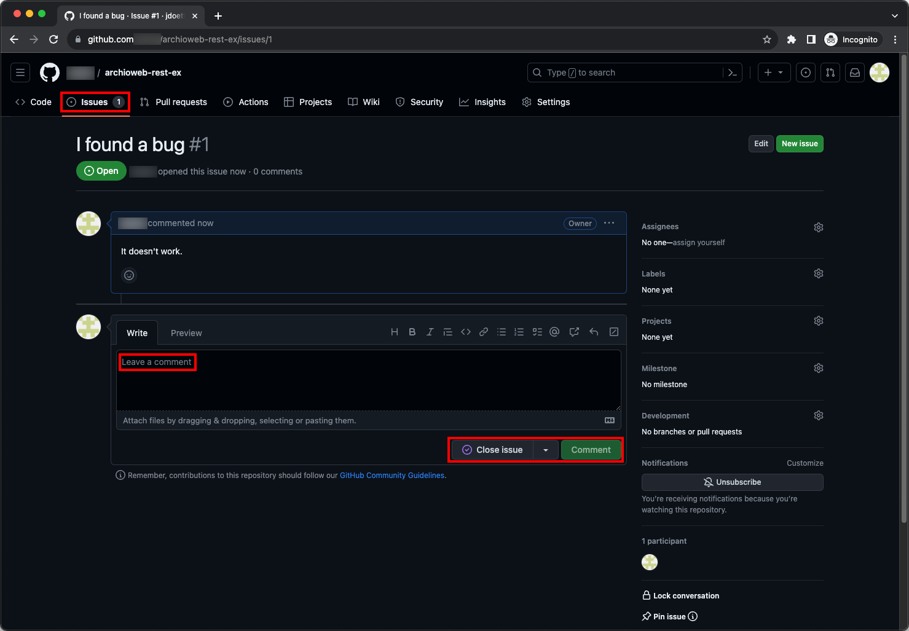

### List all issues

You can also go to the list of issues to see all reported issues. The issue you
created will either be in the Open or the Closed tab depending on whether you
closed it during the previous step.

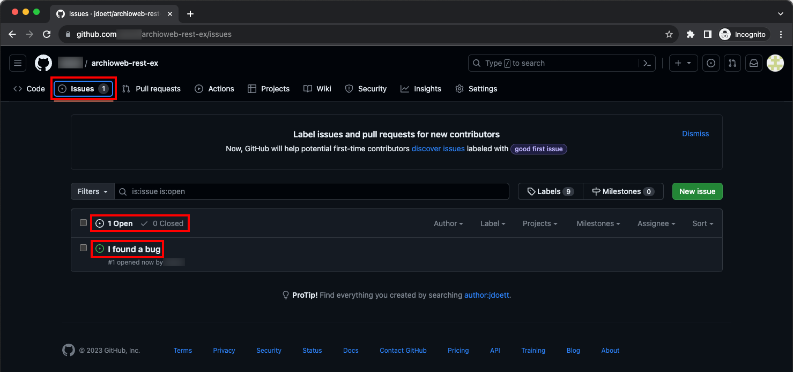

## Do the same thing with the GitHub REST API

Now that you have seen how the GitHub website allows you to manage issues, the
goal of this exercise is to do the same thing with the GitHub REST API:

- Create an issue.
- Retrieve the details of that issue.
- Close the issue.
- List all issues of the repository.

Except that you won't be using the web interface, you'll be communicating with
the API in JSON.

Read the [GitHub REST API documentation](https://docs.github.com/en/rest) and
perform these actions with your new favorite tool: Postman.

### Authenticating

In order to [authenticate to the GitHub REST
API](https://docs.github.com/en/rest/using-the-rest-api/getting-started-with-the-rest-api?apiVersion=2022-11-28#authenticating),
you will need an access token.

To generate one, go to your account's settings:

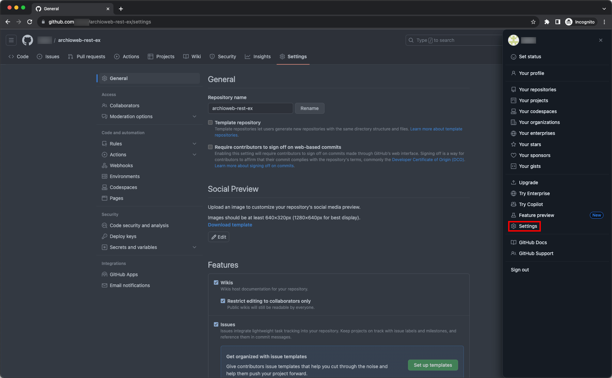

Then go to the Developer settings:

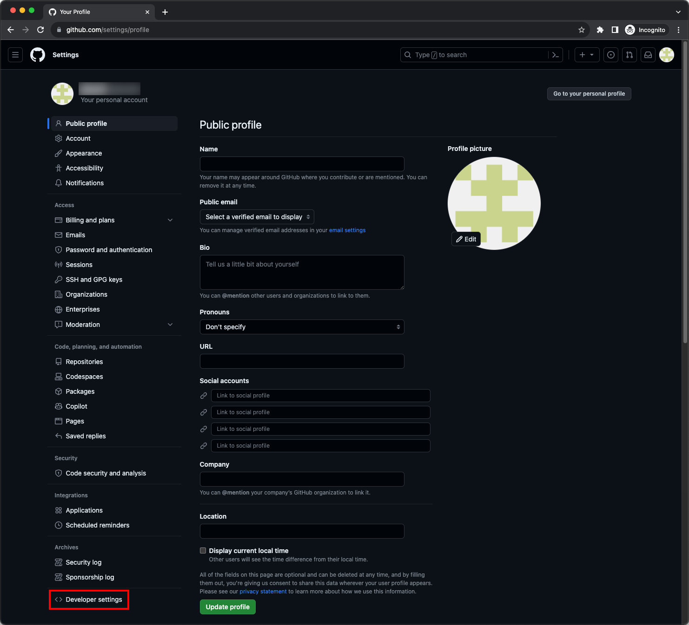

Go to the page for fine-grained personal access tokens:

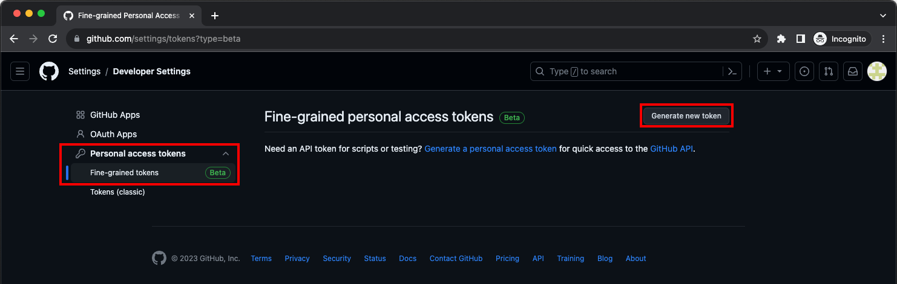

### Create a personal access token

Request the generation of a new token. You can set it to expire soon since you
won't be using it any more after this exercise.

You can limit Repository access to just the repository you created, or allow
access to all repositories, as you prefer. Either way works for this exercise.

Don't create the token right away: you also need to set the appropriate
permissions.

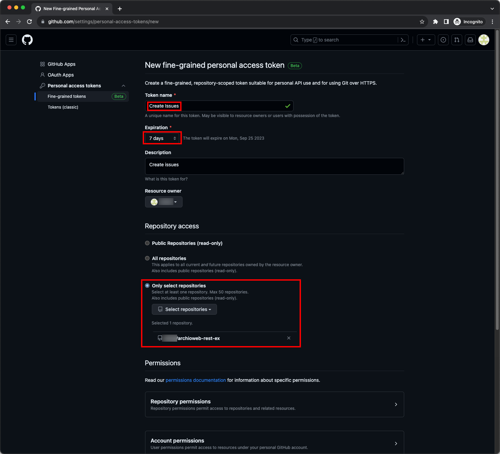

In the Permissions section, make sure to specify that this token should have
Read & Write access to Issues:

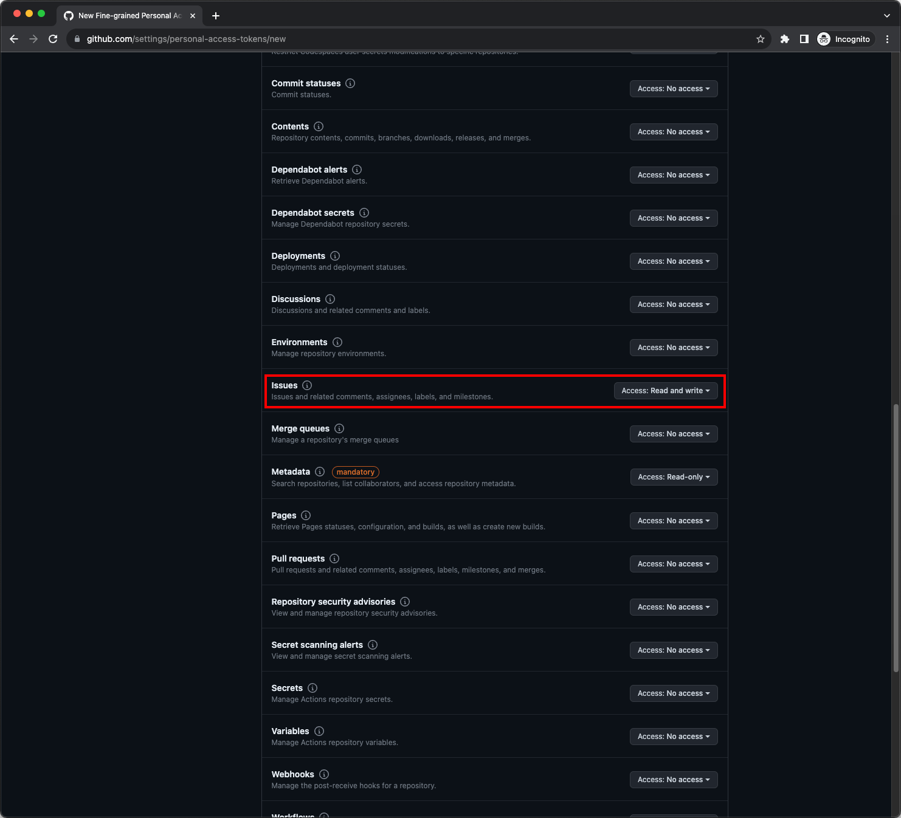

Verify that your token has the correct permissions and create it:

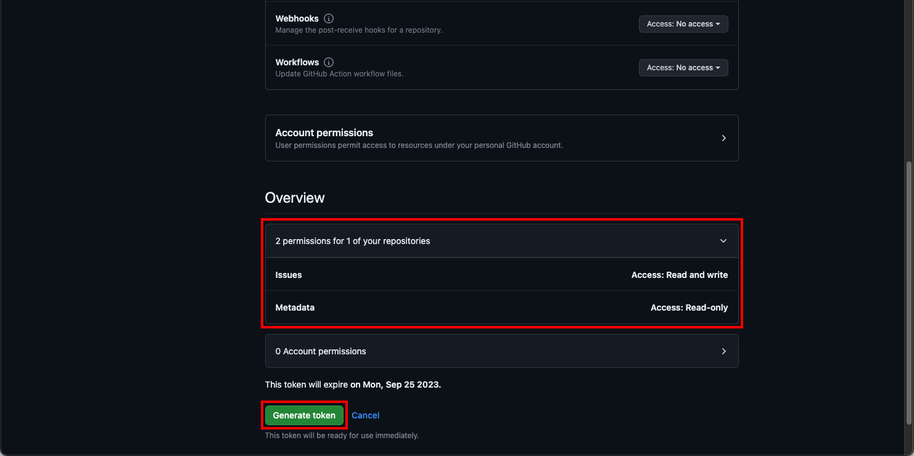

:warning: Make sure to **copy the access token** as soon as you've generated it:

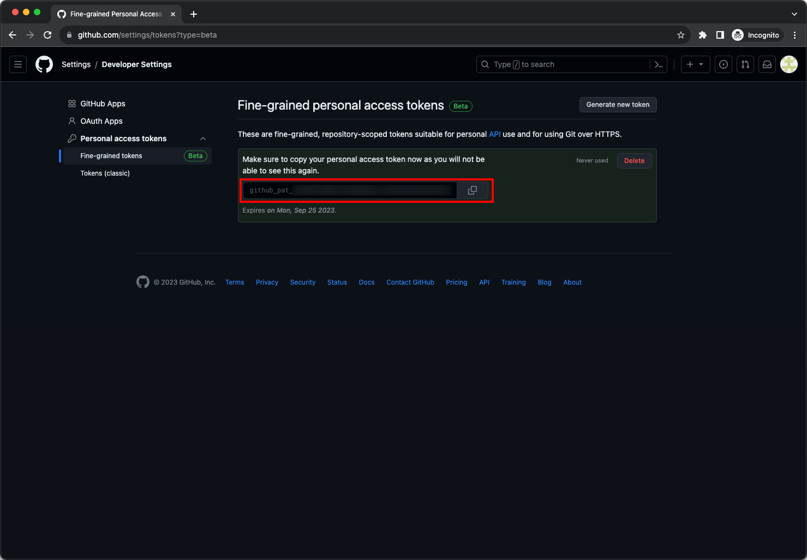

> The token is not saved by GitHub, so once you close the page, you won't be
> able to get it back. If you forgot to copy it, delete it and create another
> one.

:warning: An access token is a **password**: anyone who has it can act as you on
the repositories it grants access to. Never commit it to a repository, never
paste it into a shared document or a public Postman workspace, and delete it
once you are done with this exercise.

### Use the API

Now play with your new repository's issues with the GitHub REST API:

- Create an issue.
- Retrieve the details of that issue.
- Close the issue.
- List all issues of the repository.

The [GitHub REST API documentation](https://docs.github.com/en/rest) explains
how to use the token and how to make each request. The pages you need are:

- [Create an
  issue](https://docs.github.com/en/rest/issues/issues?apiVersion=2022-11-28#create-an-issue)
- [Get an
  issue](https://docs.github.com/en/rest/issues/issues?apiVersion=2022-11-28#get-an-issue)
- [Update an
  issue](https://docs.github.com/en/rest/issues/issues?apiVersion=2022-11-28#update-an-issue)
  (this is how you close one)
- [List repository
  issues](https://docs.github.com/en/rest/issues/issues?apiVersion=2022-11-28#list-repository-issues)

#### How to read the documentation's examples

Every endpoint's documentation shows a cURL example. Here's what one looks like
(this particular one creates a **repository**, and is only shown to explain
**how to read these examples** — it is not one of the requests you have to make,
and your token doesn't have the permission to run it anyway):

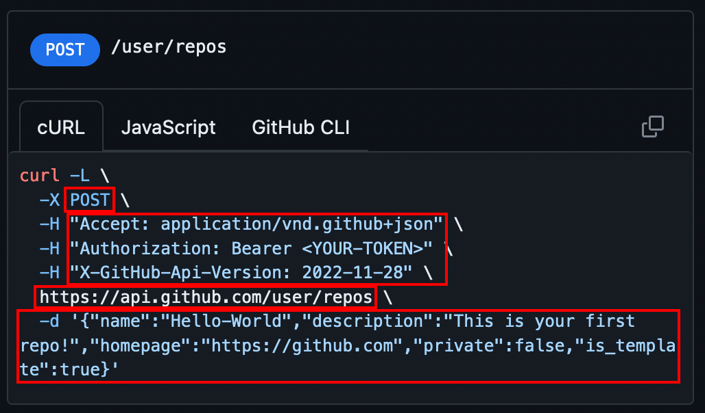

> :books: The [`curl` (**C**lient **URL**)
> command](https://curl.se/docs/manpage.html) is a command line tool that can be
> used, among other things, to make HTTP requests.

Such an example has everything you need to reproduce the request in Postman:

- The `-X` option indicates the request method, in this case `POST`.
- The various `-H` options indicate the required request headers, in this case
  `Accept`, `Authorization` and `X-GitHub-Api-Version`.
- The request URL, in this case `https://api.github.com/user/repos`.
- The `-d` option indicates the JSON to send in the request body.

Find the equivalent example on the [Create an
issue](https://docs.github.com/en/rest/issues/issues?apiVersion=2022-11-28#create-an-issue)
page and adapt it the same way.

> :gem: Rather than adding the `Authorization` header by hand, you can use
> Postman's **Authorization** tab, select the **Bearer Token** type, and paste
> your token there. Postman will add the header for you.

It is recommended that you perform this exercise with Postman since this will
help you understand how to make requests to your own API later.

### Observe the protocol

Making the requests work is only half the exercise. The GitHub API is a real,
professionally designed REST API, so it is a good place to recognize the things
you saw in the course. While you work, answer these questions:

- **Creating the issue:** what **status code** does GitHub respond with? Is
  there a `Location` header in the response, and what is in it? Does it match
  what you learned about `POST`?
- **Closing the issue:** GitHub asks you to use `PATCH`, not `PUT`, and to send
  only `{ "state": "closed" }`. Why is `PATCH` the appropriate method here? What
  would `PUT` have implied about the rest of the issue's properties?
- **Authentication:** re-send the create request **without** the `Authorization`
  header. Which status code do you get, and does it mean "I don't know you" or
  "I know you but you're not allowed"?
- **A resource that doesn't exist:** request issue number `999999` of your
  repository. Which status code do you get?
- **Invalid data:** try creating an issue **without a `title`**. GitHub responds
  with `422 Unprocessable Entity` and a JSON body containing an `errors` array.
  Compare it with the validation error example from the course: why is this
  `422` and not `400`?
- **Content negotiation:** retrieve your issue again **three times, at the exact
  same URL**, changing only the `Accept` header each time:
  `application/vnd.github+json`, then `application/vnd.github.text+json`, then
  `application/vnd.github.html+json`. Which property holds the issue's body in
  each response, and how does its content differ? Which slide of the course does
  this illustrate? (Make sure your issue has a **body containing some markdown**
  — a link, or some `**bold**` text — otherwise there is nothing to see.)
- **Custom media types:** those `Accept` values are not generic like
  `application/json` or `text/html`: GitHub defined its **own** media type. What
  does that buy them that `application/json` would not? (Hint:
  `application/json` only says "this is JSON"; it says nothing about _whose_
  JSON, or which **version** of it. Look at the `X-GitHub-Api-Version` header
  too.)
- **Pagination:** look at the **response headers** when you list the issues of a
  large repository (try
  `https://api.github.com/repos/nodejs/node/issues?per_page=2`). GitHub sends a
  `Link` header containing the URL of the next page. We will come back to this
  when we talk about pagination.
- **Rate limiting:** look for the `X-RateLimit-Limit` and
  `X-RateLimit-Remaining` response headers. What status code do you think GitHub
  sends once you have no requests remaining?
