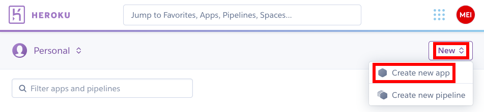
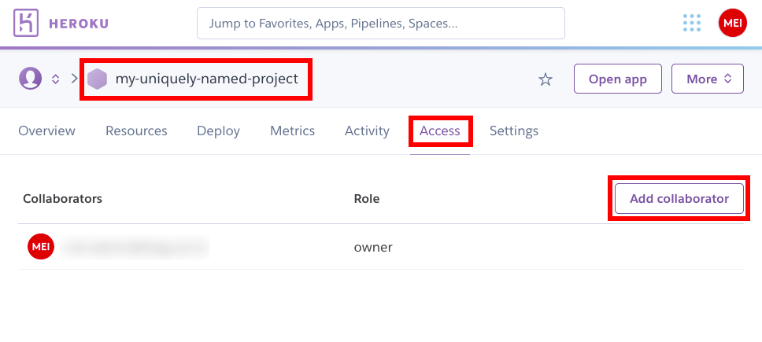
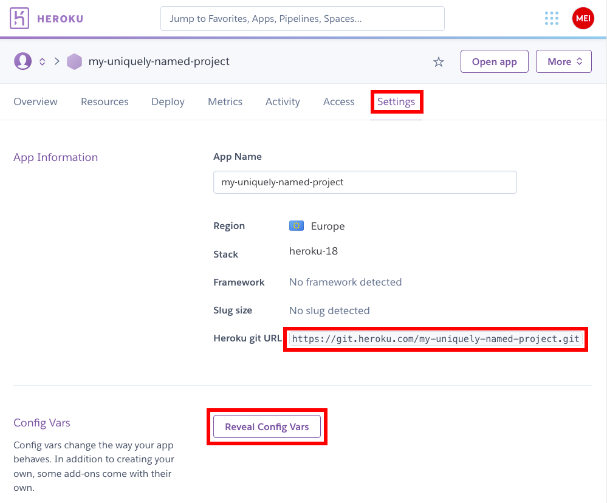
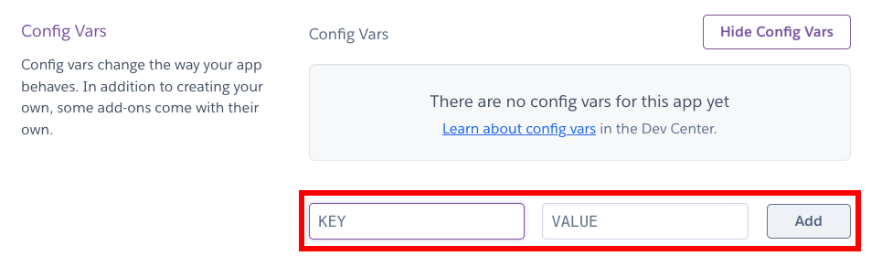

# Deploy an Express.js application with Heroku & MongoDB Atlas

This guide will walk you through the process of deploying an Express.js
application in the [cloud][cloud]. You will use [Heroku][heroku], a
[Platform-as-a-Service][paas] cloud, to run your application; and [MongoDB
Atlas][mongodb-atlas], a database cloud, to host your database.

When working as a team, only one member of the team needs to follow this guide.

<!-- START doctoc generated TOC please keep comment here to allow auto update -->
<!-- DON'T EDIT THIS SECTION, INSTEAD RE-RUN doctoc TO UPDATE -->


- [Requirements](#requirements)
- [Name your project](#name-your-project)
- [Create an Express.js application](#create-an-expressjs-application)
  - [Make it a Git repository](#make-it-a-git-repository)
  - [Push it to GitHub](#push-it-to-github)
- [Deploy the application on Heroku](#deploy-the-application-on-heroku)
  - [Create the Heroku application](#create-the-heroku-application)
  - [Deploy to Heroku](#deploy-to-heroku)
- [Connect your application to a database](#connect-your-application-to-a-database)
- [Create a MongoDB cluster on MongoDB Atlas](#create-a-mongodb-cluster-on-mongodb-atlas)
- [Provide your database URL to your Heroku application](#provide-your-database-url-to-your-heroku-application)

<!-- END doctoc generated TOC please keep comment here to allow auto update -->


## Requirements

* [Node.js][node] 12+
* [Git][git]
* A [GitHub][github] account.
* A [Heroku][heroku] account.
* The [Heroku CLI][heroku-cli].
* A [MongoDB Atlas][mongodb-atlas] account.


## Name your project

> "There are only [two hard things][two-hard-things] in Computer Science: cache
> invalidation and **naming things**."
>
> -- Phil Karlton

Choose a good name for your project. You will have to use it to name several
things: your Express.js application, the Heroku application, the MongoDB cluster
and database, etc.


## Create an Express.js application

Install the [Express.js generator][express-generator] if you haven't already:

```bash
$> npm install -g express-generator
```

Generate a new [Express][express] application:

```bash
$> cd /path/to/projects
$> express my-project
```

Make sure it works:

```bash
$> cd my-project
$> npm install
$> npm start
```

Check that you can access it at [http://localhost:3000](http://localhost:3000).
Once you're sure it works, you can stop it with `Ctrl-C`.

### Make it a Git repository

To deploy code on Heroku, you will need to use [Git][git]. Initialize a Git
repository in the application's directory:

```bash
$> git init
```

Add a `.gitignore` file to ignore the `node_modules` directory (dependencies
will be automatically installed by Heroku when you push):

```bash
$> echo node_modules > .gitignore
```

The contents of your `.gitignore` file should look like this:

```txt
node_modules
```

Commit all the app's files:

```bash
$> git add --all
$> git commit -m "Initial commit"
```

### Push it to GitHub

Register a [GitHub][github] account if you haven't already.

Create a **private** repository on GitHub, then add it as a remote on your
machine and push your new application to it:

```bash
$> git remote add origin git@github.com:your-github-username/your-repo-name.git
$> git push -u origin master
```

If you have team members, you may add them in the repository's settings on
GitHub so that they also have push access:


## Deploy the application on Heroku

Register a [Heroku][heroku] account if you haven't already.

### Create the Heroku application

Go to your dashboard and create a new application:



Choose a region and name the application. Note that the name must be unique
across all names in the region:


If other team member want to be able to deploy new versions of the application,
you can add them as collaborators now (or later):



Go to the application's Settings tab, and take a note of the **Heroku Git URL**
and the **Config Vars** section. You will need both to deploy and configure your
application:



If you reveal the configuration variables, you will see an interface allowing
you to provide environment variables to your application:



Copy the **Heroku Git URL** and add it to your repository as a remote:

```bash
$> git remote add heroku https://git.heroku.com/your-app-name.git
```

### Deploy to Heroku

To deploy the application to Heroku, simply push the code to the new remote:

```bash
$> git push heroku master
Counting objects: 18, done.
Delta compression using up to 8 threads.
Compressing objects: 100% (14/14), done.
Writing objects: 100% (18/18), 3.83 KiB | 0 bytes/s, done.
Total 18 (delta 1), reused 0 (delta 0)
remote: Compressing source files... done.
remote: Building source:
remote: -----> `Node.js app detected`
remote: -----> Creating runtime environment
remote: -----> `Building dependencies`
remote:        Installing node modules (package.json)
remote:        your-app@0.0.0 /tmp/build_c9758807eb8979e9eb8af687447e5985
remote:        ├─┬ body-parser@1.16.1
remote: -----> Launching...
remote:        `https://your-app-name.herokuapp.com/` deployed to Heroku
remote: Verifying deploy... done.
To https://git.heroku.com/your-app-name.git
 * [new branch]      master -> master
```

> If you are denied access, run `heroku login` first. This requires you to have
> the [Heroku CLI][heroku-cli] installed.

As the log indicates, you should be able to access your application at
https://your-app-name.herokuapp.com


## Connect your application to a database

Add [Mongoose][mongoose] to your application:

```bash
$> npm install mongoose
```

Then add the following code to the `app.js` file:

```js
const mongoose = require('mongoose');
mongoose.connect(process.env.DATABASE_URL || 'mongodb://localhost/your-app-name');
```

> Note the code `process.env.DATABASE_URL ||
> 'mongodb://localhost/your-app-name'` which will either take the value of the
> `$DATABASE_URL` environment variable, or default to
> `mongodb://localhost/your-app-name` if the environment variable is not
> available.

Stage all changes (including the changes made to `package.json` and
`package-lock.json` as a result of the `npm install mongoose` command). Then
commit and deploy this change:

```bash
$> git add .
$> git commit -m "Connect to a MongoDB database with Mongoose"
$> git push heroku master
```

Your application may be broken at this stage, or it may still work. At any rate,
you should see an error that looks something like this in the Heroku logs:

```bash
$> heroku logs
...
2020-09-13T09:46:06.584637+00:00 heroku[web.1]: Stopping all processes with SIGTERM
2020-09-13T09:46:06.654228+00:00 heroku[web.1]: Process exited with status 143
2020-09-13T09:46:07.926261+00:00 heroku[web.1]: Starting process with command `npm start`
2020-09-13T09:46:12.601414+00:00 app[web.1]:
2020-09-13T09:46:12.601432+00:00 app[web.1]: > your-app@0.0.0 start /app
2020-09-13T09:46:12.601433+00:00 app[web.1]: > node ./bin/www
2020-09-13T09:46:12.601433+00:00 app[web.1]:
2020-09-13T09:46:13.394704+00:00 app[web.1]: (node:23) UnhandledPromiseRejectionWarning: MongoNetworkError: failed to connect to server [localhost:27017] on first connect [Error: connect ECONNREFUSED 127.0.0.1:27017
2020-09-13T09:46:13.394707+00:00 app[web.1]: at TCPConnectWrap.afterConnect [as oncomplete] (net.js:1141:16) {
2020-09-13T09:46:13.394708+00:00 app[web.1]: name: 'MongoNetworkError'
2020-09-13T09:46:13.394709+00:00 app[web.1]: }]
2020-09-13T09:46:13.394710+00:00 app[web.1]: at Pool.<anonymous> (/app/node_modules/mongodb/lib/core/topologies/server.js:438:11)
2020-09-13T09:46:13.394711+00:00 app[web.1]: at Pool.emit (events.js:315:20)
2020-09-13T09:46:13.394712+00:00 app[web.1]: at /app/node_modules/mongodb/lib/core/connection/pool.js:562:14
2020-09-13T09:46:13.394712+00:00 app[web.1]: at /app/node_modules/mongodb/lib/core/connection/pool.js:995:11
2020-09-13T09:46:13.394712+00:00 app[web.1]: at /app/node_modules/mongodb/lib/core/connection/connect.js:32:7
2020-09-13T09:46:13.394713+00:00 app[web.1]: at callback (/app/node_modules/mongodb/lib/core/connection/connect.js:280:5)
2020-09-13T09:46:13.394713+00:00 app[web.1]: at Socket.<anonymous> (/app/node_modules/mongodb/lib/core/connection/connect.js:310:7)
2020-09-13T09:46:13.394714+00:00 app[web.1]: at Object.onceWrapper (events.js:422:26)
2020-09-13T09:46:13.394714+00:00 app[web.1]: at Socket.emit (events.js:315:20)
2020-09-13T09:46:13.394715+00:00 app[web.1]: at emitErrorNT (internal/streams/destroy.js:92:8)
2020-09-13T09:46:13.394716+00:00 app[web.1]: at emitErrorAndCloseNT (internal/streams/destroy.js:60:3)
2020-09-13T09:46:13.394716+00:00 app[web.1]: at processTicksAndRejections (internal/process/task_queues.js:84:21)
...
```

This error is caused by the fact that your application attempts to connect to
the MongoDB database at `mongodb://localhost/your-app-name` (since
`$DATABASE_URL` is not available). This may work on your machine if you have a
MongoDB server running, but it will not work on Heroku which does not have one.

You need to have a MongoDB server running somewhere on the web, reachable
through an URL. The server on your machine will not do, since it does not have a
publicly available URL. This is where MongoDB Atlas will help.


## Create a MongoDB cluster on MongoDB Atlas

Register a free [MongoDB Atlas][mongodb-try] account for a cloud deployment:


Choose the free shared cluster plan:


Create a cluster if one has not already been created for you:


Configure your cluster. The provider and region are unimportant as long as you
choose one that is free, but you should at least change the default name:


You must configure network access to your cluster to allow connections from the
outside world:


For the purposes of this guide, you can allow access from anywhere, which should
set the access list entry to `0.0.0.0/0` (i.e. any source IP address is allowed
to access the cluster):


> In a real production environment, you should whitelist the exact IP addresses
> of your servers so that only they can connect to your cluster, for improved
> security.

You must then create a database user to connect with:


Set the credentials for the new database user:


To obtain the connection URL for your cluster, go to Clusters and click on your
cluster's Connect button:


You want to connect an application:


And you are using a Node.js driver. You should copy the provided connection URL:


Note that the connection URL is in the format
`mongodb+srv://admin:<password>@your-cluster-name.abcd.mongodb.net/<dbname>?retryWrites=true&w=majority`.
There are two placeholders in this URL, `<password>` and `<dbname>`, which you
should replace:

* `<password>` is the password of the database user you just created.
* `<dbname>` is the name of a MongoDB database to connect to. You should name it
  after your project. The exact name is unimportant, since MongoDB will
  automatically create the database the first time you connect to it.

> If you have the `mongo` executable available in your command line, you can
> connect to your new MongoDB cluster from your machine with the command:
>
>     mongo "mongodb+srv://admin:<password>@your-cluster-name.abcd.mongodb.net/<dbname>?retryWrites=true&w=majority"
>
> (Use the full path to `mongo.exe` on Windows instead of `mongo`.)


## Provide your database URL to your Heroku application

Now that you have a connection URL for a MongoDB database, you should give it
to your Heroku application.

This is trivially done by adding `DATABASE_URL` to your application's
environment variables in the Config Vars section:


Setting the variable should restart your application and get rid of the error in
the logs.


[cloud]: https://en.wikipedia.org/wiki/Cloud_computing
[express]: https://expressjs.com
[express-generator]: https://www.npmjs.com/package/express-generator
[git]: https://git-scm.com
[github]: https://github.com
[heroku]: https://heroku.com
[heroku-cli]: https://devcenter.heroku.com/articles/heroku-cli
[mongodb-atlas]: https://www.mongodb.com/cloud/atlas
[mongodb-try]: https://www.mongodb.com/try
[mongoose]: https://mongoosejs.com
[node]: https://nodejs.org
[paas]: https://en.wikipedia.org/wiki/Platform_as_a_service
[two-hard-things]: https://martinfowler.com/bliki/TwoHardThings.html
