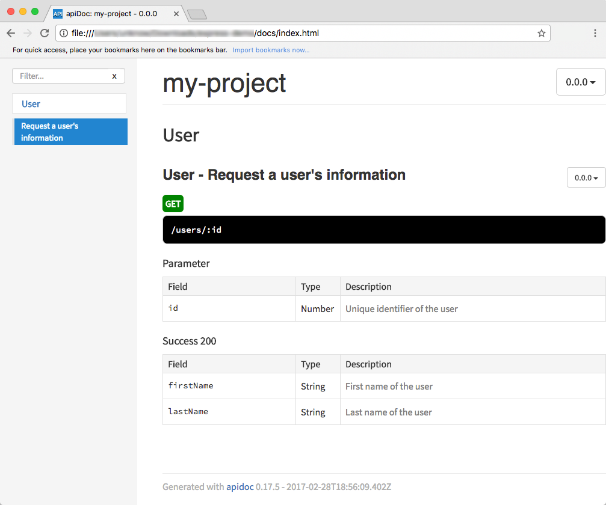

# apiDoc

Learn to generate HTML documentation for your RESTful API from annotations in your source code, using [apiDoc][apidoc].

**You will need**

* [Node.js][node] 8+

**Recommended reading**

* [RESTful APIs](../rest/)
* [npm](../npm/)

<!-- START doctoc generated TOC please keep comment here to allow auto update -->
<!-- DON'T EDIT THIS SECTION, INSTEAD RE-RUN doctoc TO UPDATE -->


- [What to do](#what-to-do)
  - [Install and run apiDoc](#install-and-run-apidoc)
  - [The generated documentation](#the-generated-documentation)
  - [Using a configuration file](#using-a-configuration-file)
  - [Using apiDoc as a development dependency](#using-apidoc-as-a-development-dependency)
- [How it works](#how-it-works)
  - [Structural annotations](#structural-annotations)
  - [Descriptive annotations](#descriptive-annotations)
  - [Documenting request parameters](#documenting-request-parameters)
  - [Reusing annotations](#reusing-annotations)
- [Resources](#resources)

<!-- END doctoc generated TOC please keep comment here to allow auto update -->


## What to do

Put comments such as this in your code:

```js
/**
 * @api {get} /users/:id Request a user's information
 * @apiName GetUser
 * @apiGroup User
 *
 * @apiParam {Number} id Unique identifier of the user
 *
 * @apiSuccess {String} firstName First name of the user
 * @apiSuccess {String} lastName  Last name of the user
 */
```


### Install and run apiDoc

[apiDoc][apidoc] is an npm package.
Install it globally with:

```bash
$> npm install -g apidoc
```

Move into your project's directory and run apiDoc with two options:

* The `-i` option should be followed by the **directory containing your documented API routes**
* The `-o` option should be followed by the **directory where you want the generated documentation to be saved**

```bash
$> cd /path/to/projects/my-project
$> apidoc -i `routes` -o `docs`
warn: Please create an apidoc.json configuration file.
info: Done.
```

Open the generated `docs/index.html` file in your browser.


### The generated documentation

<p class='center'></p>


### Using a configuration file

It's good practice to create an `apidoc.json` file in your project's directory to configure some documentation properties:

```json
{
  "name": "My project",
  "version": "1.0.0",
  "description": "It is awesome",
  "title": "My project",
  "url" : "https://example.com"
}
```

This will get rid of the `Please create an apidoc.json configuration file` warning when you run apiDoc.


### Using apiDoc as a development dependency

You can also install and run apiDoc as a development dependency:

```bash
$> npm install --save-dev apidoc
```

Add an `apidoc` script to your `package.json` file:

```json
{
  "name": "my-project",
  "scripts": {
*   "apidoc": "apidoc -i routes -o docs",
    "start": "..."
  },
  ...
}
```

You and your teammates can now generate the documentation this way,
without having to install the module globally on each machine:

```bash
$> npm run apidoc
```


## How it works

The main annotation of apiDoc is:

```
  @api {get} /path Short description
```

As long as you have it in a comment, apiDoc will parse that comment and include it into the generated documentation.


### Structural annotations

The following annotations are used to **organize** your documentation and configure the **left-side menu**:

Annotation    | Purpose
:---          | :---
`@apiName`    | The name under which the comment block will appear in the left-side menu
`@apiGroup`   | All comment blocks in the same group will be grouped together in the left-side menu, with the group name as a header
`@apiDefine`  | Defines a reusable documentation block that you can include into other comments with `@apiUse`
`@apiUse`     | Re-use the annotations from another documentation block defined with `@apiDefine`


### Descriptive annotations

The following annotations describe how your **API operations** work and the contents of the **HTTP requests and responses**:

Annotation           | Purpose
:---                 | :---
`@apiDescription`    | Detailed multi-line description of the operation
`@apiHeader`         | HTTP header description
`@apiHeaderExample`  | HTTP header example
`@apiParam`          | Request parameter (e.g. URL path, URL query, JSON property)
`@apiParamExample`   | Request parameter example
`@apiExample`        | Full HTTP request example
`@apiSuccess`        | Response parameter (e.g. JSON property)
`@apiSuccessExample` | Successful HTTP response example
`@apiError`          | Possible error for that operation
`@apiErrorExample`   | Error HTTP response example
`@apiVersion` | The version of your documentation block (useful if several versions are active in parallel)


### Documenting request parameters

The `@apiParam` annotation is a generic annotation to document any kind of request parameter.
You can group parameters together by specifying a **category in parentheses**:

```js
/**
 * @apiParam `(URL path parameters)` {String} id The movie's unique identifier
 * @apiParam `(URL query parameters)` {Number} page The page to retrieve
 * @apiParam `(Request body)` {String} title The movie's title
 * @apiParam `(Request body)` {Number} rating The movie's rating
 */
```

This will produce three parameter tables in the generated documentation:

* A table with the `URL path parameters` header and the first parameter
* A table with the `URL query parameters` header and the second parameter
* A table with the `Request body` header and the last two parameters


#### Request parameter constraints

You can document **validation constraints** on request parameters:

```js
/**
 * @apiParam (URL query parameters) `{Number{1..}}` `[`page`]` The page to retrieve
 * @apiParam (Request body) `{String{3..50}}` title The movie's title
 * @apiParam (Request body) `{Number{0..10}}` `[`rating`]` The movie's rating
 * @apiParam (Request body) `{String="male","female"}` gender The person's gender
 */
```

* Parameter names surrounded with brackets `[]` are **optional**
* **Length constraints** can be specified as a range (e.g. `Number{1..}` means 1 or greater, `String{3..50}` means between 3 an 50 characters long)
* **Enumeration constraints** can be specified as comma-separated values (e.g. `String="male","female"`)


### Reusing annotations

Let's say you have several API operations where the request body has the same request parameters.
You can define those **once** in an `@apiDefine` block.
You can put this block **anywhere you want**.
It doesn't even have to be next to any code.

```js
/**
 * `@apiDefine PersonInRequestBody`
 * @apiParam (Request body) {String{3..30}} name The person's name
 * @apiParam (Request body) {String="male,female"} gender The person's gender
 * @apiParam (Request body) {String} [birthDate] The person's birth date
 */
```

You can then **reuse** these annotations in other blocks with `@apiUse`:

<!-- slide-column -->

```js
/**
 * @api {post} /api/people
 * `@apiUse PersonInRequestBody`
 * ...
 */
```

<!-- slide-column -->

```js
/**
 * @api {put} /api/people/:id
 * `@apiUse PersonInRequestBody`
 * ...
 */
```

<!-- slide-container -->

This works for most apiDoc annotations, not just request parameters.


## Resources

**Documentation**

* [apiDoc documentation][apidoc]

**Generic alternatives**

* Plain [Markdown][markdown]
* [GitBook][gitbook] (Markdown, not API-specific)

**API-specific alternatives**

* [RAML][raml] (YAML-based schema, large community with many tools)
* [Slate][slate] (Markdown)
* [Swagger][swagger] (OpenAPI specification, large community with many tools)


[apiary]: https://apiary.io
[apidoc]: http://apidocjs.com
[apidoc-param]: http://apidocjs.com/#param-api-param
[gitbook]: https://www.gitbook.com
[markdown]: https://daringfireball.net/projects/markdown/syntax
[node]: https://nodejs.org/
[raml]: https://raml.org
[slate]: https://github.com/lord/slate
[swagger]: https://swagger.io
