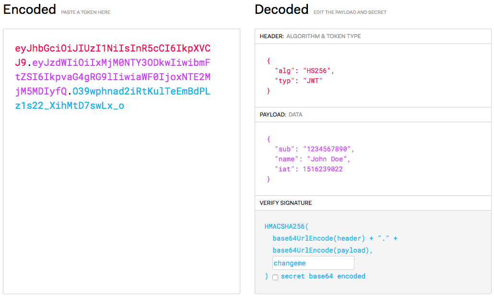

# Express Authentication

Learn how to set up authentication with [JSON Web Tokens][jwt] an [Express][express] application.

**You will need**

- A running [Express][express] application with [Mongoose][mongoose] plugged in

**Recommended reading**

- [Express](../express/)
- [Mongoose](../mongoose/)

<!-- START doctoc generated TOC please keep comment here to allow auto update -->
<!-- DON'T EDIT THIS SECTION, INSTEAD RE-RUN doctoc TO UPDATE -->

- [Security concepts](#security-concepts)
- [Storing passwords securely](#storing-passwords-securely)
  - [What is a hash function?](#what-is-a-hash-function)
  - [Hashing is not encryption](#hashing-is-not-encryption)
  - [Cryptographic hash functions](#cryptographic-hash-functions)
  - [Storing hashed passwords](#storing-hashed-passwords)
    - [Salting](#salting)
- [bcrypt](#bcrypt)
  - [Using bcrypt to hash a password](#using-bcrypt-to-hash-a-password)
    - [Using bcrypt with Express and Mongoose](#using-bcrypt-with-express-and-mongoose)
    - [Hiding the password hash from API responses](#hiding-the-password-hash-from-api-responses)
  - [Using bcrypt to verify a password](#using-bcrypt-to-verify-a-password)
    - [Verifying a password with Express and Mongoose](#verifying-a-password-with-express-and-mongoose)
- [Authentication tokens](#authentication-tokens)
  - [What is an authentication token?](#what-is-an-authentication-token)
  - [JSON Web Token (JWT)](#json-web-token-jwt)
    - [What's in a JWT?](#whats-in-a-jwt)
    - [JWT claims](#jwt-claims)
    - [JWT best practices](#jwt-best-practices)
  - [The `jsonwebtoken` package](#the-jsonwebtoken-package)
    - [Verifying a JWT](#verifying-a-jwt)
- [Authentication flow](#authentication-flow)
  - [Unauthorized client](#unauthorized-client)
  - [Login](#login)
  - [Authenticated request](#authenticated-request)
  - [Full flow](#full-flow)
- [Sample code](#sample-code)
  - [Sample login route](#sample-login-route)
  - [Sample Express JWT authentication middleware](#sample-express-jwt-authentication-middleware)
    - [Using the authentication middleware](#using-the-authentication-middleware)
- [Authorization](#authorization)
  - [Enforcing permissions](#enforcing-permissions)
    - [Checking the owner](#checking-the-owner)
  - [Using roles](#using-roles)
    - [Extracting roles from the JWT](#extracting-roles-from-the-jwt)
    - [Writing an authorization middleware](#writing-an-authorization-middleware)
    - [Enforcing roles](#enforcing-roles)
    - [Augmenting permissions](#augmenting-permissions)
- [References](#references)

<!-- END doctoc generated TOC please keep comment here to allow auto update -->

## Security concepts

| Process        | Description                                                                                                                                                                                                             |
| :------------- | :---------------------------------------------------------------------------------------------------------------------------------------------------------------------------------------------------------------------- |
| Identification | Occurs when a user claims to have a specific identity, for example by supplying a **username**.                                                                                                                         |
| Authentication | The process of **proving an identity** by supplying appropriate credentials, such as a **password**, an **authentication token**, or by using a **public key** with asymmetric cryptography.                            |
| Authorization  | The process of **verifying that you have access to something**, such as a specific resource. For example, a user may have the right to edit their own posts in a social application, but not the posts of another user. |

In this presentation, we'll focus on setting up **authentication**
with [bcrypt][bcrypt] and [JSON Web Tokens][jwt].

## Storing passwords securely

It's a bad idea to store your users' passwords in clear.
If your database is compromised, not only will your application be compromised,
but others may be as well if users have used the same passwords elsewhere.

A better way is to use a [cryptographic hash function][hash].

### What is a hash function?

<!-- slide-column -->

A [hash function][hash-function] maps **data of arbitrary size** to **data of a fixed size**.
The value returned by a hash function is called a hash value, a **digest**, or simply a hash.


<!-- slide-column -->


### Hashing is not encryption

<!-- slide-column -->

<p class='center'><strong>Encryption</strong></p>


<!-- slide-column -->

<p class='center'><strong>Hashing</strong></p>


### Cryptographic hash functions

<!-- slide-column -->

A [cryptographic hash function][hash] is a [hash function][hash-non-crypto] that has the following properties:

- The same message always results in the same hash (**deterministic**).
- **Computing** the hash value of any message **is quick**.

<!-- slide-column 60 -->


<!-- slide-container -->

- It is infeasible to generate a message from its hash value except by trying all possible messages (**one-way**).
- A small change to a message should change the hash value so extensively that the new hash value appears uncorrelated with the old hash value.
- It is infeasible to find two different messages with the same hash value (collisions).

### Storing hashed passwords

The properties of a hash function make it suitable for securely verifying
users' passwords without actually storing them:

- When the user **registers** the first time, their password is hashed. **Only
  the hash is stored** in the database. The plain password is not kept.
- When the user comes back later to **log in**, the password is passed through
  the same hash function. **If the hash is the same, the password is the correct
  one** (in all probability).

If the database of such a service is compromised, a hacker does not get the
actual passwords, only the hashes, which are not reversible due to the
properties of a cryptographic hash function.

> This is also why most secure services cannot tell you what your current
> password is, because they do not store it. They can only verify that it is the
> correct one when you log in.

#### Salting

Using only a hash function is vulnerable to [rainbow tables][rainbow-table]: a
hacker may precompute the hashes for the most common passwords in advance. With
such a table, the password could be deduced from the hash.

The addition of a [**salt**][salt] solves this problem. A salt is a random piece
of data. In the simplest implementation, it is concatenated with your password
before the hash function is applied.

```js
// Without salt, vulnerable to rainbow table attacks.
hashFunction(password);

// With salt, generating rainbow tables for all
// possible salts is virtually impossible.
const salt = generateRandomBytes();
hashFunction(password + salt);
```

If you generate a different salt for each user account and store it alongside
the hashed password, you can reproduce the same hash when the user logs in.

Salting makes it impractical to generate rainbow tables because it would require
too much computing power and storage, since you would have to generate the
tables for all possible salts (a potentially infinite number).

## bcrypt

<!-- slide-front-matter class: center, middle -->

An adaptive password hashing function.

### Using bcrypt to hash a password

The [`bcrypt` package][bcrypt-npm] provides an implementation of the
[bcrypt][bcrypt] password-hashing function. Simply use its `hash` function to
generate a bcrypt hash from a password.

```js
import bcrypt from 'bcrypt';

const plainPassword = 'changeme';
const costFactor = 10;

const hashedPassword = await bcrypt.hash(plainPassword, costFactor);

// Store the hashed password in your database...
```

> Creating a password hash is a costly operation, especially if the cost factor of the bcrypt algorithm is high (more than 10).
> Do not use the synchronous methods provided by the `bcrypt` package (e.g. `hashSync`),
> as they will block execution of your application until they are done.

#### Using bcrypt with Express and Mongoose

Here's an example of how to use bcrypt in an Express application using Mongoose for database access.

```js
router.post('/', async function (req, res, next) {
  const plainPassword = req.body.password;
  const costFactor = 10;

* const hashedPassword = await bcrypt.hash(plainPassword, costFactor);

  const newUser = new User(req.body);
* newUser.password = hashedPassword;

  const savedUser = await newUser.save();

  res.send(savedUser);
});
```

#### Hiding the password hash from API responses

You don't want your API users to view the password hash.
Here's one way to hide it with Mongoose:

```js
const userSchema = new Schema({
  // ...
  password: {
    type: String,
    required: true
  }
});

*userSchema.set("toJSON", {
*  transform: transformJsonUser
*});

function transformJsonUser(doc, json, options) {
* // Remove the hashed password from the generated JSON.
* delete json.password;
  return json;
}
```

### Using bcrypt to verify a password

The `compare` function takes the following arguments:

- The **plain password** to check.
- The **hashed password** from your database.

The asynchronous callback will be called with **a boolean indicating whether the password matches**.

```js
const valid = await bcrypt.compare(plainPassword, hashedPassword);

// Do something depending on password validity...
```

#### Verifying a password with Express and Mongoose

Here's a password verification example for a hypothetical login route in an
Express application using Mongoose:

```js
import bcrypt from "bcrypt";
import User from "../models/user.js";

router.post("/login", async function (req, res, next) {
  const user = await `User.findOne`({ name: req.body.name });
  if (!user) {
    return res.sendStatus(401); // Unauthorized
  }

  const valid = await `bcrypt.compare(req.body.password, user.password)`;
  if (!valid) {
    return res.sendStatus(401); // Unauthorized
  }

  // Login is valid.
  res.send(\`Welcome ${user.name}!`);
});
```

## Authentication tokens

<!-- slide-front-matter class: center, middle -->

### What is an authentication token?

An authentication token allows a user to authenticate to a server without sending his or her credentials at every request.

It is an alternative to cookies, with the following advantages:

- Tokens are **stateless**. A token contains all the information it needs for authentication,
  freeing your server from managing sessions.
- Tokens can be **generated from anywhere**,
  allowing you the option to handle the signing and verification of tokens on different servers.
- **Fine-grained access control**.
  The token payload can contain specific user roles and permissions.

### JSON Web Token (JWT)

A [JSON Web Token][jwt] is a special format for authentication tokens:

<p class='center'></p>

#### What's in a JWT?

A JWT contains:

- A header indicating the **hashing algorithm** and other JWT configuration properties.
- A **payload** containing the **authentication claims**, i.e. who is the authenticated user.
- A **signature** which is a [HMAC][hmac] of the previous 2 parts of the token, based on a **secret** known only by the server.

Since the signature is tied to the contents of the token, and HMAC uses cryptographic hash functions which are not reversible:

- An attacker cannot create a valid JWT token unless he knows the secret.
- Nor can he modify an existing token while keeping the signature valid.

#### JWT claims

The properties of the payload should be [**registered claims**][jwt-claims].
These are some of the most common claims (all are optional):

| Claim | Description                                     |
| :---- | :---------------------------------------------- |
| `iss` | Issuer                                          |
| `sub` | Subject (e.g. the ID of the authenticated user) |
| `aud` | Audience                                        |
| `exp` | Expiration time (UNIX timestamp)                |
| `nbf` | Not before                                      |
| `iat` | Issued at                                       |

For example, a very simple token might only contain `sub` to indicate the authenticated user, and `exp` for an expiration date.

> New claims should either be registered, or use a collision-resistant name such as a URL, e.g. `https://my-api.com/jwt/claims/custom`.

#### JWT best practices

- **Keep it secret. Keep it safe.**
  The signing key should be treated like any other credentials and revealed only to services that absolutely need it.
  It should not be put under version control.
- **Do not add sensitive data to the payload.**
  Tokens are signed to protect against manipulation and are easily decoded.
  Add the bare minimum number of claims to the payload for best performance and security.
- **Give tokens an expiration.**
  Technically, once a token is signed, it is valid forever, unless the signing key is changed or expiration explicitly set.
  This could pose potential issues so have a strategy for expiring and/or revoking tokens.
- **Embrace HTTPS.**
  Do not send tokens over non-HTTPS connections as those requests can be intercepted and tokens compromised.

### The `jsonwebtoken` package

Generating a JWT is trivial with the `jsonwebtoken` npm package:

```js
import { promisify } from 'util';
import jwt from 'jsonwebtoken';

const signJwt = promisify(jwt.sign);

// Retrieve the secret key from your configuration.
const secretKey = process.env.SECRET_KEY || 'changeme';
// UNIX timstamp representing a date in 7 days.
const exp = Math.floor(Date.now() / 1000) + 7 * 24 * 3600;

// Create and sign a token.
*const token = await signJwt({ sub: 'userId42', exp: exp }, secretKey);

// Use the signed token...
```

> The `jsonwebtoken` library uses callbacks instead of Promises. Many libraries
> retain their callback APIs for backward compatibility and to avoid breaking
> changes. Use [`util.promisify`][util.promisify] to convert `jwt.sign` and
> `jwt.verify` to return Promises.

#### Verifying a JWT

Verifying it is just as easy:

```js
import { promisify } from "util";
import jwt from "jsonwebtoken";

const verifyJwt = promisify(jwt.verify);

// Retrieve the secret key from your configuration.
const secretKey = process.env.SECRET_KEY || "changeme";

// Create and sign a token.
*const payload = await verifyJwt(token, secretKey);

// Use the signed token...
```

## Authentication flow

<!-- slide-front-matter class: center, middle -->

How a typical API using JWTs for authentication could behave.

#### Unauthorized client

On the first try, the user does not provide any authentication:


#### Login

Since the server indicated that authentication is missing,
the user will send his or her credentials to obtain a new JWT:


#### Authenticated request

Now that the user is in possession of a valid JWT token,
he or she can send it as a bearer token in the `Authorization` header to authenticate:


#### Full flow

This is a summary of the general principle:

- The user sends his or her credentials to obtain a JWT.
- The JWT is sent as authentication for all requests to protected resources.


## Sample code

<!-- slide-front-matter class: center, middle -->

A little help.

### Sample login route

```js
import bcrypt from 'bcrypt';
import jwt from 'jsonwebtoken';
import { promisify } from 'util';
import User from '../models/user.js';

const signJwt = promisify(jwt.sign);
const secretKey = process.env.SECRET_KEY || 'changeme';

router.post('/login', async function (req, res, next) {
  // Attempt to find a user with the provided name
  const user = await User.findOne({ name: req.body.name });
  if (!user) return res.sendStatus(401); // user not found

  // Compare the provided password with the stored hashed password
  const valid = await bcrypt.compare(req.body.password, user.password);
  if (!valid) return res.sendStatus(401); // wrong password

  // Define JWT expiration: current time + 1 week (in seconds)
  const exp = Math.floor(Date.now() / 1000) + 7 * 24 * 3600;
  // Create the payload for the JWT including the user ID and expiration
  const payload = { sub: `user._id.toString()`, exp: exp };

  // Sign the JWT and send it to the client
  const token = await signJwt(payload, secretKey);
  res.send({ token });
});
```

### Sample Express JWT authentication middleware

```js
import jwt from 'jsonwebtoken';
import { promisify } from 'util';
import User from '../models/user.js';

const secretKey = process.env.SECRET_KEY || 'changeme';
const verifyJwt = promisify(jwt.verify);

async function authenticate(req, res, next) {
  // Ensure the header is present.
  const authorization = req.get('Authorization');
  if (!authorization) {
    return res.status(401).send('Authorization header is missing');
  }
  // Check that the header has the correct format.
  const match = authorization.match(/^Bearer (.+)$/);
  if (!match) {
    return res.status(401).send('Authorization header is not a bearer token');
  }
  // Extract and verify the JWT.
  const token = match[1];
  try {
    const payload = await verifyJwt(token, secretKey);
    req.currentUserId = payload.sub;
    next(); // Pass the ID of the authenticated user to the next middleware.
  } catch {
    res.status(401).send('Your token is invalid or has expired');
  }
}
```

#### Using the authentication middleware

The previous middleware can simply be plugged into routes which require authentication:

```js
router.post('/things', `authenticate`, function (req, res, next) {
  // If we reach this function, the previous authentication middleware
  // has done its job, i.e. a valid JWT was in the Authorization header.
  const currentUserId = req.currentUserId;

  // Do what needs to be done...
});
```

> If you need the whole user object, you can always find it from the ID with `User.findById` or `User.findOne`.

You may also use an existing library which will verify the token for you instead
of writing the code yourself, like [express-jwt][express-jwt].

## Authorization

<!-- slide-front-matter class: center, middle -->

<p class='center'></p>

### Enforcing permissions

Even once you have made sure the user is **authenticated**, your job is not
necessarily done. You may still have to check whether the user is **authorized**
to perform the action.

For example, let's assume a user can only modify the things he or she created.
When a thing is modified, you have to check **whether the currently
authenticated user is the one who actually created that thing**.

#### Checking the owner

Here's an example of how you could do that:

```js
router.put('/things/:id', `authenticate`, function (req, res, next) {
  // Get the thing.
  const thing = await Thing.findById(req.params.id);

  // Check authorization: was this thing created by the authenticated
  // user (good), or by another user (bad)?
  if (`req.currentUserId !== thing.user.toString()`) {
    return res.status(403).send('Please mind your own business.');
  }

  // Do what needs to be done...
});
```

### Using roles

If your application requires more advanced permissions than just checking the
owner, you can define simple static **roles**, such as "administrator"; or you
can go all the way and define individual permissions and roles that can be
dynamically configured in your database.

In both cases, an interesting property of JWTs is that you can store anything in
them, such as a user's permissions:

```js
const payload = {
  exp: Math.floor(Date.now() / 1000) + 7 * 24 * 3600, // Expire in 7 days.
  sub: user._id.toString(), // The subject (who is authenticated).
* scope: "admin" // Include permissions in the payload.
};

const token = await signJwt(payload, secretKey)

// Send the token to the client.
res.send({ token });
```

> The `scope` claim is an officially [registered claim][jwt-claims] which was
> defined in [RFC 8693 OAuth 2.0 Token Exchange][jwt-scope].

#### Extracting roles from the JWT

To use the roles or permissions you have defined, you must extract them from the
JWT when verifying it, and pass it further along the middleware chain just like
the subject. You could modify the `authenticate` middleware to do this:

```js
// Extract and verify the JWT.
const token = match[1];
try {
  const payload = await verifyJwt(token, secretKey);

  // Attach authentication information to the request for the next middleware.
  req.currentUserId = payload.sub;

* // Obtain the list of permissions from the "scope" claim.
* const scope = payload.scope;
* req.currentUserPermissions = scope ? scope.split(" ") : [];

  next();
} catch {
  res.status(401).send("Your token is invalid or has expired");
}
```

#### Writing an authorization middleware

You could write a simple factory function to create Express middlewares that
check whether a user has a role or permission:

```js
function authorize(requiredPermission) {
  // Create an return an authorization middleware. The required permission
  // will be available in the returned function because it is a closure.
  return function authorizationMiddleware(req, res, next) {
    if (!req.currentUserPermissions) {
      // The user is not authenticated or has no permissions.
      return res.sendStatus(403);
    }

    const authorized = req.currentUserPermissions.includes(requiredPermission);
    if (!authorized) {
      // The user is authenticated but does not have the required permission.
      return res.sendStatus(403);
    }

    // The user is authorized.
    next();
  };
}
```

#### Enforcing roles

You can then use this function to add authorization middleware to your routes.
For example, you could require a specific permission before allowing access to a
route:

```js
router.put(
  '/protected/route',
  // Authenticate before authorization.
  authenticate,
  // Ensure only administrators can access this route.
  `authorize('admin')`,
  function (req, res, next) {
    // Do admin stuff...
  }
);
```

You may also use an existing library which will verify permissions for you
instead of writing the code yourself, like
[express-jwt-permissions][express-jwt-permissions].

#### Augmenting permissions

Or you could use a role to grant further permissions to a route accessible by
normal users. For example, a user may not be able to edit another user's things,
but maybe an administrator is allowed to:

```js
// All authenticated users can access this route.
router.put("/things/:id", `authenticate`, function (req, res, next) {
  // Get the thing.
  const thing = await Thing.findById(req.params.id);

* // The user is authorized to edit the thing only if he or she is
* // the owner of the thing, or if he or she is an administrator.
* const authorized =
*   req.currentUserPermissions.includes("admin") ||
*   req.currentUserId === thing.user.toString();
*
* if (!authorized) {
*   return res.status(403).send("Please mind your own things.");
* }

  // Do what needs to be done...
});
```

## References

- [Token-based authentication made easy](https://auth0.com/learn/token-based-authentication-made-easy/)
- [JWT introduction](https://jwt.io/introduction/)
- [We’re under attack! 23+ Node.js security best practices](https://medium.com/@nodepractices/were-under-attack-23-node-js-security-best-practices-e33c146cb87d)

[bcrypt]: https://en.wikipedia.org/wiki/Bcrypt
[bcrypt-npm]: https://www.npmjs.com/package/bcrypt
[express]: https://expressjs.com
[express-jwt]: https://github.com/auth0/express-jwt
[express-jwt-permissions]: https://www.npmjs.com/package/express-jwt-permissions
[hash]: https://en.wikipedia.org/wiki/Cryptographic_hash_function
[hash-function]: https://en.wikipedia.org/wiki/Hash_function
[hash-non-crypto]: https://en.wikipedia.org/wiki/Hash_function
[hmac]: https://en.wikipedia.org/wiki/HMAC
[jwt]: https://jwt.io
[jwt-claims]: https://www.iana.org/assignments/jwt/jwt.xhtml
[jwt-scope]: https://tools.ietf.org/html/rfc8693#section-4.2
[mongoose]: https://mongoosejs.com
[util.promisify]: https://nodejs.org/dist/latest-v8.x/docs/api/util.html#util_util_promisify_original
[rainbow-table]: https://en.wikipedia.org/wiki/Rainbow_table
[salt]: https://en.wikipedia.org/wiki/Salt_(cryptography)
