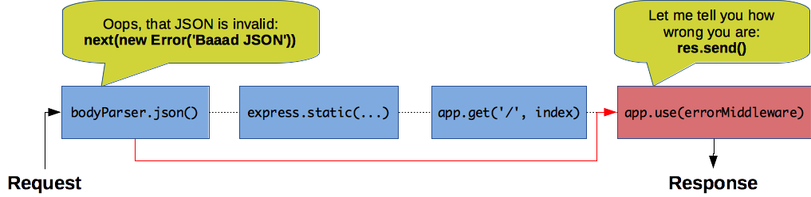

# Express

Learn the basics of [Express][express], a fast, unopinionated, minimalistic web framework for [Node.js][node].

**You will need**

* [Node.js][node] 12+
* [Google Chrome][chrome] (recommended, any browser with developer tools will do)
* [Postman][postman] (recommended, any tool that makes raw HTTP requests will do)

**Recommended reading**

* [npm](../npm/)
* [RESTful APIs](../rest/)

<!-- START doctoc generated TOC please keep comment here to allow auto update -->
<!-- DON'T EDIT THIS SECTION, INSTEAD RE-RUN doctoc TO UPDATE -->


- [What is Express?](#what-is-express)
  - [Core functionality](#core-functionality)
  - [Install the Express generator](#install-the-express-generator)
  - [Generate a skeleton application](#generate-a-skeleton-application)
  - [Install dependencies and run it](#install-dependencies-and-run-it)
  - [Browse the landing page](#browse-the-landing-page)
- [Application structure](#application-structure)
  - [The server component](#the-server-component)
  - [The client component](#the-client-component)
  - [The package.json file](#the-packagejson-file)
- [Live reload](#live-reload)
  - [Not having to restart manually](#not-having-to-restart-manually)
  - [Adding nodemon as a development dependency](#adding-nodemon-as-a-development-dependency)
  - [Making nodemon faster](#making-nodemon-faster)
- [Express middleware](#express-middleware)
  - [What is middleware?](#what-is-middleware)
  - [Middleware function signature](#middleware-function-signature)
  - [Plug in middleware functions](#plug-in-middleware-functions)
  - [Add your own](#add-your-own)
  - [Limiting middleware by HTTP method or URL path](#limiting-middleware-by-http-method-or-url-path)
  - [Controlling the middleware chain](#controlling-the-middleware-chain)
    - [Sending a response](#sending-a-response)
    - [Calling next again](#calling-next-again)
    - [Only one response can be sent](#only-one-response-can-be-sent)
    - [Serving the index page](#serving-the-index-page)
    - [Serving static files](#serving-static-files)
    - [Creating a user with a JSON payload](#creating-a-user-with-a-json-payload)
  - [Attaching data to the request in a middleware](#attaching-data-to-the-request-in-a-middleware)
  - [Asynchronous middleware](#asynchronous-middleware)
  - [How to deal with errors in middlewares](#how-to-deal-with-errors-in-middlewares)
    - [Error-handling middleware](#error-handling-middleware)
    - [Error-handling example](#error-handling-example)
    - [Error-handling middleware in the generated application](#error-handling-middleware-in-the-generated-application)
- [The request object](#the-request-object)
  - [Request example](#request-example)
  - [Getting the HTTP method, URL path and query parameters](#getting-the-http-method-url-path-and-query-parameters)
  - [Getting HTTP headers](#getting-http-headers)
  - [Getting the HTTP request body](#getting-the-http-request-body)
- [The response object](#the-response-object)
  - [Sending the response](#sending-the-response)
  - [Setting the HTTP status code](#setting-the-http-status-code)
  - [Sending HTTP response headers](#sending-http-response-headers)
  - [Chain response methods](#chain-response-methods)
- [Routing](#routing)
  - [Basic routing](#basic-routing)
  - [Routing middlewares](#routing-middlewares)
  - [Routers](#routers)
    - [Creating a router](#creating-a-router)
    - [Plugging in a router](#plugging-in-a-router)
    - [What's it for?](#whats-it-for)
    - [Plugging routers on routers](#plugging-routers-on-routers)
- [Resources](#resources)

<!-- END doctoc generated TOC please keep comment here to allow auto update -->


## What is Express?

<!-- slide-front-matter class: center, middle, image-header -->


A fast, unopinionated, **minimalist** web framework for Node.js


### Core functionality

<!-- slide-column 33 -->

**Routing**

Map HTTP methods and URLs to controllers

<!-- slide-column -->

**Middleware**

Intercept and modify HTTP requests and responses

<!-- slide-column -->

**Template engines**

Render views with pluggable template engines

<!-- slide-container -->

Express is **minimalist**: it doesn't provide much out of the box.
Use the many **middleware** packages at your disposal to build more complex applications.


### Install the Express generator

You can create an Express app from scratch, but we'll use [express-generator][express-generator] to quickly create an application skeleton:

```bash
$> npm install -g express-generator
```

It provides the `express` command:

```bash
$> express --help

  Usage: express [options] [dir]

  Options:

    -h, --help           output usage information
        --version        output the version number
    -e, --ejs            add ejs engine support
        --pug            add pug engine support
        --hbs            add handlebars engine support
    -H, --hogan          add hogan.js engine support
    -v, --view <engine>  add view <engine> support (ejs|hbs|hjs|jade|pug|...
    -c, --css <engine>   add stylesheet <engine> support (less|stylus|...
        --git            add .gitignore
    -f, --force          force on non-empty directory
```


### Generate a skeleton application

```bash
$> cd /path/to/projects
$> express my-app

   create : my-app
   create : my-app/package.json
   create : my-app/app.js
   create : my-app/public
   create : my-app/public/javascripts
   create : my-app/public/images
   create : my-app/public/stylesheets
   create : my-app/public/stylesheets/style.css
   create : my-app/routes
   create : my-app/routes/index.js
   create : my-app/routes/users.js
   create : my-app/views
   create : my-app/views/index.jade
   create : my-app/views/layout.jade
   create : my-app/views/error.jade
   create : my-app/bin
   create : my-app/bin/www

   install dependencies:
     $ cd my-app && npm install

   run the app:
     $ DEBUG=my-app:* npm start
```


### Install dependencies and run it

As instructed, let's install the dependencies:

```bash
$> cd my-app
$> npm install
...
npm notice created a lockfile as package-lock.json. You should commit this file.
added 99 packages from 139 contributors and audited 194 packages in 2.705s
...
```

And run it:

```bash
$> DEBUG=my-app:* npm start

> my-app@0.0.0 start /path/to/projects/my-app
> node ./bin/www

  my-app:server Listening on port 3000 +0ms
```


### Browse the landing page

Visit [http://localhost:3000](http://localhost:3000) in your browser and you should see the app running:

<p class='center'></p>

In the CLI where you're running the app, you should also see that your request was **logged**:

```txt
  my-app:server Listening on port 3000 +0ms
GET / 200 321.805 ms - -
GET /stylesheets/style.css 200 2.457 ms - -
```


## Application structure

<!-- slide-front-matter class: center, middle -->


What goes where


### The server component

Let's take a look at the generated files:

```txt
package.json
app.js
routes
  index.js
  users.js
bin
  www
```

* `package.json` is used to track **dependencies** with npm
* `app.js` is the **main script** that will create and configure the Express app
* `routes` contains files that define the app's **routes and controllers**
* `bin/www` is the **entrypoint** (the script you execute to launch the app)

The above files are executed **locally** on your machine when you develop,
or **on the server** when you deploy to a host.


### The client component

The rest of the files are:

```txt
views
  index.jade
  layout.jade
  error.jade
public
  javascripts
  images
  stylesheets
    style.css
```

* `views` contains the **page templates** (written in [Jade][jade] by default)
  that will be rendered to HTML by the server and **served to the browser**
* `public` contains **static files** that will be **served to the browser**

### The package.json file

Let's take a look at the generated `package.json`:

```json
{
  "name": "my-app",
  "version": "0.0.0",
  "private": true,
  "scripts": {
    "start": "node ./bin/www"
  },
  "dependencies": {
    "cookie-parser": "~1.4.4",
    "debug": "~2.6.9",
    "express": "~4.16.1",
    "http-errors": "~1.6.3",
    "jade": "~1.11.0",
    "morgan": "~1.9.1"
  }
}

```

* There is a **start script** configured to launch the app with `npm start`
* A few **dependencies** are pre-installed to provide basic web app functionality


## Live reload

<!-- slide-front-matter class: center, middle -->

<p class='center'></p>

### Not having to restart manually

> Unlike PHP with Apache, Node.js source code is not reinterpreted on-the-fly
> after you make modifications. Once it is loaded into memory, updating the
> source code has no effect.

[Nodemon][nodemon] is a **monitoring script** that can launch any Node.js app
for you, and **automatically restart it** when you make changes.

It's an npm package you can install globally:

```bash
$> npm install -g nodemon
$> cd /path/to/projects/my-app
$> DEBUG=my-app:* nodemon
[nodemon] 1.11.0
[nodemon] to restart at any time, enter rs
[nodemon] `watching: *.*`
[nodemon] `starting node ./bin/www`
  express-demo:server Listening on port 3000 +0ms
```

It will execute the `npm start` script defined in your `package.json` by default,
and restart the app if **any file changes**.

### Adding nodemon as a development dependency

Instead of installing it globally, it's good practice to install nodemon as a **development dependency** so that your whole team can use it without having to re-install it globally on their machine:

```bash
$> cd /path/to/projects/my-app
$> npm install --save-dev nodemon
```

Add an npm run script called `dev` in your `package.json` file:

```json
{
  "name": "my-app",
  "scripts": {
*   "dev": "nodemon",
    "start": "node ./bin/www"
  },
  ...
}
```

If you commit this change, anyone cloning your repository can run nodemon (after running `npm install`):

```bash
$> npm run dev
```

### Making nodemon faster

Nodemon watches **all file changes** by default; this consumes extra CPU time
and memory. You can make it watch **only relevant files** by adding a
`nodemon.json` configuration file in your project's directory:

```json
{
  "watch": [
    "app.js",
    "bin/www",
    "routes/**/*.js"
  ]
}
```

If you add **new directories** containing source code to your project, **do not
forget** to add them to this configuration file for nodemon to watch them as
well.


## Express middleware

<!-- slide-front-matter class: center, middle -->

Handling requests and responses


### What is middleware?

Middlewares are functions that are called **during the application's request-response cycle**.
They can:

* Execute any code
* Make changes to the request and the response objects
* End the request-response cycle
* Call the next middleware in the chain


### Middleware function signature

This is an example of a middleware function:

```js
function myMiddleware(req, res, next) {
  console.log('Hello World!');
  next();
}
```

Whenever a request is made to the Express application, it will receive:

* The current **request** object (HTTP method, path, headers, etc)
* The **response** object (can be used to configure and send the response)
* A `next()` function that **calls the next middleware**

So, middlewares form a **chain** and are executed **in order, one by one**.


### Plug in middleware functions

Open `app.js`:

```js
var app = express();

// view engine setup
app.set('views', path.join(__dirname, 'views'));
app.set('view engine', 'jade');

app.use(logger('dev'));
app.use(express.json());
app.use(express.urlencoded({ extended: false }));
app.use(cookieParser());
app.use(express.static(path.join(__dirname, 'public')));

app.use('/', indexRouter);
app.use('/users', usersRouter);
```

Middleware functions are **plugged into your application** by passing them to `app.use()`.
As you can see, several middlewares are already plugged in.


### Add your own

Add your new middleware function just below the creation of the Express application:

```js
var app = express();

app.use(function myMiddleware(req, res, next) {
  console.log('Hello World!');
  next();
});
```

In your CLI, stop the running application with Ctrl-C, restart it, and reload the page in your browser.
You should see your middleware working:

```bash
  my-app:server Listening on port 3000 +0ms
Hello World
GET / 304 287.312 ms - -
Hello World
GET /stylesheets/style.css 304 2.356 ms - -
```


### Limiting middleware by HTTP method or URL path

You can use a middleware only for HTTP requests on a specific path:

```js
app.use('/hello', function hello(req, res, next) {
  res.send('world');
});
```

Express also provides `.get`, `.post`, `.put`, etc to apply a middleware only for requests made with that HTTP method:

```js
app.post('/ping', function ping(req, res, next) {
  res.send('pong');
});
```

As you can see, you can use `res.send()` to send a response to the client.


### Controlling the middleware chain

Remove the call to `next()` in your first middleware function:

```js
app.use(function myMiddleware(req, res, next) {
  console.log('Hello World!');
});
```

Again, restart the app and reload the page in your browser.

The page is not loading... Why?

#### Sending a response

By not calling `next()`, you have **interrupted the middleware chain**:
the next middleware functions are not being executed, so no response is being sent to the client.

Update your middleware again, this time to send a response to the client:

```js
app.use(function myMiddleware(req, res, next) {
  console.log('Hello World!');
  res.send('Hello World!');
});
```

If you restart the app and reload the page in your browser, you will see that it works again.

But you're still not calling next, so all you see is the Hello World response.
**Other** middleware functions are **still not executed**.

#### Calling next again

Put the call to `next()` back in:

```js
app.use(function myMiddleware(req, res, next) {
  console.log('Hello World!');
  res.send('Hello World!');
  next();
});
```

Now there's an error... Why?

```bash
  my-app:server Listening on port 3000 +0ms
Hello World!
GET / 304 - ms - -
Error [ERR_HTTP_HEADERS_SENT]:
  Cannot set headers after they are sent to the client
    at ServerResponse.setHeader (_http_outgoing.js:455:11)
    at ServerResponse.header (.../express/lib/response.js:767:10)
    at ServerResponse.contentType (.../express/lib/response.js:595:15)
    at ServerResponse.send (.../express/lib/response.js:145:14)
    ...
```

#### Only one response can be sent

This is what happens:

* Your middleware function sends the Hello World response
* Another middleware a few lines below (`app.use('/', index);`) tries to send the index page

HTTP is a request-response protocol: **one request** will get **one response**.
Your code is trying to send *two responses for the same request*.

Remember that each middleware function can either:

* Modify the request/response and pass them along to the **next middleware** in the chain
* **OR send the response** to the client and interrupt the chain

This is an application of the [chain of responsibility][design-pattern-cor] design pattern.
Each middleware decides whether to handle the request and stop the chain, or pass it along.

#### Serving the index page

Let's look at a few examples:

```http
GET / HTTP/1.1
Host: localhost:3000
```


#### Serving static files

```http
GET /stylesheets/style.css HTTP/1.1
Host: localhost:3000
```


#### Creating a user with a JSON payload

```http
POST /users HTTP/1.1
Content-Type: application/json
Host: localhost:3000

{
  "name": "jdoe",
  "email": "john.doe@example.com"
}
```


### Attaching data to the request in a middleware

You can attach data to the request object:

```js
app.use(function(req, res, next) {
  req.hello = 'World';
  next();
});
```

Then use that in the next middleware:

```js
app.use(function(req, res, next) {
  console.log('Hello ' + req.hello); // "Hello World"
  next();
});
```

Many middlewares use this pattern to **provide data to the next middlewares**.
For example, the `express.json()` middleware parses the body of HTTP requests with the `application/json` content type,
and attaches it to the `req.body` property.


### Asynchronous middleware

You don't have to call `next()` right away.
You can do it after some asynchronous calls:

```js
app.use(function(req, res, next) {
  `fs.readFile`('data.txt', 'utf-8', `function(err, data) {`
    if (err) {
      return next(err);
    }

    req.myData = data;
    `next();`
  `}`);
});
```

The middleware chain will not proceed until you call `next()`.

#### Using promises

If your asynchronous call returns a promise, you can also use `async/await`:

```js
app.use(`async function`(req, res, next) {
  try {
    req.myData = `await fs.promises.readFile`('data.txt', 'utf-8');
    `next();`
  } catch (err) {
    next(err);
  }
});
```


### How to deal with errors in middlewares

Sometimes things go wrong:

* The user sends invalid data
* A database query fails (invalid query, connection issue, etc)

In that case, the proper thing to do with Express is to give the error to `next()`:

```js
app.use(function(req, res, next) {
  fs.readFile('data.txt', { encoding: 'utf-8' }, function(err, data) {
*   if (err) {
*     return next(err);
*   }

    req.myData = data;
    next();
  });
});
```

#### Error-handling with promises

If you are using `async/await`, remember to wrap your code in a `try/catch` to
catch any error that might occur, and give it to Express:

```js
app.use(async function(req, res, next) {
* try {
    req.myData = await fs.promises.readFile('data.txt', 'utf-8');
    next();
* } catch (err) {
*   next(err);
* }
});
```

#### Error-handling middleware

When you pass an error to `next()`, the following "normal" middleware functions are **not called**.
Only special **error-handling middleware functions** are called.

Compared to normal middleware functions, an error-handling middleware takes a fourth argument (the error):

```js
app.use(function(err, req, res, next) {
  res.send('Your request failed because: ' + err.message);
});
```

Simply declaring the function with these 4 arguments tells Express that this is an error-handling middleware function and not a normal one.

#### Error-handling example

As you can see in this example, when an error occurs in the first middleware,
other normal middlewares are **bypassed** until an **error-handling middleware** is found.

```http
POST /users HTTP/1.1
Content-Type: application/json
Host: localhost:3000

{
  "name": "bourne,
  JSON BOURNE IS DEAD
}
```



#### Error-handling middleware in the generated application

Take a look at `app.js`.
One error-handling middleware has already been plugged in for you:

```js
// error handler
app.use(function(err, req, res, next) {
  // set locals, only providing error in development
  res.locals.message = err.message;
  res.locals.error = req.app.get('env') === 'development' ? err : {};

  // render the error page
  res.status(err.status || 500);
  res.render('error');
});
```

It will render any error in a "pretty" error page.


## The request object

<!-- slide-front-matter class: center, middle -->

Using the `req` object


### Request example

How can we extract all the data from this request?

```http
POST /test/a/b?page=3&select=foo&select=bar HTTP/1.1
Content-Type: application/json
Host: localhost:3000
Authorization: Basic Zm9vOmJhcgo=

{
  "age": "24",
  "name": {
    "first": "John",
    "last": "Doe"
  }
}
```


### Getting the HTTP method, URL path and query parameters

Let's start with the request line:

```http
POST /test/a/b?page=3&select=foo&select=bar HTTP/1.1
```

This is how to get the different parts:

```js
app.all('/test/:param1/:param2', function(req, res, next) {
  console.log(req.method);  // "POST"
  console.log(req.path);    // "/test/a/b"
  console.log(req.params);  // { param1: "a", param2: "b" }
  console.log(req.query);   // { page: 3, select: [ "foo", "bar" ] }
  next();
});
```


### Getting HTTP headers

Now let's get the headers:

```http
Content-Type: application/json
Host: localhost:3000
Authorization: Basic Zm9vOmJhcgo=
```

You can get the **normalized** headers (all in lower case):

```js
app.all('/test/:param1/:param2', function(req, res, next) {
  console.log(req.headers);
  // {
  //   "content-type": "application/json",
  //   "host": "localhost:3000",
  //   "authorization": "Basic Zm9vOmJhcgo="
  // }
});
```

Or you can use `req.get()` to retrieve them in a case-insensitive manner:

```js
app.all('/test/:param1/:param2', function(req, res, next) {
  console.log(req.get('content-type')); // "application/json"
  console.log(req.get('Content-Type')); // "application/json"
});
```


### Getting the HTTP request body

Finally, let's get the request body:

```json
{
  "age": "24",
  "name": {
    "first": "John",
    "last": "Doe"
  }
}
```

As long as you have the `express.json()` middleware in your chain, it's as simple as this:

```js
app.all('/test/:param1/:param2', function(req, res, next) {
  console.log(req.body);
  // {
  //   "age": "24",
  //   "name": {
  //     "first": "John",
  //     "last": "Doe"
  //   }
  // }
});
```


## The response object

<!-- slide-front-matter class: center, middle -->

Using the `res` object


### Sending the response

Use `res.send()` for most use cases.
It will automatically determine the type of content your are sending and set the appropriate `Content-Type` header:

<!-- slide-column 45 -->

```js
res.send('Some text');
```

<!-- slide-column -->

```http
HTTP/1.1 200 OK
Content-Type: text/plain

Some text
```

<!-- slide-container -->

<!-- slide-column 45 -->

```js
res.send({
  some: 'object'
});
```

<!-- slide-column -->

```http
HTTP/1.1 200 OK
Content-Type: application/json

{
  "some": "object"
}
```


### Setting the HTTP status code

Use `res.status()` to set the status code:

<!-- slide-column -->

```js
res.status(201).send({
  some: 'object'
});
```

<!-- slide-column -->

```http
HTTP/1.1 201 Created
Content-Type: application/json

{
  "some": "object"
}
```

<!-- slide-container -->

If you have no body to send, use `res.sendStatus()`:

<!-- slide-column -->

```js
res.sendStatus(204);
```

<!-- slide-column -->

```http
HTTP/1.1 204 No Content
```


### Sending HTTP response headers

Use `res.set()` to set headers:

<!-- slide-column -->

```js
res.set('Header-1', 'foo');
res.set('Total-Books', 2);

res.send([
  'Catch-22',
  'Fahrenheit 451'
]);
```

<!-- slide-column -->

```http
HTTP/1.1 200 OK
Content-Type: application/json
Header-1: foo
Total-Books: 2

[
  "Catch-22",
  "Fahrenheit 451"
]
```

<!-- slide-container -->

Setting headers does not send the response, so you can do it in **multiple middlewares** as long as you do not call `res.send()`:

<!-- slide-column -->

```js
app.use(function(req, res, next) {
  res.set('Header-1', 'foo');
  next();
});

app.use(function(req, res, next) {
  res.set('Header-2', 'bar');
  res.send('Some text');
});
```

<!-- slide-column -->

```http
HTTP/1.1 200 OK
Content-Type: text/plain
Header-1: foo
Header-2: bar

Some text
```


### Chain response methods

You can also chain all the previous methods together:

<!-- slide-column -->

```js
res
  .set('Header-1', 'foo')
  .status(201)
  .send('Some text');
```

<!-- slide-column -->

```http
HTTP/1.1 201 Created
Content-Type: text/plain
Header-1: foo

Some text
```

<!-- slide-container -->

Express's `res` object is an application of the [builder][design-pattern-builder] design pattern.


## Routing

<!-- slide-front-matter class: center, middle -->

Mapping HTTP methods and URLs to handler functions


### Basic routing

As we've seen, basic routing can be applied to middleware by using `.get`, `.post`, etc and passing a path:

```js
app.get('/hello', function() {
  res.send('World');
});
```

You can also have dynamic parameters in your URLs:

```js
app.get('/authors/`:authorId`/books/`:bookId`', function(req, res, next) {
  res.send('Getting book ' + `req.params.bookId` + ' by ' + `req.params.authorId`);
});
```

Calling `http://localhost:3000/authors/24/books/33` will produce the following response:

```txt
Getting book 33 by 24
```


### Routing middlewares

A route can also contain **its own chain of successive middlewares**:

```js
function `getNameFromQuery`(req, res, next) {
  req.nameToSalute = req.query.name;
  next();
}

function `prepareSalutation`(req, res, next) {
  req.salutation = 'Hello ' + req.nameToSalute;
  next();
}

app.get('/hello', `getNameFromQuery`, `prepareSalutation`, function(req, res, next) {
  res.send(req.salutation);
});
```

These middleware functions are **only executed for that route** (`GET /hello` in this case).


### Routers

An Express [router][router] is an **isolated instance of middleware and routes**.
It's basically a **mini-app**.

Imagine that you have the following API routes:

<!-- slide-column -->

```
GET /authors
POST /authors
GET /authors/:id
PATCH /authors/:id
DELETE /authors/:id
```

<!-- slide-column -->

```
GET /books
POST /books
GET /books/:id
PATCH /books/:id
DELETE /books/:id
```

<!-- slide-container -->

You can define a **router** in a separate file for each of the two sets of routes,
that way you don't have one monolithic file with all your code in it.

#### Creating a router

```js
var express = require('express');

var booksRouter = express.Router();

booksRouter.`post('/'`, /*...*/);

booksRouter.`get('/'`, function(req, res, next) {
  var books = [ 'Catch-22', 'Fahrenheit 451' ];
  res.send(books);
});

booksRouter.`get('/:id'`, function(req, res, next) {
  var book = { title: 'Fahrenheit 451', year: 1953, author: 'Ray Bradburry' };
  res.send(book);
});

booksRouter.`put('/:id'`, /*...*/);
booksRouter.`delete('/:id'`, /*...*/);

module.exports = booksRouter;
```

Note that we don't use `/books` and `/books/:id` as paths but `/` and `/:id`.

#### Plugging in a router

A router behaves like a middleware function, so you can simply plug it into your application with `app.use()`:

```js
var app = express();

// Require the books router from the routes directory
var booksRouter = require('./routes/books');

app.use('/books', booksRouter);
```

Any request where the path starts with `/books` will be handled by that router,
with that path as a **prefix**:

<p class='center'></p>

<!-- slide-notes -->

The path passed to `app.use()` is **prepended to your router's paths**,
so your router's `/:id` route becomes `/books/:id` when plugged in like this.
It will handle HTTP requests to `/books/42`, for example.

#### What's it for?

Imagine a more complex API where **comments** can be attached to **multiple other resources**:

<!-- slide-column -->

**Comments on books**

```
POST /books/:id`/comments`
GET /books/:id`/comments`
PATCH /books/:id`/comments/:cid`
DELETE /books/:id`/comments/:cid`
```

<!-- slide-column -->

**Comments on movies**

```
POST /movies/:id`/comments`
GET /movies/:id`/comments`
PATCH /movies/:id`/comments/:cid`
DELETE /movies/:id`/comments/:cid`
```

<!-- slide-container -->

If you didn't have routers, you would have to define these 4 routes in **both** the **books' and movies' routers**:

```js
// In routes/books.js
booksRouter.`post('/:id/comments'`, /*...*/);
booksRouter.`get('/:id/comments'`, /*...*/);
booksRouter.`patch('/:id/comments/:cid'`, /*...*/);
booksRouter.`delete('/:id/comments/:cid'`, /*...*/);

// In routes/movies.js
moviesRouter.`post('/:id/comments'`, /*...*/);
moviesRouter.`get('/:id/comments'`, /*...*/);
moviesRouter.`patch('/:id/comments/:cid'`, /*...*/);
moviesRouter.`delete('/:id/comments/:cid'`, /*...*/);
```

#### Plugging routers on routers

With a router, you could **define these sub-paths once**:

```js
// Create a comments router to attach comments to
// the parent found by the specified middleware
module.exports = function `makeCommentsRouter`(findParentMiddleware) {
  const commentsRouter = express.Router();
  commentsRouter.`post('/'`, findParentMiddleware, /*...*/);
  commentsRouter.`get('/'`, findParentMiddleware, /*...*/);
  commentsRouter.`patch('/:cid'`, findParentMiddleware, /*...*/);
  commentsRouter.`delete('/:cid'`, findParentMiddleware, /*...*/);
  return commentsRouter;
};
```

Then plug the whole URL sub-structure onto both the **books' and movies' routers**:

```js
// In routes/books.js
const makeCommentsRouter = require('./comments');
booksRouter.`use('/books/:id/comments', makeCommentsRouter(findBook))`;

// In routes/movies.js
const makeCommentsRouter = require('./comments');
moviesRouter.`use('/movies/:id/comments', makeCommentsRouter(findMovie)`);
```


## Resources

* [API reference][api] (documentation for `app`, `req`, `res` and `Router`)
* [Routing][routing]
* [Using middleware][using-middleware]


[api]: http://expressjs.com/en/4x/api.html
[chrome]: https://www.google.com/chrome/
[design-pattern-builder]: https://sourcemaking.com/design_patterns/builder
[design-pattern-cor]: https://sourcemaking.com/design_patterns/chain_of_responsibility
[express]: https://expressjs.com
[express-generator]: https://www.npmjs.com/package/express-generator
[jade]: https://www.npmjs.com/package/jade
[using-middleware]: http://expressjs.com/en/guide/using-middleware.html
[node]: https://nodejs.org/en/
[nodemon]: https://www.npmjs.com/package/nodemon
[router]: http://expressjs.com/en/4x/api.html#router
[routing]: http://expressjs.com/en/guide/routing.html
[postman]: https://www.getpostman.com
