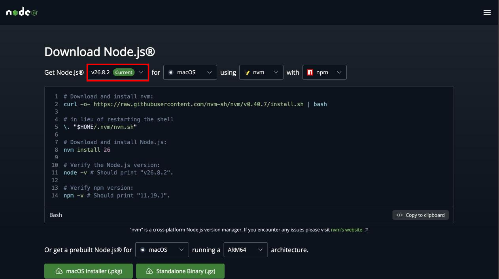
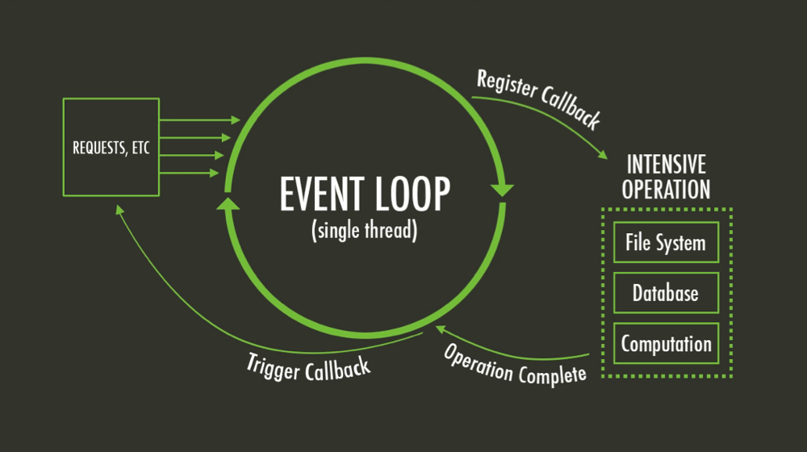
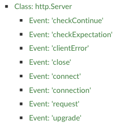

# Node.js Introduction

Learn how to use [Node.js][node], an asynchronous JavaScript runtime that can
run on your local machine or server.

**You will need**

- A Unix CLI

**Recommended reading**

- [Command line](https://archidep.ch/2026/course/101-command-line/)
- [JavaScript](../js/)

<!-- START doctoc generated TOC please keep comment here to allow auto update -->
<!-- DON'T EDIT THIS SECTION, INSTEAD RE-RUN doctoc TO UPDATE -->

- [What is Node.js?](#what-is-nodejs)
  - [Installation](#installation)
  - [Which Node.js version to choose?](#which-nodejs-version-to-choose)
  - [Install Node.js and make sure it works](#install-nodejs-and-make-sure-it-works)
  - [Create and execute a Node.js file](#create-and-execute-a-nodejs-file)
  - [Node.js modules](#nodejs-modules)
  - [Requiring core modules](#requiring-core-modules)
  - [A note on Node.js and CommonJS modules](#a-note-on-nodejs-and-commonjs-modules)
  - [Writing your own module](#writing-your-own-module)
  - [Importing local modules](#importing-local-modules)
  - [Importing specific exports](#importing-specific-exports)
  - [Export properties](#export-properties)
  - [Function as the main export](#function-as-the-main-export)
  - [Import syntax](#import-syntax)
  - [The `process` object](#the-process-object)
- [Synchronous vs. Asynchronous](#synchronous-vs-asynchronous)
  - [Synchronous code](#synchronous-code)
  - [Asynchronous code](#asynchronous-code)
  - [Non-blocking I/O](#non-blocking-io)
  - [Your Node.js code is single-threaded](#your-nodejs-code-is-single-threaded)
- [The event loop](#the-event-loop)
  - [A short reminder](#a-short-reminder)
    - [Reading a stack trace](#reading-a-stack-trace)
  - [The call stack](#the-call-stack)
  - [Stack overflow](#stack-overflow)
  - [Platform APIs](#platform-apis)
    - [The JavaScript runtime is single-threaded](#the-javascript-runtime-is-single-threaded)
  - [Other event-driven, non-blocking I/O architectures](#other-event-driven-non-blocking-io-architectures)
- [Awaiting promises](#awaiting-promises)
  - [`await` does not block the program](#await-does-not-block-the-program)
    - [Execution order solution](#execution-order-solution)
- [Spot the mistake](#spot-the-mistake)
  - [Mistake 1](#mistake-1)
    - [Mistake 1 result](#mistake-1-result)
    - [Mistake 1 issue](#mistake-1-issue)
    - [Mistake 1 correct implementation](#mistake-1-correct-implementation)
  - [Mistake 2](#mistake-2)
    - [Mistake 2 result](#mistake-2-result)
    - [Mistake 2 issue](#mistake-2-issue)
    - [Mistake 2 correct implementation](#mistake-2-correct-implementation)
  - [Mistake 3](#mistake-3)
    - [Mistake 3 result](#mistake-3-result)
    - [Mistake 3 issue](#mistake-3-issue)
    - [Mistake 3 correct implementation](#mistake-3-correct-implementation)
    - [Mistake 3 execution order](#mistake-3-execution-order)
- [The HTTP module](#the-http-module)
  - [Modern web language](#modern-web-language)
  - [Event emitters](#event-emitters)
- [Batteries included](#batteries-included)
- [Appendix: Node.js callbacks](#appendix-nodejs-callbacks)
  - [Where callbacks come from](#where-callbacks-come-from)
  - [The callback convention](#the-callback-convention)
  - [**Always** check for errors](#always-check-for-errors)
  - [Callback hell](#callback-hell)
- [Resources](#resources)

<!-- END doctoc generated TOC please keep comment here to allow auto update -->

## What is [Node.js][node]?

<!-- slide-front-matter class: center, middle, image-header -->

<p class='center'></p>

> "Node.js is an **asynchronous JavaScript runtime** built on Chrome's V8
> JavaScript engine. Node.js uses an **event-driven**, **non-blocking I/O**
> model that makes it lightweight and efficient."

> "Node.js is used on servers to develop fast, scalable web applications."

### Installation

<p class='center'></p>

### Which Node.js version to choose?

<p class='center'></p>

- There is **one major release per year**, in April. It is the **Current**
  release for 6 months: latest features, not recommended for production yet.
- In October, it becomes a [**l**ong **t**erm **s**upport (LTS)][node-lts]
  release: **Active** for a year, then in **Maintenance** (critical & security
  fixes), for **30 months** of support in total.
- Production applications should use an **LTS** release.

> Until Node.js 27, there were 2 releases per year and only **even-numbered**
> versions became LTS. That rule is still in a lot of documentation, but [it no
> longer applies][node-release-schedule].

### Install Node.js and make sure it works

Download and install Node.js now. Once the installation is done, you should be
able to display the version in your CLI:

```bash
$> node --version
v26.8.2
```

By simply running the `node` command without any arguments, you can also open an
interactive Node.js [REPL][repl] (note the prompt change indicating that you are
in the Node.js console):

```bash
$> node
> 1 + 2
3
```

Type `.exit` or press `Ctrl-C` twice to exit.

### Create and execute a Node.js file

Create a `script.mjs` file in a new `node-demo` project directory:

```js
function hello(name) {
  console.log(\`Hello ${name}!`);
}

hello('World');
```

Execute it by running it with the `node` executable:

```bash
$> cd /path/to/projects/node-demo

$> node script.mjs
Hello World!
```

Originally, JavaScript was only executable in web browsers,
but here you are running JavaScript code **locally with Node.js**, like you would other scripting languages (e.g. PHP, Ruby or Python).

### Node.js modules

Node.js code is organized in **modules**. These are the core modules available
to you out of the box (with those that you are likely to use in most
applications highlighted):

Assertion testing, Asynchronous context tracking, Async hooks, Buffer, C++
addons, C/C++ addons with Node-API, C++ embedder API, **Child processes**,
Cluster, Command-line options, Console, **Crypto**, Debugger, Deprecated APIs,
Diagnostics Channel, DNS, Domain, Environment variables, Errors, **Events**,
FFI, **File system**, Globals, **HTTP**, **HTTP/2**, **HTTPS**, Inspector,
Internationalization, Iterable Streams, Modules: CommonJS modules, Modules:
ECMAScript modules, Modules: `node:module` API, Modules: Packages, Modules:
TypeScript, Net, OS, **Path**, Performance hooks, Permissions, **Process**,
Punycode, **Query strings**, Readline, REPL, Report, Single executable
applications, SQLite, **Stream**, String decoder, **Test runner**, Timers,
**TLS/SSL**, Trace events, TTY, UDP/datagram, **URL**, Utilities, V8, Virtual
File System, VM, WASI, Web Crypto API, Web Streams API, Worker threads, Zlib.

> Refer to the [documentation][node-26-api] for more information.

### Requiring core modules

You can get a hold of Node.js's modules in your code by `import`-ing the name of
the module, prefixed with `node:`. The following example imports the [`os`
module][node-module-os], which provides operating system-related utility
methods:

```js
// Import the operating system core module
*import os from 'node:os';

function hello(name) {
  console.log(\`Hello ${name}!`);
* console.log(\`I am running on ${os.platform()}`);
}

hello('World');
```

This will log your platform:

```bash
$> node script.mjs
Hello World!
I am running on darwin
```

> Core modules also work without the prefix (`import os from 'os'`), which you
> will see a lot. Prefer `node:`: it says the module is built into Node.js.

### A note on Node.js and CommonJS modules

Node.js was first released in 2009, before [ECMAScript 2015's modules][esm] were
standardized. At the time, there were many module systems in the wild like
[CommonJS][commonjs] and [RequireJS][requirejs]. Node.js chose CommonJS, based
on `require`.

Node.js treats JavaScript code as CommonJS modules by default. You can [tell
Node.js to treat your code as ECMAScript modules][node-26-esm-enabling] by
naming your files with the `.mjs` extension instead of `.js`. If you have a
`package.json` file (we'll learn more about these later), you can also set the
`type` property to `module`.

This is what a CommonJS-based Node.js file used to look like:

```js
*const os = require('os');

function hello(name) {
  console.log(\`Hello ${name}!`);
  console.log(\`I am running on ${os.platform()}`);
}

hello('World');
```

> Since ECMAScript modules are now [natively supported][node-26-esm], we will
> use them rather than the obsolete `require`.

### Writing your own module

Let's say we want to extract the `hello` function to another module.
Create a `utils.mjs` file:

```js
import os from 'node:os';

// Export the function so that you can use
// it when importing this file
export function hello(name) {
  console.log(\`Hello ${name}!`);
  console.log(\`I am running on ${os.platform()}`);
}
```

`export`-ing things is what allow you to `import` them from other files.

### Importing local modules

You also use `import` for your own module, but instead of just a name you have
to provide a **file path** (relative or absolute). Modify `script.mjs` as
follows:

```js
// Import everything from the utils.mjs file in the current directory
*import * as utils from './utils.mjs';

// Use the exported function
utils.hello('World');
```

It should still work:

```bash
$> node script.mjs
Hello World!
I am running on darwin
```

### Importing specific exports

You don't have to import everything. You can also import only what you need
using a syntax similar to a [destructuring
assignment][destructuring-assignment]:

```js
// Import specific exports from the utils.mjs file in the current directory
*import { hello } from './utils.mjs';

// Use the exported function
hello('World');
```

It should still work:

```bash
$> node script.mjs
Hello World!
I am running on darwin
```

### Export properties

You can `export` whatever you want:

```js
`export const theMeaningOfLife` = 42;
```

And use it where it is required:

```js
import { hello`, theMeaningOfLife` } from './utils.mjs';
hello('World');
*console.log(\`The meaning of life is ${theMeaningOfLife}`);
```

This will print:

```bash
$> node script.mjs
Hello World!
I am running on darwin
*The meaning of life is 42
```

### Function as the main export

Some modules only export a function instead of an object with properties.
Add a `doIt.mjs` file:

```js
// Define a default export
`export default` function() {
  console.log('Doing it');
};
```

Modify `script.mjs`:

```js
*import doIt from './doIt.mjs';
import { hello, theMeaningOfLife } from './utils.mjs';
hello('World');
console.log(\`The meaning of life is ${theMeaningOfLife}`);
*doIt();
```

The additional text `Doing it` will be logged as well.

### Import syntax

A short summary on how to import things:

| Statement                                  | Effect                                                                                                     |
| :----------------------------------------- | :--------------------------------------------------------------------------------------------------------- |
| `import os from 'node:os'`                 | Import the **core Node.js module** named `os`                                                              |
| `import lodash from 'lodash'`              | Import the **npm package** named `lodash` (more on that later)                                             |
| `import * as foo from './foo.mjs'`         | Import everything exported by the `foo.mjs` file in the current directory (relative to the current file)   |
| `import { a, b } from './foo.mjs'`         | Import specific exports from the `foo.mjs` file in the current directory (relative to the current file)    |
| `import * as baz from './foo/bar/baz.mjs'` | Import everything exported by the `baz.mjs` file in the `foo/bar` directory (relative to the current file) |
| `import * as qux from '../../qux.mjs'`     | Import everything exported by the `qux.mjs` file two directories above (relative to the current file)      |

### The `process` object

The global [`process`][node-process] object describes the running process. There
is nothing to import; it is always available:

```js
// The command line arguments (the first two are always
// the node executable and the script being run).
console.log(process.argv);

// The environment variables.
console.log(process.env.HOME);
```

```bash
$> node script.mjs foo bar
[ '/path/to/node', '/path/to/node-demo/script.mjs', 'foo', 'bar' ]
/Users/jdoe
```

> You will need `process.argv` for the exercises, and `process.env` later in
> the course to configure your application.

## Synchronous vs. Asynchronous

<!-- slide-front-matter class: center, middle -->

### Synchronous code

Basic JavaScript code is synchronous.

It means that only one command or function can be executed at a time.

```js
function getRandomNumber() {
  return Math.random();
}

console.log('Hello');

const result = getRandomNumber();

console.log(\`Result: ${result}`);
console.log('End of program');
```

Code executes **sequentially**:

```txt
Hello
Result: 0.12438
End of program
```

The call to `getRandomNumber()` blocks the thread until its execution is complete.

### Asynchronous code

With asynchronous code, some operations are executed **in parallel**:

```js
import fs from 'node:fs/promises';

console.log('Hello');

// List the files at the root of the file system
fs.readdir('/').then(result => {
  console.log(\`Files: ${result.join(', ')}`);
  console.log('Done');
});

console.log('End of program');
```

Code execution is **not sequential**:

```txt
Hello
End of program
Files: file.txt, dir, other-file.txt
Done
```

How does this work?

### Non-blocking I/O

`fs.readdir` does not return the list of files. It returns a
[**promise**][promise]: an object representing a result that is **not there
yet**.

```
  fs.readdir(path[, options]) → Promise
```

- With synchronous code, the call blocks the thread until it is done
- With asynchronous code, the rest of the code **keeps executing**; you tell the
  promise what to do `.then()`, and Node.js runs it **when the result is ready**

Under the hood, Node.js lists the directory in a separate thread,
then settles the promise when it's ready.

This is called **non-blocking I/O**, because I/O operations never block your code while they are in progress:

- Database access
- File system access
- HTTP requests
- Etc.

### Your Node.js code is single-threaded

Although I/O operations are non-blocking, **your code always executes in a single thread**:

```js
import fs from 'node:fs/promises';
let fileCount = 0;

fs.readdir('/').then(result => {
  `fileCount = fileCount + result.length`;
  console.log(\`Files listed: ${fileCount}`);
});

console.log(\`End of program: ${fileCount}`);
```

This will **always** log `End of program: 0` first, then `Files listed: N`.

Even if the operating system is very fast and the directory is listed _instantaneously_,
Node.js **guarantees** that the last line, the `End of program` log, will be executed first.

Asynchronous callbacks will always wait for **synchronous code** to finish executing.

## The event loop

The [event loop][event-loop] is the main component of JavaScript's concurrency model,
and is what produces the behavior described in the previous slides.

<p class='center'></p>

<!-- slide-notes -->

- Event loop:
  - Run the initial script (which will register callbacks)
  - Get the next event in the queue
  - Invoke the registered callbacks in sequence
  - Delegate I/O operations to the Node platform (in separate, non-blocking threads)

### A short reminder

Before explaining the event loop,
you must be clear on something.

You've probably often encountered something that looks like this while programming
(not this specific message, but similar-looking blocks of lines in a console):

```
Error: Both arguments must be numbers
    at add (file:///path/to/project/st-demo.mjs:3:11)
    at compute (file:///path/to/project/st-demo.mjs:10:10)
    at demo (file:///path/to/project/st-demo.mjs:14:17)
    at file:///path/to/project/st-demo.mjs:18:1
    at ModuleJob.run (node:internal/modules/esm/module_job:569:25)
    at async node:internal/modules/esm/loader:650:26
    at async asyncRunEntryPointWithESMLoader (node:internal/modules/run_main:101:5)
```

What is this called and what does it mean?

#### Reading a stack trace

```
Error: Both arguments must be numbers
    at `add` (file:///path/to/project/`st-demo.mjs:3`:11)
    at `compute` (file:///path/to/project/`st-demo.mjs:10`:10)
    at `demo` (file:///path/to/project/`st-demo.mjs:14`:17)
    at file:///path/to/project/`st-demo.mjs:18`:1
```

```js
function add(a, b) {
  if (typeof a !== 'number' || typeof b !== 'number') {
*   throw new Error('Both arguments must be numbers');
  }

  return a + b;
}

function compute(a, b, op) {
* return op(a, b);
}

function demo() {
* const value = compute(2, 'foo', add);
  console.log(value);
}

*demo();
```

### The call stack

The [**call stack**][stack] is how the JavaScript interpreter keeps track of its place in a script that calls multiple functions.

- When called, a function is added to the top of the stack.
- Functions called by that function are added to the stack further up.
- When a function finishes, it is taken off the stack and the interpreter resumes where it left off.

<!-- slide-column -->

**What will the stack look like** as the following code is executed?

[Check it out with Loupe](http://latentflip.com/loupe/?code=ZnVuY3Rpb24gbXVsdGlwbHkoYSwgYikgewogIHJldHVybiBhICogYjsKfQoKZnVuY3Rpb24gc3F1YXJlKGEpIHsKICByZXR1cm4gbXVsdGlwbHkoYSwgYSk7Cn0KCmZ1bmN0aW9uIHByaW50U3F1YXJlKGEpIHsKICBjb25zdCBzcXVhcmVkID0gc3F1YXJlKGEpOwogIGNvbnNvbGUubG9nKHNxdWFyZWQpOwp9CgpwcmludFNxdWFyZSg0KTs%3D!!!PGJ1dHRvbj5DbGljayBtZSE8L2J1dHRvbj4%3D)

<!-- slide-column 60 -->

```js
function multiply(a, b) {
  return a * b;
}

function square(a) {
  return multiply(a, a);
}

function printSquare(a) {
  const squared = square(a);
  console.log(squared);
}

printSquare(4);
```

### Stack overflow

Taking into account the fact that the call stack has a limited size
(unfortunately, your computer does not have infinite memory),
**what will happen to the call stack** when the following code is run?

```js
function eagerlyMultiply(a) {
  return a * eagerlyMultiply(a);
}

eagerlyMultiply();
```

[Check it out with Loupe](http://latentflip.com/loupe/?code=ZnVuY3Rpb24gZWFnZXJseU11bHRpcGx5KGEpIHsKICByZXR1cm4gYSAqIGVhZ2VybHlNdWx0aXBseShhKTsKfQoKZWFnZXJseU11bHRpcGx5KCk7!!!PGJ1dHRvbj5DbGljayBtZSE8L2J1dHRvbj4%3D)

### Platform APIs

The **JavaScript engine** (V8, both in Node.js and in Chrome) **can only run one
thing at a time**.

But some functions are not run by the JavaScript engine;
they are run by the underlying platform: Node.js's C++ and [libuv][libuv] layer for Node.js, or the web browser for a website.
For example:

- `readFile` (Node.js API)
- `fetch` (Node.js & Web API)
- `setTimeout` (Node.js & Web API)

<!-- slide-column -->

**What will happen** when the following code is run?

[Check it out with Loupe](http://latentflip.com/loupe/?code=ZnVuY3Rpb24gcHJvZ3JhbSgpIHsKICBjb25zb2xlLmxvZygnU3RhcnQgb2YgcHJvZ3JhbScpOwoKICBzZXRUaW1lb3V0KGZ1bmN0aW9uIGNiKCkgewogICAgY29uc29sZS5sb2coJ0hlbGxvJyk7CiAgfSwgNTAwMCk7CgogIGNvbnNvbGUubG9nKCdFbmQgb2YgcHJvZ3JhbScpOwp9Cgpwcm9ncmFtKCk7!!!PGJ1dHRvbj5DbGljayBtZSE8L2J1dHRvbj4%3D)

<!-- slide-column 60 -->

```js
function program() {
  console.log('Start of program');

  setTimeout(function cb() {
    console.log('Hello');
  }, 5000);

  console.log('End of program');
}

program();
```

#### The JavaScript runtime is single-threaded

What does this mean?

Let's use `setTimeout` as before, but this time set the value of the timeout to zero.
It should call the function right away, right?

<!-- slide-column -->

**What will happen** when the following code is run?

[Check it out with Loupe](http://latentflip.com/loupe/?code=ZnVuY3Rpb24gcHJvZ3JhbSgpIHsKICBjb25zb2xlLmxvZygnU3RhcnQgb2YgcHJvZ3JhbScpOwoKICBzZXRUaW1lb3V0KGZ1bmN0aW9uIGNiKCkgewogICAgY29uc29sZS5sb2coJ0hlbGxvJyk7CiAgfSwgMCk7CgogIGNvbnNvbGUubG9nKCdFbmQgb2YgcHJvZ3JhbScpOwp9Cgpwcm9ncmFtKCk7!!!PGJ1dHRvbj5DbGljayBtZSE8L2J1dHRvbj4%3D)

<!-- slide-column 60 -->

```js
function program() {
  console.log('Start of program');

  setTimeout(function cb() {
    console.log('Hello');
  }, `0`);

  console.log('End of program');
}

program();
```

### Other event-driven, non-blocking I/O architectures

Node.js is not the only tool to use an event-driven architecture with an event loop.
Similar mechanisms are used in other frameworks and tools:

- JavaScript running in the browser also runs on an event loop
- [Event Machine][event-machine] (Ruby event-processing library)
- [nginx][nginx] (web server written in C with an event-driven architecture)
- [Twisted][twisted] (Python event-driven networking engine)

## Awaiting promises

[`async/await`][async] is syntax on top of promises. Inside an `async` function
— or at the [top level of an ECMAScript module][tla] — `await` gives you the
**value** a promise will produce, and lets you write asynchronous code that
reads top-to-bottom:

<!-- slide-column -->

**With `.then()`**

```js
import fs from 'node:fs/promises';

fs.readdir('/').then(files => {
  console.log(files.length);
});
```

<!-- slide-column -->

**With `await`**

```js
import fs from 'node:fs/promises';

const files = await fs.readdir('/');
console.log(files.length);
```

<!-- slide-container -->

This is how you will write asynchronous code for the rest of this course.

### `await` does not block the program

`await` suspends **the function it is in**. It does **not** stop Node.js from
doing other things. Here are two functions that each `await` in the middle:

```js
import { setTimeout as sleep } from 'node:timers/promises';

async function work(name, ms) {
  console.log(\`${name}: start`);
  `await sleep(ms)`;
  console.log(\`${name}: end`);
}
```

<!-- slide-column -->

**What does this print?**

```js
await work('A', 200);
await work('B', 100);
```

<!-- slide-column -->

**And this?**

```js
await Promise.all([
  work('A', 200),
  work('B', 100)
]);
```

#### Execution order solution

<!-- slide-column -->

```js
await work('A', 200);
await work('B', 100);
```

```txt
A: start
A: end
B: start
B: end
```

Total: **300ms**

`A` is **fully finished** before `B` is even started: you `await` the first call
before making the second one.

<!-- slide-column -->

```js
await Promise.all([
  work('A', 200),
  work('B', 100)
]);
```

```txt
A: start
*B: start
*B: end
A: end
```

Total: **200ms**

Both calls are **started** before anything is awaited, so they overlap — and
`B` finishes **first**, because it is faster.

<!-- slide-container -->

> Waiting for two things that do not depend on each other one after the other is
> the most common performance mistake in asynchronous code.

## Spot the mistake

<!-- slide-front-matter class: center, middle -->

Three bugs you will write at least once.

### Mistake 1

What's wrong with this code?

```js
import fs from 'node:fs/promises';

// Save a salutation into hello.txt
await fs.writeFile('hello.txt', 'Hello Bob!', 'utf-8');

// Read the salutation from hello.txt
const salutation = fs.readFile('hello.txt', 'utf-8');

// Log the salutation read from hello.txt
console.log(salutation);
console.log(salutation.toUpperCase());
```

Save it to a file and run it with `node` to see the issue.

#### Mistake 1 result

If you save the script to `bug1.mjs` and execute it, this is what will happen:

```bash
$> node bug1.mjs
*Promise { <pending> }

TypeError: salutation.toUpperCase is not a function
    at file:///path/to/projects/node-demo/bug1.mjs:11:24
```

#### Mistake 1 issue

The `await` is **missing** on the second call:

```js
const salutation = `fs.readFile`('hello.txt', 'utf-8');
```

- `fs.readFile()` returns a **promise**, not a string, and that promise is what
  is stored in `salutation`.
- The file is being read, but **nothing is waiting for the result**.
- `Promise { <pending> }` is Node.js telling you exactly that: you are looking
  at a promise that has no value yet.

> Whenever you see `Promise { <pending> }` in your output, or `undefined` where
> you expected data, **look for a missing `await`**.

#### Mistake 1 correct implementation

```js
import fs from 'node:fs/promises';

// Save a salutation into hello.txt
await fs.writeFile('hello.txt', 'Hello Bob!', 'utf-8');

// Read the salutation from hello.txt
const salutation = `await` fs.readFile('hello.txt', 'utf-8');

// Log the salutation read from hello.txt
console.log(salutation);
console.log(salutation.toUpperCase());
```

```bash
$> node bug1.mjs
Hello Bob!
HELLO BOB!
```

### Mistake 2

This is an example of **error handling**.

The intended behavior is that if the file does not exist, the text
`Could not read file because: some error` should be printed, otherwise it
should print the contents of the file in upper case.

```js
import fs from 'node:fs/promises';

let text;
try {
  text = await fs.readFile('file-that-does-not-exist.txt', 'utf-8');
} catch (err) {
  console.warn(\`Could not read file because: ${err.message}`);
}

// Log the contents in upper case
console.log(text.toUpperCase());
```

What's wrong with this code?

#### Mistake 2 result

If you save this script in `bug2.mjs` and execute it, this is what will happen:

```bash
$> node bug2.mjs
Could not read file because: ENOENT: no such file or directory, open 'file-...'

TypeError: Cannot read properties of undefined (reading 'toUpperCase')
    at file:///path/to/projects/node-demo/bug2.mjs:11:18
```

As expected, we see the `Could not read file because: ...` log.
But we also see another **unexpected error** and its stack trace.

#### Mistake 2 issue

The error is caught, but execution of the script is **not stopped**. After the
`catch` block, the code carries on with `text` still `undefined`:

```js
let text;
try {
  text = await fs.readFile('file-that-does-not-exist.txt', 'utf-8');
} catch (err) {
* console.warn(\`Could not read file because: ${err.message}`);
}

// Log the contents in upper case
*console.log(text.toUpperCase());
```

**Catching an error is not the same as handling it.** Once you are in the
`catch` block, you must decide what happens next.

#### Mistake 2 correct implementation

Put the code that **needs the result** inside the `try` block:

```js
import fs from 'node:fs/promises';

try {
  const text = await fs.readFile('file-that-does-not-exist.txt', 'utf-8');
  // Log the contents in upper case
  `console.log(text.toUpperCase());`
} catch (err) {
  // Handle the error
  console.warn(\`Could not read file because: ${err.message}`);
}
```

Or stop the script in the `catch` block:

```js
} catch (err) {
  console.warn(\`Could not read file because: ${err.message}`);
  `process.exit(1);`
}
```

### Mistake 3

This code is supposed to save a file for each name, then log when it is done.

```js
import fs from 'node:fs/promises';

async function save(name) {
  const contents = \`Hello, ${name}!`;
  await fs.writeFile(\`${name}.txt`, contents, 'utf-8');
  console.log(\`Saved ${name}.txt`);
}

const names = ['alice', 'bob', 'carol'];

names.forEach(`async` name => {
  await save(name);
});

console.log('All names saved!');
```

What's wrong with this code?

#### Mistake 3 result

```bash
$> node bug3.mjs
*All names saved!
Saved bob.txt
Saved carol.txt
Saved alice.txt
```

The program claims to be done **before** anything has been saved.

> Run it again and the 3 `Saved ...` lines may come out in a different order.
> We will come back to that.

#### Mistake 3 issue

`forEach` knows nothing about promises.

- Your `async` callback returns a **promise** each time it is called.
- `forEach` **throws those promises away** and returns immediately.
- So `console.log('All names saved!')` runs while the saves are still pending.

> This applies to `forEach` specifically. `map` also returns immediately, but it
> **gives you back** the array of promises, which is what makes the fix below
> possible.

#### Mistake 3 correct implementation

<!-- slide-column -->

**One at a time**, with `for...of`:

```js
`for (const name of names) {`
  await save(name);
`}`

console.log('All names saved!');
```

Use this when each operation depends on the previous one.

<!-- slide-column -->

**All at once**, with `Promise.all`:

```js
await Promise.all(
  `names.map(name => save(name))`
);

console.log('All names saved!');
```

Use this when they are independent — it is much faster.

<!-- slide-container -->

In both versions, `All names saved!` is now logged **last**. But do we know in
which order the 3 `Saved ...` logs will appear?

#### Mistake 3 execution order

<!-- slide-column -->

**`for...of`: yes**

```txt
Saved alice.txt
Saved bob.txt
Saved carol.txt
All names saved!
```

Each `save()` is **fully finished** before the next one starts, so the logs
always follow the order of the array.

<!-- slide-column -->

**`Promise.all`: no**

```txt
*Saved carol.txt
*Saved alice.txt
*Saved bob.txt
All names saved!
```

All 3 saves are running **at the same time**. Whichever write finishes first
logs first, and that changes from one run to the next.

<!-- slide-container -->

> `Promise.all` **does** preserve order where it matters: the array it resolves
> with is in the same order as the promises you gave it, no matter which one
> finished first. It is the **side effects** — logs, writes — that are not
> ordered.

## The HTTP module

<!-- slide-front-matter class: center, middle -->

### Modern web language

Node.js provides a ready-to-use HTTP server. Thanks to the event loop, this one
small server can handle many clients concurrently.

```js
// Import the HTTP module.
import http from 'node:http';

// Define configuration properties.
const hostname = '127.0.0.1';
const port = 3000;

// Create an HTTP server that will respond to
// all requests with "Hello World" in plain text.
const server = http.createServer(function(req, res) {
  res.statusCode = 200;
  res.setHeader('Content-Type', 'text/plain');
  res.end('Hello World\n');
});

// Run the server on the configured host and port.
// Register a callback function to be notified when
// the server has started successfully.
server.listen(port, hostname, function() {
  console.log(\`Server running at http://${hostname}:${port}/`);
});
```

### Event emitters

Many Node.js objects are [event emitters][node-event-emitter].
You can register callback functions to **react** to these events:

<!-- slide-column 30 -->



<!-- slide-column 70 -->

```js
server.on('connection', function(socket) {
  console.log(\`${socket.remoteAddress} connected`);
});

server.on('request', function(message) {
  console.log(\`${message.url} requested`);
});
```

## Batteries included

The `node` command does more than run a file. A few [options][node-cli] that
used to require extra tools:

| Option       | What it does                                                     |
| :----------- | :--------------------------------------------------------------- |
| `--watch`    | Restart the program whenever a source file changes                |
| `--env-file` | Load environment variables from a `.env` file into `process.env`  |
| `--test`     | Run test files with Node's built-in test runner                   |

```bash
$> node --watch --env-file=.env script.js
```

We will come back to the first two later in the course, when we have something
worth restarting and something worth configuring.

> Most tutorials you will find still reach for a package to do these things
> (`nodemon`, `dotenv`). That advice predates these options.

## Appendix: Node.js callbacks

<!-- slide-front-matter class: center, middle -->

You will not need callbacks for your project, but you will meet them in older
code, so here is what they look like.

### Where callbacks come from

Similarly to ECMAScript modules, [promises][promise] were not yet part of
ECMAScript when Node.js was first released in 2009. The handling of
asynchronous operations was built on **callback functions** instead: you pass a
function in, and Node.js calls it back when the operation is done.

```js
import fs from 'node:fs';

// List the files at the root of the file system
fs.readdir('/', `function(err, result) {`
  // handle error or result
`}`);
```

Most core modules still offer this style alongside their [promise-based
version][node-fs-promises]. You will run into it in older npm packages, in
documentation and in almost every StackOverflow answer written before 2018.

### The callback convention

Node.js callback functions almost always have this signature:

```
  function(err, result)
```

1. Either the operation **failed**:

- `err` contains an **error** describing the problem
- `result` is `null` or `undefined`

2. Or the operation **succeeded**:

- `err` is `null` or `undefined`
- `result` contains the **result** of the operation

There is no `try/catch` here: an error is just **the first argument**, and
nothing forces you to look at it.

### **Always** check for errors

Since nothing forces you to check `err`, forgetting to is the classic bug:

```js
import fs from 'node:fs';

fs.readFile('name.txt', 'utf-8', function(err, data) {
* if (err) {
*   `return` console.warn(\`Could not read the file because: ${err.message}`);
* }

  console.log(\`Hello ${data}`);
});
```

If you forget to check `err`, this code logs `Hello undefined` when the
operation fails (e.g. the file doesn't exist).

Do not forget the `return` either, or use `else`, to ensure that your "success"
code is not run when an error occurs — the same mistake as
[Mistake 2](#mistake-2), in callback form.

### Callback hell

The result is only available **inside** the callback, so chaining operations
means nesting them:

```js
fs.writeFile('hello.txt', 'Hello Bob!', 'utf-8', `function(err) {`
  if (err) {
    return console.warn(\`Could not write file: ${err.message}`);
  }

  fs.readFile('hello.txt', 'utf-8', `function(err, data) {`
    if (err) {
      return console.warn(\`Could not read file: ${err.message}`);
    }

    console.log(data);
  `}`);
`}`);
```

The same thing with `await`:

```js
await fs.writeFile('hello.txt', 'Hello Bob!', 'utf-8');
console.log(await fs.readFile('hello.txt', 'utf-8'));
```

> This is why promises and `async/await` were added to the language.

## Resources

**Documentation**

- [Core modules (26.x)][node-26-api]

**Further reading**

- [Introduction to Node.js][node-intro]
- [JavaScript Concurrency Model and Event Loop][event-loop]
- [Understanding the Node.js Event Loop][event-loop-strongloop]
- [Philip Roberts: What the heck is the event loop anyway? (YouTube)][event-loop-wth]

[async]: https://developer.mozilla.org/en-US/docs/Web/JavaScript/Reference/Statements/async_function
[commonjs]: https://nodejs.org/docs/latest-v26.x/api/modules.html
[destructuring-assignment]: https://developer.mozilla.org/en-US/docs/Web/JavaScript/Reference/Operators/Destructuring_assignment
[esm]: https://developer.mozilla.org/en-US/docs/Web/JavaScript/Guide/Modules
[event-loop]: https://developer.mozilla.org/en-US/docs/Web/JavaScript/EventLoop
[event-loop-strongloop]: http://strongloop.com/strongblog/node-js-event-loop/
[event-loop-wth]: https://www.youtube.com/watch?v=8aGhZQkoFbQ
[event-machine]: http://rubyeventmachine.com
[libuv]: https://libuv.org
[node-intro]: https://nodejs.org/en/learn/getting-started/introduction-to-nodejs
[nginx]: https://www.nginx.com
[node]: https://nodejs.org/en/
[node-26-api]: https://nodejs.org/docs/latest-v26.x/api/documentation.html
[node-26-esm]: https://nodejs.org/docs/latest-v26.x/api/esm.html#modules-ecmascript-modules
[node-26-esm-enabling]: https://nodejs.org/docs/latest-v26.x/api/esm.html#enabling
[node-cli]: https://nodejs.org/docs/latest-v26.x/api/cli.html
[node-event-emitter]: https://nodejs.org/docs/latest-v26.x/api/events.html
[node-fs-promises]: https://nodejs.org/docs/latest-v26.x/api/fs.html#promises-api
[node-lts]: https://nodejs.org/en/about/previous-releases
[node-release-schedule]: https://nodejs.org/en/blog/announcements/evolving-the-nodejs-release-schedule
[node-module-os]: https://nodejs.org/docs/latest-v26.x/api/os.html
[node-process]: https://nodejs.org/docs/latest-v26.x/api/process.html
[promise]: https://developer.mozilla.org/en-US/docs/Web/JavaScript/Reference/Global_Objects/Promise
[repl]: https://en.wikipedia.org/wiki/Read%E2%80%93eval%E2%80%93print_loop
[requirejs]: https://requirejs.org
[stack]: https://developer.mozilla.org/en-US/docs/Glossary/Call_stack
[tla]: https://developer.mozilla.org/en-US/docs/Web/JavaScript/Reference/Operators/await#top_level_await
[twisted]: https://twisted.org
