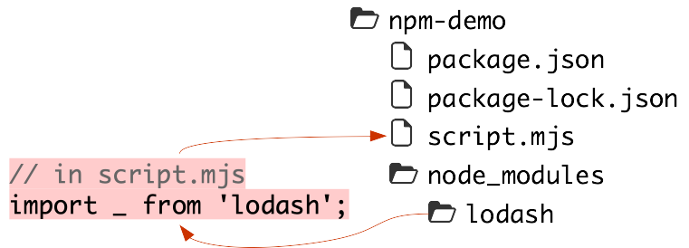
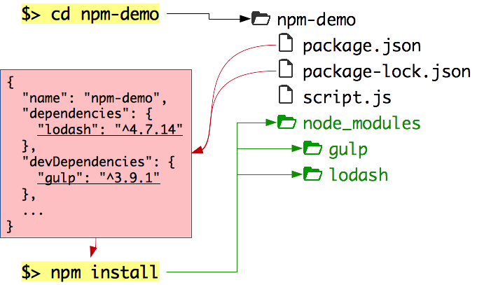
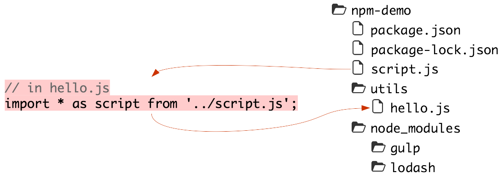
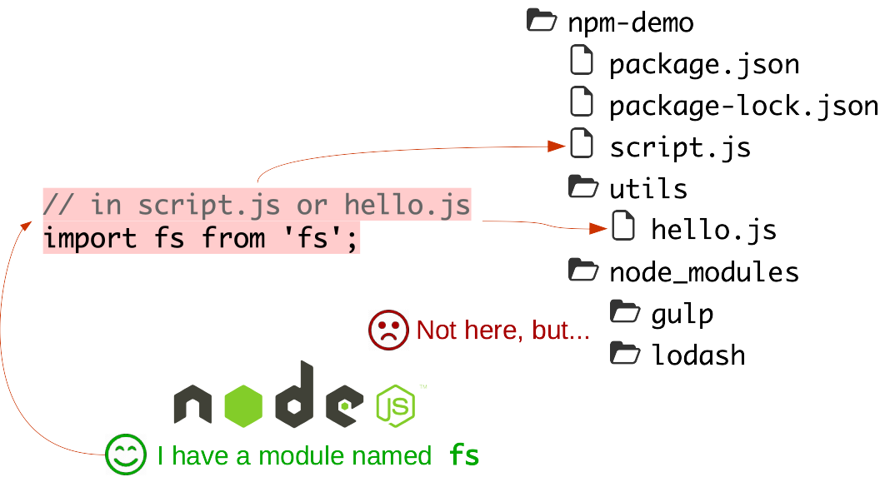

# npm

Learn how to use [npm][npm], the most popular [Node.js][node] package manager, and the largest code registry in the world with over a quarter million packages.

**You will need**

* A Unix CLI

**Recommended reading**

* [Command line](../cli/)
* [Node.js](../node/)

<!-- START doctoc generated TOC please keep comment here to allow auto update -->
<!-- DON'T EDIT THIS SECTION, INSTEAD RE-RUN doctoc TO UPDATE -->

- [What is npm?](#what-is-npm)
  - [Why use a package manager?](#why-use-a-package-manager)
  - [There are many package managers](#there-are-many-package-managers)
  - [The npm registry](#the-npm-registry)
  - [npm packages](#npm-packages)
- [The npm command](#the-npm-command)
  - [How do I use it?](#how-do-i-use-it)
- [npm init](#npm-init)
  - [Interactively create a package.json file](#interactively-create-a-packagejson-file)
  - [What it looks like](#what-it-looks-like)
- [npm install](#npm-install)
  - [Installing packages](#installing-packages)
  - [Using installed packages](#using-installed-packages)
  - [Importing ECMAScript Modules](#importing-ecmascript-modules)
  - [Tracking installed packages](#tracking-installed-packages)
    - [Re-installing dependencies manually](#re-installing-dependencies-manually)
  - [npm saves the dependencies to package.json](#npm-saves-the-dependencies-to-packagejson)
  - [npm install with a package.json](#npm-install-with-a-packagejson)
  - [The --save-dev option](#the---save-dev-option)
  - [The --production option](#the---production-option)
  - [The --global option](#the---global-option)
    - [Global packages](#global-packages)
    - [Where are global packages installed?](#where-are-global-packages-installed)
- [Common mistakes](#common-mistakes)
  - [Missing `package.json` file](#missing-packagejson-file)
  - [Wrong directory](#wrong-directory)
- [The behavior of `import`](#the-behavior-of-import)
  - [Requiring your own modules](#requiring-your-own-modules)
  - [Requiring packages installed with npm](#requiring-packages-installed-with-npm)
    - [Global packages installed with npm](#global-packages-installed-with-npm)
  - [Importing core Node.js modules](#importing-core-nodejs-modules)
  - [Import summary](#import-summary)
- [More complex packages](#more-complex-packages)
    - [Run a web app](#run-a-web-app)
- [npm scripts](#npm-scripts)
  - [Lifecycle scripts](#lifecycle-scripts)
  - [The scripts property](#the-scripts-property)
  - [Custom scripts](#custom-scripts)
- [npm publish](#npm-publish)
  - [What do I need to publish?](#what-do-i-need-to-publish)
  - [Publishing](#publishing)
  - [Avoiding publication](#avoiding-publication)
- [Resources](#resources)

<!-- END doctoc generated TOC please keep comment here to allow auto update -->


## What is npm?

<!-- slide-front-matter class: center, middle -->

> "npm is the **package manager** for JavaScript. Find, share, and reuse packages of code from hundreds of thousands of developers — and assemble them in powerful new ways."


### Why use a package manager?

* Use code or applications that **other developers** have written to solve particular problems
* Regularly check if there are any **upgrades** and download them
* **Share** your own code with the community or **reuse** code across projects

<p class='center'></p>


### There are many package managers

For programming languages:

| Package manager | Language |
| :---            | :---     |
| Composer        | PHP      |
| Maven           | Java     |
| npm             | Node.js  |
| RubyGems        | Ruby     |
| pip             | Python   |

For operating systems:

| Package manager                   | OS                   |
| :---                              | :---                 |
| Advanced Package Tool (apt)       | Debian, Ubuntu       |
| Homebrew (brew)                   | Mac OS X             |
| Yellowdog Updater, Modified (yum) | RHEL, Fedora, CentOS |


### The npm registry

The [npm registry][npm] hosts over a million packages of reusable code — the largest code registry in the world.


It contains [more than double the next most populated package registry][modulecounts] (the Apache Maven repository).


### npm packages

An npm **package** or **module** is basically a **reusable piece of code** that you can install and use.
It's composed of:

* A directory with some files in it (what will be installed)
* A [package.json][package.json] file with some metadata about the package:

```json
{
  "name": "my-project",
  "version": "1.3.2",
  "description": "It's great",
  "main": "index.js",
  "scripts": {
    "start": "node index.js"
  },
  "dependencies": {
    "express": "^4.13.3",
    "lodash": "~3.1.0"
  },
  "keywords": [ "awesome", "project" ],
  "author": "John Doe <john.doe@example.com>",
  "license": "MIT"
}
```


## The npm command

<!-- slide-front-matter class: center, middle -->

npm is also a set of command line tools that work together with the registry.


### How do I use it?

```bash
$> npm help

Usage: npm <command>

where <command> is one of:
    access, adduser, bin, bugs, c, cache, completion, config,
    ddp, dedupe, deprecate, dist-tag, docs, edit, explore, get,
    `help`, help-search, i, `init`, `install`, install-test, it, link,
    list, ln, login, logout, ls, outdated, owner, pack, ping,
    prefix, prune, `publish`, rb, rebuild, repo, restart, root,
    run, run-script, s, se, search, set, shrinkwrap, star,
    stars, `start`, stop, t, tag, team, test, tst, un, uninstall,
    unpublish, unstar, up, update, v, version, view, whoami

npm <cmd> -h     quick help on <cmd>
npm -l           display full usage info
npm help <term>  search for help on <term>
npm help npm     involved overview
```


## npm init

<!-- slide-front-matter class: center, middle -->

Create a new package


### Interactively create a package.json file

Create and move into a new project directory:

```bash
$> cd /path/to/projects
$> mkdir npm-demo
$> cd npm-demo
```

Run `npm init`:

```bash
$> npm init
This utility will walk you through creating a package.json file.
It only covers the most common items, and tries to guess sensible defaults.

...

Press ^C at any time to quit.
name: (npm-demo)
version: (1.0.0)
description: npm demo
entry point: (index.js)
test command:
git repository:
keywords: npm, demo
author: John Doe <john.doe@example.com>
license: (ISC)
```


### What it looks like

```json
{
  "name": "npm-demo",
  "version": "1.0.0",
  "description": "npm demo",
  "main": "index.js",
  "scripts": {
    "test": "echo \"Error: no test specified\" && exit 1"
  },
  "keywords": [ "npm", "demo" ],
  "author": "John Doe <john.doe@example.com>",
  "license": "ISC"
}
```

Read the [documentation][package.json] to find out everything you can configure in this file.


## npm install

<!-- slide-front-matter class: center, middle -->

Install a package


### Installing packages

When you install a package with the `npm install` command, npm creates a `node_modules` directory in the current working directory.
It then saves the downloaded packages in that directory:

```bash
$> npm install lodash
npm-demo@1.0.0 /path/to/projects/npm-demo
└── lodash@4.17.4

$> ls
node_modules package.json package-lock.json

$> ls node_modules
lodash
```

<p class='center'></p>


### Using installed packages

Any script that is in the same directory as `package.json` and `node_modules`
can `import` the installed packages:

Create a `script.mjs` file in the project and run it::

<!-- slide-column -->

```js
import _ from 'lodash';

let numbers = [ 1, 1, 2, 3, 2 ];
console.log(_.uniq(numbers));
```

<!-- slide-column 40 -->

```bash
$> node script.mjs
[ 1, 2, 3 ]
```

<!-- slide-container -->

You have used the `uniq` function from the `lodash` package,
which returns an array with its duplicate elements removed.

<p class='center'></p>

### Importing ECMAScript Modules

As was mentionned during the presentation on Node, we will be using ECMAScript
modules during this course.

In your `package.json`, add the following property:

```json
type: "module"
```

This will allow you to use ECMAScript modules without having to name your files
with the `.mjs` extension. You can now rename it to `.js`.

```bash
$> mv script.mjs script.js
$> node script.js
[ 1, 2, 3 ]
```

### Tracking installed packages

Now remove the `node_modules` directory:

```bash
rm -fr node_modules
```

Your script should no longer work since the `lodash` package is no longer available:

```bash
$> node script.js
node:internal/errors:464
    ErrorCaptureStackTrace(err);
    ^

Error [ERR_MODULE_NOT_FOUND]: Cannot find package 'lodash'
Error: Cannot find module 'lodash'
```

Deleting the `node_modules` directory is not a common real-world scenario,
However, it can get quite large, so most people have it in their `.gitignore`
file in their Git repositories, since you just have to run `npm install` to get
your dependencies back.

That means that when **cloning** your project, your colleagues **won't** get the `node_modules` directory.

#### Re-installing dependencies manually

<!-- slide-column -->

You could reinstall all these packages manually, but imagine that you have **dozens** of dependencies.
Do you want each team member to **re-type** the same `npm install` commands all the time?

This is the typical list of dependencies for a **barebones** Express web application:

<!-- slide-column 20 -->


### npm saves the dependencies to package.json

npm automatically tracks the dependencies you install. There is a `--save`
option that was required for that in earlier versions, but it's the default now.

When you ran `npm install`, a new `dependencies` section should have appeared in your `package.json` file:

<p class='center'></p>


### npm install with a package.json

Delete the `node_modules` directory again and simply run `npm install` with no other arguments:

```bash
$> rm -fr node_modules
$> npm install
npm-demo@1.0.0 /path/to/projects/npm-demo
└── lodash@4.17.4
```

npm has installed the `lodash` package again.
If you **don't specify a package** to install,
the install command will **read** the `package.json` and **install the dependencies** listed there.

<!-- slide-column 40 -->

The `package-lock.json` also contains the precise versions of the packages you installed.
That way, your entire team can reproduce the exact same package structure as on your machine.

<!-- slide-column -->


### The --save-dev option

You often use two kinds of packages:

* **Production dependencies** that your program or application needs to run (e.g. a database client)
* **Development dependencies** that you use during development but do not need to run the application (e.g. a live-reload server)

<!-- slide-column 45 -->

Use the `--save-dev` option to save your development dependencies:

```bash
$> npm install --save-dev gulp
```

A `devDependencies` section will be added to your `package.json`:

<!-- slide-column -->

<p class='center'></p>


### The --production option

<!-- slide-column 45 -->

Use `npm install` with no arguments when you want to install **all dependencies**, including development dependencies:

```bash
$> npm install
```



<!-- slide-column -->

Use the `--omit=dev` flag to install **only production dependencies** (e.g. on a server, where you will only need to *run* your program and will not need your development tools):

```bash
$> npm install --omit=dev
```


### The --global option

Some packages can be installed **globally**.
Use the `--global` or `-g` option:

```bash
$> npm install --global http-server
```

**If you get an `EACCES` error**, execute the following commands:

```bash
$> mkdir ~/.npm-global
$> npm config set prefix '~/.npm-global'
$> echo 'export PATH=~/.npm-global/bin:$PATH' >> ~/.bash_profile
```

Re-open your CLI, then retry the installation, which should work this time:

```bash
$> npm install --global http-server
```

#### Global packages

Global packages are **NOT installed in the current directory**.
They are installed in a **system directory** and are **global to your machine**
(you don't need to re-install them for each project).

<p class='center'></p>

<!-- slide-column -->

Global packages provide **new commands** that you can use in your CLI.
In this case, the `http-server` package is a simple command-line HTTP server:

<!-- slide-column -->

```bash
$> http-server
Starting up http-server, serving ./
Available on:
  http://127.0.0.1:8080
  http://10.178.123.132:8080
Hit CTRL-C to stop the server
```

#### Where are global packages installed?

Use `npm config` to find out where global packages are installed on your machine:

```bash
$> npm config get prefix
/usr/local

$> ls /usr/local/lib/node_modules
http-server
```

You *cannot* use `--save` with global packages.
You **do not need to** since they are global to your machine and available anywhere in the CLI.
However, if you **reset** your machine or Node.js installation, you will have to **reinstall** manually.


## Common mistakes

<!-- slide-front-matter class: center, middle -->

It happens.


### Missing `package.json` file

If you **forgot to add a `package.json` file** to your project,
npm will still install your dependencies and log a warning that is **easy to miss**:

```bash
$> npm install --save lodash
npm WARN `saveError` ENOENT: no such file or directory,
  open '/path/to/projects/npm-demo/package.json'
/path/to/projects/npm-demo
└── lodash@4.17.4
```

<p class='center'></p>


### Wrong directory

Npm will not know if you are in the **wrong directory**.
It will simply **install packages there**.
Of course, you will **NOT** be able to `import` them from your project:

<p class='center'></p>


## The behavior of `import`

<!-- slide-front-matter class: center, middle -->


### Requiring your own modules

You can import your own Node.js scripts with **relative file paths**:

<p class='center'></p>

<p class='center'></p>

Beware of **circular dependencies**.
In this example, you should do one or the other, **not both**.


### Requiring packages installed with npm

You can import packages you installed with npm **using their name**:

<p class='center'></p>

#### Global packages installed with npm

You **CANNOT** import packages you installed **globally** with npm.
They provide **new commands** but cannot be used in code:

<p class='center'></p>


### Importing core Node.js modules

When you give **a name** to `import`, it will also look for a **core Node.js
modules** with that name:

<p class='center'></p>


### Import summary

Statement                                | What is imported
:--------------------------------------- | :-------------------------------------------------------------------------------------------------------------------------------------------------------------------------------
`import * as script from './script'`     | The `script.js` file in the current directory (relative to the file using `import`)
`import * as script from './dir/script'` | The `script.js` file in the `dir` directory (relative to the file using `import`)
`import * as script from '../script'`    | The `script.js` file in the parent directory (relative to the file using `import`)
`import myModule from 'my-module'`       | The `my-module` npm package (if found in `node_modules` in the same directory *or any parent directory*)<br/>**OR**<br/>The core Node.js module with that name (if there is one)


## More complex packages

The npm registry has many packages, some small, some big.
Let's install [Express][express], a web application framework:

```bash
$> npm install express
```

Create a `server.js` file with the following content:

```js
import express from 'express';

const app = express();

app.get('/', function(req, res) {
  res.send('Hello ' + req.query.name + '!');
});

app.listen(3000, function () {
  console.log('Example app listening on port 3000!');
});
```

#### Run a web app

Run the file:

```bash
$> node server.js
Example app listening on port 3000!
```

Visit [http://localhost:3000?name=World](http://localhost:3000?name=World) in your browser.

You have a running web application server!


## npm scripts

<!-- slide-front-matter class: center, middle -->

npm is not only a package *installer*, it's also a package **manager**


### Lifecycle scripts

For programs that can be **long-lived**, such as **web servers**,
npm defines **standard lifecycle scripts** that you should use to control your program.
Here are a few:

Command       | Purpose
:---          | :---
`npm start`   | Run your program
`npm stop`    | Stop your program
`npm restart` | Restart your program
`npm test`    | Run automated tests for your program

Read the [documentation][npm-scripts] to learn about all the available lifecycle scripts.


### The scripts property

<!-- slide-column 40 -->

In order for your program to **respond** to these `npm start|stop|...` commands,
the corresponding **scripts** should be defined in your `package.json` file under the `scripts` property:

<!-- slide-column -->

<p class='center'></p>

<!-- slide-container -->

Here we define that running `npm start` should **execute** the `server.js` file with Node.js:

```bash
$> npm start

> npm-demo@1.0.0 start /path/to/projects/npm-demo
> node server.js

Example app listening on port 3000!
```


### Custom scripts

You can also define your own custom scripts:

```json
{
  "name": "npm-demo",
* "scripts": {
*   "hello": "echo Hello World"
* },
  ...
}
```

These scripts are run with `npm run <script>`:

```bash
$> npm run hello

> npm-demo@1.0.0 serve-static /path/to/projects/npm-demo
> echo Hello World

*Hello World
```


## npm publish

<!-- slide-front-matter class: center, middle -->

Publish a package


### What do I need to publish?

You need a valid `package.json` file.

You should also set the `main` property:

```json
{
  "name": "npm-demo",
* "main": "./script.js",
  ...
}
```

When people `import` your module after installing it, they will get the same
result as if they had imported that file.


### Publishing

Publishing is as simple as running the `npm publish` command in the directory where your `package.json` file is located:

```js
npm publish
```

You of course need an **npm account**.

You can only publish a new package if the package name is not already used.
Names are registered on a **first-come, first-serve** basis.


### Avoiding publication

Sometimes you write code that should not be published:

* A website (something that makes no sense to `import`)
* A private package with confidential information

In these cases, you can set the `private` property of the `package.json` file:

```json
{
  "name": "npm-demo",
* "private": true,
  ...
}
```

`npm publish` will then refuse to publish the package.


## Resources

**Documentation**

* [Command line usage][npm-cli]
* [package.json][package.json]


[express]: https://expressjs.com
[modulecounts]: http://www.modulecounts.com
[node]: https://nodejs.org
[npm]: https://www.npmjs.com
[npm-cli]: https://docs.npmjs.com/cli/npm
[npm-fix-permissions]: https://docs.npmjs.com/getting-started/fixing-npm-permissions
[npm-scripts]: https://docs.npmjs.com/misc/scripts
[package.json]: https://docs.npmjs.com/files/package.json
