# npm

Learn how to use [npm][npm], the most popular [Node.js][node] package manager, and the largest code registry in the world with over 4 million packages.

**You will need**

* A Unix CLI

**Recommended reading**

* [Command line](https://archidep.ch/2026/course/101-command-line/)
* [Node.js](../node/)

<!-- START doctoc generated TOC please keep comment here to allow auto update -->
<!-- DON'T EDIT THIS SECTION, INSTEAD RE-RUN doctoc TO UPDATE -->

- [What is npm?](#what-is-npm)
  - [Why use a package manager?](#why-use-a-package-manager)
  - [There are many package managers](#there-are-many-package-managers)
  - [The npm registry](#the-npm-registry)
  - [npm packages](#npm-packages)
- [The npm command](#the-npm-command)
  - [How do I use it?](#how-do-i-use-it)
- [npm init](#npm-init)
  - [Interactively create a package.json file](#interactively-create-a-packagejson-file)
  - [What it looks like](#what-it-looks-like)
- [npm install](#npm-install)
  - [Installing packages](#installing-packages)
  - [Using installed packages](#using-installed-packages)
  - [Importing ECMAScript Modules](#importing-ecmascript-modules)
  - [Tracking installed packages](#tracking-installed-packages)
    - [Re-installing dependencies manually](#re-installing-dependencies-manually)
  - [npm saves the dependencies to package.json](#npm-saves-the-dependencies-to-packagejson)
  - [npm install with a package.json](#npm-install-with-a-packagejson)
  - [The --save-dev option](#the---save-dev-option)
  - [The --omit=dev option](#the---omitdev-option)
  - [The --global option](#the---global-option)
    - [Global packages](#global-packages)
    - [Where are global packages installed?](#where-are-global-packages-installed)
  - [Running a package without installing it](#running-a-package-without-installing-it)
- [Versions and updates](#versions-and-updates)
  - [Semantic versioning](#semantic-versioning)
  - [Version ranges](#version-ranges)
  - [The lock file](#the-lock-file)
  - [npm ci](#npm-ci)
  - [Keeping dependencies up to date](#keeping-dependencies-up-to-date)
  - [Known vulnerabilities](#known-vulnerabilities)
  - [The engines field](#the-engines-field)
- [Common mistakes](#common-mistakes)
  - [Missing `package.json` file](#missing-packagejson-file)
  - [Wrong directory](#wrong-directory)
- [The behavior of `import`](#the-behavior-of-import)
  - [Importing your own modules](#importing-your-own-modules)
  - [Importing packages installed with npm](#importing-packages-installed-with-npm)
    - [Global packages installed with npm](#global-packages-installed-with-npm)
  - [Importing core Node.js modules](#importing-core-nodejs-modules)
  - [Import summary](#import-summary)
- [More complex packages](#more-complex-packages)
    - [Run a web app](#run-a-web-app)
- [npm scripts](#npm-scripts)
  - [Lifecycle scripts](#lifecycle-scripts)
  - [The scripts property](#the-scripts-property)
  - [Custom scripts](#custom-scripts)
- [Publishing, and not publishing](#publishing-and-not-publishing)
- [Resources](#resources)

<!-- END doctoc generated TOC please keep comment here to allow auto update -->


## What is npm?

<!-- slide-front-matter class: center, middle -->

> "npm is the **package manager** for JavaScript. Find, share, and reuse packages of code from hundreds of thousands of developers — and assemble them in powerful new ways."


### Why use a package manager?

* Use code or applications that **other developers** have written to solve particular problems
* Regularly check if there are any **upgrades** and download them
* **Share** your own code with the community or **reuse** code across projects

<p class='center'></p>


### There are many package managers

For programming languages:

| Package manager | Language |
| :---            | :---     |
| Composer        | PHP      |
| Maven           | Java     |
| npm             | Node.js  |
| RubyGems        | Ruby     |
| pip             | Python   |

For operating systems:

| Package manager                   | OS                   |
| :---                              | :---                 |
| Advanced Package Tool (apt)       | Debian, Ubuntu       |
| Homebrew (brew)                   | Mac OS X             |
| Yellowdog Updater, Modified (yum) | RHEL, Fedora, CentOS |


### The npm registry

The [npm registry][npm] hosts over 4 million packages of reusable code — the largest code registry in the world.

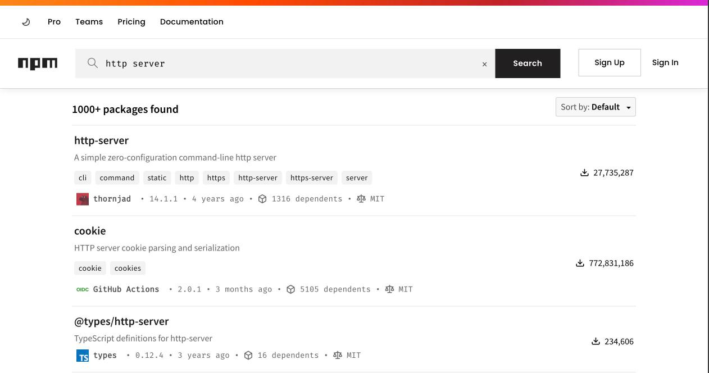

It contains more than double the number of packages of the next most populated
package registry (the Apache Maven repository).


### npm packages

An npm **package** or **module** is basically a **reusable piece of code** that you can install and use.
It's composed of:

* A directory with some files in it (what will be installed)
* A [package.json][package.json] file with some metadata about the package:

```json
{
  "name": "my-project",
  "version": "1.3.2",
  "description": "It's great",
  "type": "module",
  "main": "index.js",
  "scripts": {
    "start": "node index.js"
  },
  "dependencies": {
    "express": "^5.2.1",
    "lodash": "^4.18.1"
  },
  "keywords": [ "awesome", "project" ],
  "author": "John Doe <john.doe@example.com>",
  "license": "MIT"
}
```


## The npm command

<!-- slide-front-matter class: center, middle -->

npm is also a set of command line tools that work together with the registry.


### How do I use it?

```bash
$> npm help
npm <command>

Usage:

npm `install`        install all the dependencies in your project
npm `install` <foo>  add the <foo> dependency to your project
npm `test`           run this project's tests
npm `run` <foo>      run the script named <foo>
npm <command> -h   quick help on <command>

All commands:

    access, adduser, approve-scripts, audit, bugs, cache, ci,
    completion, config, dedupe, deny-scripts, deprecate, diff,
    dist-tag, docs, doctor, edit, exec, explain, explore,
    find-dupes, fund, get, help, help-search, `init`, `install`,
    install-ci-test, install-scripts, install-test, link, ll,
    login, logout, ls, org, outdated, owner, pack, ping, pkg,
    prefix, profile, prune, `publish`, query, rebuild, repo,
    restart, root, run, sbom, search, set, shrinkwrap, stage,
    star, stars, `start`, stop, team, test, token, trust,
    undeprecate, uninstall, unpublish, unstar, update, version,
    view, whoami
```


## npm init

<!-- slide-front-matter class: center, middle -->

Create a new package


### Interactively create a package.json file

Create a new project directory and run `npm init` in it:

```bash
$> cd /path/to/projects
$> mkdir npm-demo
$> cd npm-demo

$> npm init
This utility will walk you through creating a package.json file.
...
Press ^C at any time to quit.
package name: (npm-demo)
version: (1.0.0)
description: npm demo
entry point: (index.js)
test command:
git repository:
keywords: npm, demo
author: John Doe <john.doe@example.com>
license: (ISC)
*type: (commonjs) module
```

> Answer **`module`** to the last question: this course uses ECMAScript modules.


### What it looks like

```json
{
  "name": "npm-demo",
  "version": "1.0.0",
  "description": "npm demo",
  "keywords": [ "npm", "demo" ],
  "license": "ISC",
  "author": "John Doe <john.doe@example.com>",
* "type": "module",
  "main": "index.js",
  "scripts": {
    "test": "echo \"Error: no test specified\" && exit 1"
  }
}
```

Read the [documentation][package.json] to find out everything you can configure in this file.


## npm install

<!-- slide-front-matter class: center, middle -->

Install a package


### Installing packages

When you install a package with the `npm install` command, npm creates a `node_modules` directory in the current working directory.
It then saves the downloaded packages in that directory:

```bash
$> npm install lodash

added 1 package, and audited 2 packages in 708ms

found 0 vulnerabilities

$> ls
node_modules package-lock.json package.json

$> ls node_modules
lodash
```

<p class='center'>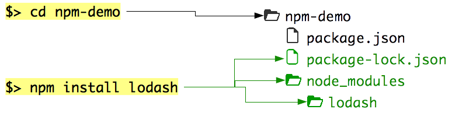</p>


### Using installed packages

Any script that is in the same directory as `package.json` and `node_modules`
can `import` the installed packages:

Create a `script.mjs` file in the project and run it:

<!-- slide-column -->

```js
import _ from 'lodash';

let numbers = [ 1, 1, 2, 3, 2 ];
console.log(_.uniq(numbers));
```

<!-- slide-column 40 -->

```bash
$> node script.mjs
[ 1, 2, 3 ]
```

<!-- slide-container -->

You have used the `uniq` function from the `lodash` package,
which returns an array with its duplicate elements removed.

<p class='center'>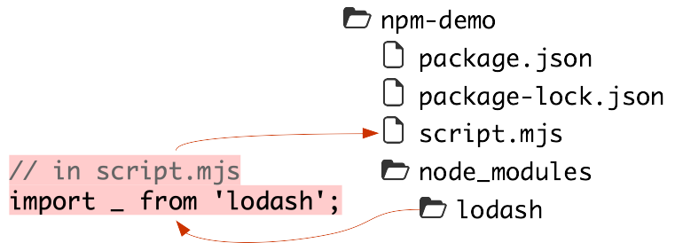</p>

### Importing ECMAScript Modules

As was mentioned during the presentation on Node, we will be using ECMAScript
modules during this course.

If you answered `commonjs` to `npm init` (or have an older project), change the
`type` property of your `package.json`:

```json
{
  "name": "npm-demo",
* "type": "module",
  ...
}
```

This allows you to use ECMAScript modules without having to name your files with
the `.mjs` extension. You can now rename your script to `.js`:

```bash
$> mv script.mjs script.js
$> node script.js
[ 1, 2, 3 ]
```

### Tracking installed packages

Now remove the `node_modules` directory:

```bash
rm -fr node_modules
```

Your script should no longer work since the `lodash` package is no longer available:

```bash
$> node script.js
Error [ERR_MODULE_NOT_FOUND]: Cannot find package 'lodash' imported from
/path/to/projects/npm-demo/script.js
    at packageResolve (node:internal/modules/esm/resolve:784:25)
    ...
```

Deleting the `node_modules` directory is not a common real-world scenario.
However, it can get quite large, so most people have it in their `.gitignore`
file in their Git repositories, since you just have to run `npm install` to get
your dependencies back.

That means that when **cloning** your project, your colleagues **won't** get the `node_modules` directory.

#### Re-installing dependencies manually

<!-- slide-column -->

You could reinstall all these packages manually, but imagine that you have **dozens** of dependencies.
Do you want each team member to **re-type** the same `npm install` commands all the time?

This is the typical list of dependencies for a **barebones** Express web application:

<!-- slide-column 20 -->

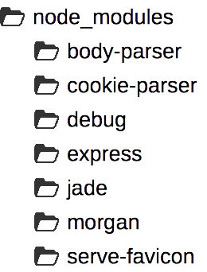


### npm saves the dependencies to package.json

npm automatically tracks the dependencies you install. There is a `--save`
option that was required for that in earlier versions, but it's the default now.

When you ran `npm install`, a new `dependencies` section should have appeared in your `package.json` file:

<p class='center'>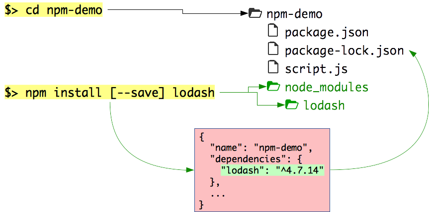</p>


### npm install with a package.json

Delete the `node_modules` directory again and simply run `npm install` with no other arguments:

```bash
$> rm -fr node_modules
$> npm install

added 1 package, and audited 2 packages in 608ms
```

npm has installed the `lodash` package again.
If you **don't specify a package** to install,
the install command will **read** the `package.json` and **install the dependencies** listed there.

<!-- slide-column 40 -->

The `package-lock.json` also contains the precise versions of the packages you installed.
That way, your entire team can reproduce the exact same package structure as on your machine.

<!-- slide-column -->

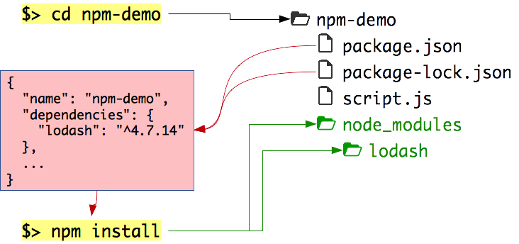


### The --save-dev option

You often use two kinds of packages:

* **Production dependencies** that your program or application needs to run (e.g. a database client)
* **Development dependencies** that you use during development but do not need to run the application (e.g. a tool that restarts your server when you edit a file)

<!-- slide-column 45 -->

Use the `--save-dev` option to save your development dependencies:

```bash
$> npm install --save-dev nodemon
```

A `devDependencies` section will be added to your `package.json`:

<!-- slide-column -->

<p class='center'>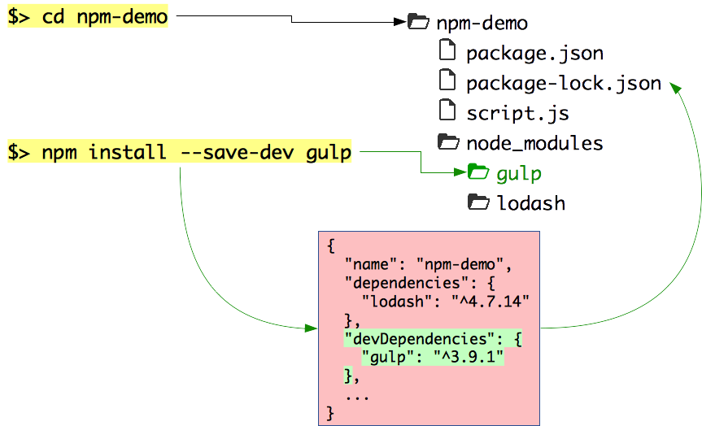</p>

<!-- slide-container -->

> The diagram uses `gulp`, an older build tool, as its development dependency.
> The mechanism is the same whichever package you install.


### The --omit=dev option

<!-- slide-column 45 -->

Use `npm install` with no arguments when you want to install **all dependencies**, including development dependencies:

```bash
$> npm install
```

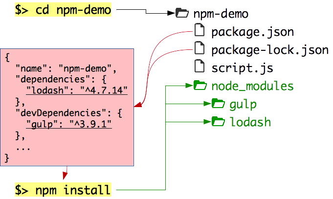

<!-- slide-column -->

Use the `--omit=dev` flag to install **only production dependencies** (e.g. on a server, where you will only need to *run* your program and will not need your development tools):

```bash
$> npm install --omit=dev
```

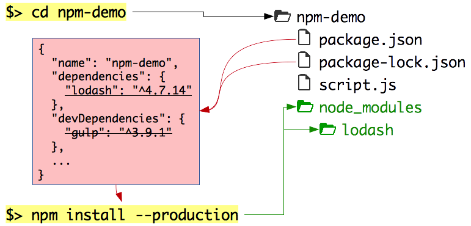

<!-- slide-container -->

> This option used to be called `--production`, which is what the diagram still
> shows. It works, but npm now answers `npm warn config production Use
> --omit=dev instead.`


### The --global option

Some packages can be installed **globally**.
Use the `--global` or `-g` option:

```bash
$> npm install --global http-server
```

**If you get an `EACCES` error**, it means npm is trying to write to a directory
you do not own (e.g. `/usr/local`). Do **not** retry with `sudo`.

The robust fix is to install Node.js with a **version manager** (such as
[nvm][nvm], fnm or Volta), which puts both Node.js and the global packages in
your home directory. npm also documents [how to change the global
directory][npm-fix-permissions] if you prefer to keep your installation.

```bash
$> npm install --global http-server
```

#### Global packages

Global packages are **NOT installed in the current directory**.
They are installed in a **system directory** and are **global to your machine**
(you don't need to re-install them for each project).

<p class='center'>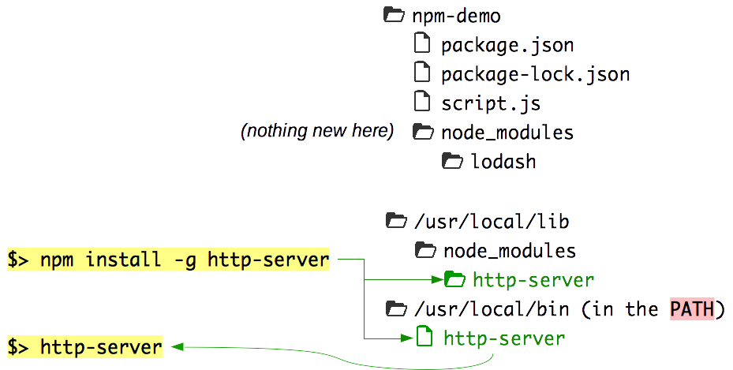</p>

<!-- slide-column -->

Global packages provide **new commands** that you can use in your CLI.
In this case, the `http-server` package is a simple command-line HTTP server:

<!-- slide-column -->

```bash
$> http-server
Starting up http-server, serving ./
Available on:
  http://127.0.0.1:8080
  http://10.178.123.132:8080
Hit CTRL-C to stop the server
```

#### Where are global packages installed?

Use `npm config` to find out where global packages are installed on your machine:

```bash
$> npm config get prefix
/Users/jdoe/.asdf/installs/nodejs/26.8.2

$> ls /Users/jdoe/.asdf/installs/nodejs/26.8.2/lib/node_modules
http-server npm
```

> The exact path depends on **how you installed Node.js**: a version manager
> puts it in your home directory, while a system-wide installation may use
> `/usr/local` or `/opt/homebrew`.

You *cannot* use `--save` with global packages.
You **do not need to** since they are global to your machine and available anywhere in the CLI.
However, if you **reset** your machine or Node.js installation, you will have to **reinstall** manually.


### Running a package without installing it

Installing a command globally is often unnecessary. `npx`, which comes with npm,
**downloads a package, runs its command and caches it**:

```bash
$> npx http-server
npm warn exec The following package was not found and will be
installed: http-server@14.1.1
Starting up http-server, serving .

Available on:
  http://127.0.0.1:8080
Hit CTRL-C to stop the server
```

- No global installation, so no `EACCES` problem and nothing to keep up to date.
- If the package is **already a dependency** of your project, `npx` runs *that*
  version instead of downloading anything.

> Use `npx` for one-off commands, and `--global` only for commands you really
> want available everywhere, all the time.


## Versions and updates

<!-- slide-front-matter class: center, middle -->

What `^5.2.1` means, and how to keep it up to date.


### Semantic versioning

Most npm packages follow [semantic versioning][semver]: a version is
**`MAJOR.MINOR.PATCH`**, e.g. `5.2.1`.

| Part      | Incremented when                               | Safe to take?           |
| :-------- | :--------------------------------------------- | :---------------------- |
| **MAJOR** | the API changes in a **breaking** way           | no, read the changelog  |
| **MINOR** | features are **added**, without breaking others | yes                     |
| **PATCH** | **bugs are fixed**, without breaking others     | yes                     |

> This is a **promise made by the author**, not something npm can enforce. It is
> what makes the ranges on the next slide reasonably safe.


### Version ranges

npm does not save the exact version of a dependency, but a **range** starting
with a caret:

```json
"dependencies": {
* "express": "^5.2.1"
}
```

| Range    | Accepts                                    | Examples             |
| :------- | :----------------------------------------- | :------------------- |
| `^5.2.1` | patches **and** minors: `>=5.2.1 <6.0.0`   | 5.3.0 ✔, 6.0.0 ✘    |
| `~5.2.1` | patches only: `>=5.2.1 <5.3.0`             | 5.2.9 ✔, 5.3.0 ✘    |
| `5.2.1`  | only that exact version                    | 5.2.1                |

> With `^`, a fresh `npm install` can give you a **newer version than the one
> you developed with**. That is what the lock file is for.


### The lock file

`package-lock.json` records the **exact** version of every package that was
installed — including the dependencies of your dependencies.

<!-- slide-column -->

**Commit it to Git.**

Your teammates, your automated tests and your server then install exactly what
you tested, instead of whatever the ranges allow today.

<!-- slide-column -->

**Do not commit `node_modules`.**

```bash
$> cat .gitignore
node_modules
```

<!-- slide-container -->

> Deleting `node_modules` costs you one `npm install`. Deleting
> `package-lock.json` throws away the only record of what actually worked.


### npm ci

`npm ci` (**c**lean **i**nstall) deletes `node_modules` and installs **exactly**
what the lock file says:

```bash
$> npm ci

added 96 packages, and audited 97 packages in 524ms

found 0 vulnerabilities
```

|                          | `npm install`  | `npm ci`             |
| :----------------------- | :------------- | :------------------- |
| Installs what is in      | `package.json` | `package-lock.json`  |
| Can change the lock file | yes            | **never**            |
| Without a lock file      | works          | **fails**            |

Use it on servers and in automated tests, where you want a **reproducible**
install rather than the newest thing the ranges allow.


### Keeping dependencies up to date

```bash
$> npm outdated
Package  Current  Wanted  Latest  Location              Depended by
express    5.0.0   5.2.1   5.2.1  node_modules/express  my-project
lodash   4.17.20  4.18.1  4.18.1  node_modules/lodash   my-project
```

- **Current** is installed, **Wanted** is the newest version your range allows,
  **Latest** is the newest published version.
- `npm update` installs the **Wanted** versions and updates the lock file.
- Getting to **Latest** when it is a **major** version is a manual decision:
  change the range in `package.json` yourself, after reading the changelog.

> `npm update` never crosses a major version, precisely because your ranges say
> it must not.


### Known vulnerabilities

`found 0 vulnerabilities`, printed after every install, is the result of
**`npm audit`**: npm compares the versions you installed against a public
database of **known security advisories**.

```bash
$> npm audit
# npm audit report

minimist  1.0.0 - 1.2.5
Severity: critical
Prototype Pollution in minimist
https://github.com/advisories/GHSA-vh95-rmgr-6w4m
fix available via `npm audit fix`

1 critical severity vulnerability
```

- `npm audit fix` installs the closest **non-breaking** version that solves the
  problem — here, minimist 1.2.8 — and updates the lock file.
- It reports vulnerabilities in **your dependencies' dependencies** too, which
  you did not choose and often cannot see.

> Resist `npm audit fix --force`: it installs **major** versions across your
> ranges, and is quite capable of breaking your application to silence a
> warning in a package you never call.


### The engines field

`engines` declares which Node.js version your project needs:

```json
{
  "name": "npm-demo",
* "engines": {
*   "node": ">=26"
* },
  ...
}
```

```bash
npm warn EBADENGINE Unsupported engine {
npm warn EBADENGINE   package: 'npm-demo@1.0.0',
npm warn EBADENGINE   required: { node: '>=26' },
npm warn EBADENGINE   current: { node: 'v20.19.0', npm: '10.8.2' }
```

> Deployment platforms **read this field** to choose the Node.js version that
> will run your application. Without it, you may get an old one.


## Common mistakes

<!-- slide-front-matter class: center, middle -->

It happens.


### Missing `package.json` file

If you **forgot to run `npm init`**, npm will install your dependencies anyway
and **silently create a minimal `package.json`** for you:

```bash
$> npm install lodash
added 1 package in 154ms
$> cat package.json
{
  "dependencies": {
    "lodash": "^4.18.1"
  }
}
```

It has no `name`, no `version`, no `scripts` and, most importantly, **no
`"type": "module"`**, so Node.js complains when you run a script that uses
`import`:

```bash
$> node script.js
(node:1234) [`MODULE_TYPELESS_PACKAGE_JSON`] Warning: Module type of
file:///path/to/npm-demo/script.js is not specified...
To eliminate this warning, add `"type": "module"` to package.json.
```

Always run `npm init` **first**, then add `"type": "module"`.

<!--
  TODO: the images/npm-missing-package.png diagram still shows the obsolete
  "saveError" warning and the "--save" option. Regenerate it from diagrams.odg
  before putting it back on this slide.
-->


### Wrong directory

npm will not know if you are in the **wrong directory**.
It will simply **install packages there**.
Of course, you will **NOT** be able to `import` them from your project:

<p class='center'>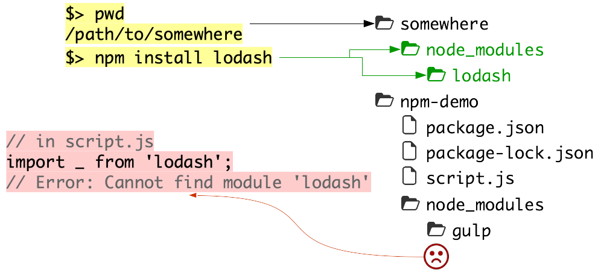</p>


## The behavior of `import`

<!-- slide-front-matter class: center, middle -->


### Importing your own modules

You can import your own Node.js scripts with **relative file paths**:

<p class='center'>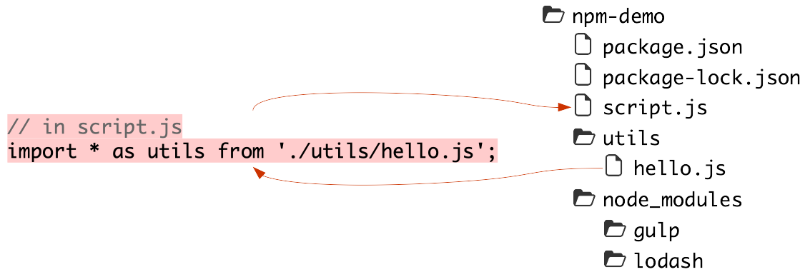</p>

<p class='center'>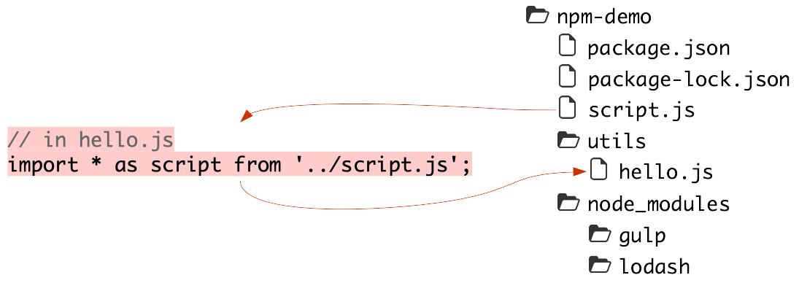</p>

Beware of **circular dependencies**.
In this example, you should do one or the other, **not both**.


### Importing packages installed with npm

You can import packages you installed with npm **using their name**:

<p class='center'>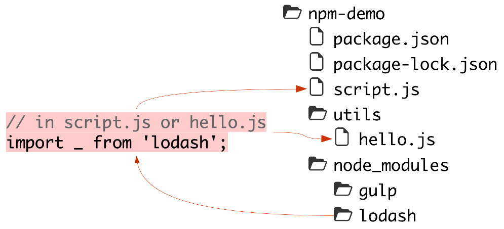</p>

#### Global packages installed with npm

You **CANNOT** import packages you installed **globally** with npm.
They provide **new commands** but cannot be used in code:

<p class='center'>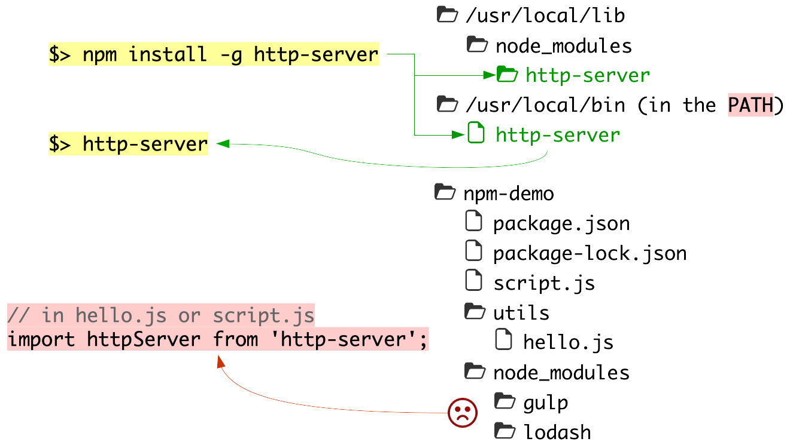</p>


### Importing core Node.js modules

When you give **a name** to `import`, it will also look for a **core Node.js
modules** with that name:

<p class='center'>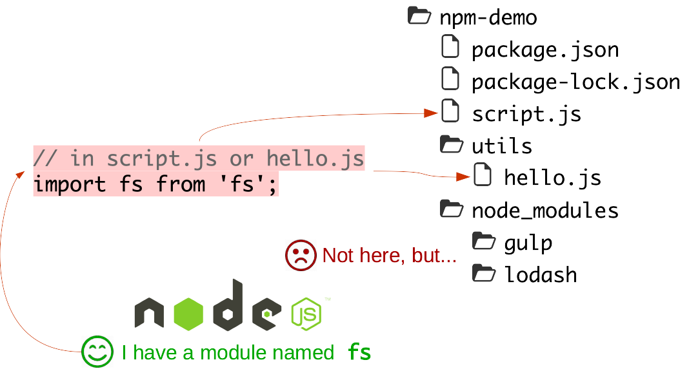</p>


### Import summary

Statement                                   | What is imported
:------------------------------------------ | :-------------------------------------------------------------------------------------------------------------------------------------------------------------------------------
`import * as script from './script.js'`     | The `script.js` file in the current directory (relative to the file using `import`)
`import * as script from './dir/script.js'` | The `script.js` file in the `dir` directory (relative to the file using `import`)
`import * as script from '../script.js'`    | The `script.js` file in the parent directory (relative to the file using `import`)
`import myModule from 'my-module'`          | The `my-module` npm package (if found in `node_modules` in the same directory *or any parent directory*)<br/>**OR**<br/>The core Node.js module with that name (if there is one)

> When importing **your own files**, the **file extension is mandatory** with
> ECMAScript modules. `import * as script from './script'` will **not** work; it
> will fail with an `ERR_MODULE_NOT_FOUND` error. (The old `require` function
> used to guess the extension for you; `import` does not.)


## More complex packages

The npm registry has many packages, some small, some big.
Let's install [Express][express], a web application framework:

```bash
$> npm install express
```

Create a `server.js` file with the following content:

```js
import express from 'express';

const app = express();

app.get('/', function(req, res) {
  res.send(\`Hello ${req.query.name}!`);
});

app.listen(3000, function () {
  console.log('Example app listening on port 3000!');
});
```

#### Run a web app

Run the file:

```bash
$> node server.js
Example app listening on port 3000!
```

Visit [http://localhost:3000?name=World](http://localhost:3000?name=World) in your browser.

You have a running web application server!


## npm scripts

<!-- slide-front-matter class: center, middle -->

npm is not only a package *installer*, it's also a package **manager**


### Lifecycle scripts

For programs that can be **long-lived**, such as **web servers**,
npm defines **standard lifecycle scripts** that you should use to control your program.
Here are a few:

Command       | Purpose
:---          | :---
`npm start`   | Run your program
`npm stop`    | Stop your program
`npm restart` | Restart your program
`npm test`    | Run automated tests for your program

Read the [documentation][npm-scripts] to learn about all the available lifecycle scripts.


### The scripts property

<!-- slide-column 40 -->

In order for your program to **respond** to these `npm start|stop|...` commands,
the corresponding **scripts** should be defined in your `package.json` file under the `scripts` property:

<!-- slide-column -->

<p class='center'>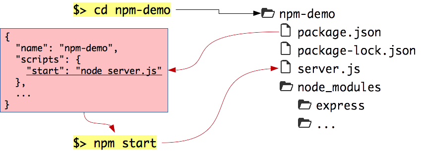</p>

<!-- slide-container -->

Here we define that running `npm start` should **execute** the `server.js` file with Node.js:

```bash
$> npm start

> npm-demo@1.0.0 start
> node server.js

Example app listening on port 3000!
```


### Custom scripts

You can also define your own custom scripts:

```json
{
  "name": "npm-demo",
* "scripts": {
*   "hello": "echo Hello World"
* },
  ...
}
```

These scripts are run with `npm run <script>`:

```bash
$> npm run hello

> npm-demo@1.0.0 hello
> echo Hello World

*Hello World
```


## Publishing, and not publishing

The packages you install are published to the registry by their authors with
[`npm publish`][npm-publish], from a directory containing a valid
`package.json` (the `main` property tells npm which file people get when they
`import` your package). Names are registered on a **first-come, first-serve**
basis.

You will **not** publish anything during this course, and most code should never
be published: a web application is not something anyone will `import`, and your
project may contain confidential information.

Protect yourself by setting the `private` property of your `package.json`:

```json
{
  "name": "npm-demo",
* "private": true,
  ...
}
```

`npm publish` will then **refuse** to publish the package.


## Resources

**Documentation**

* [Command line usage][npm-cli]
* [package.json][package.json]


[express]: https://expressjs.com
[node]: https://nodejs.org
[nvm]: https://github.com/nvm-sh/nvm
[npm]: https://www.npmjs.com
[npm-cli]: https://docs.npmjs.com/cli/npm
[npm-fix-permissions]: https://docs.npmjs.com/getting-started/fixing-npm-permissions
[npm-publish]: https://docs.npmjs.com/cli/commands/npm-publish
[npm-scripts]: https://docs.npmjs.com/misc/scripts
[package.json]: https://docs.npmjs.com/files/package.json
[semver]: https://semver.org
