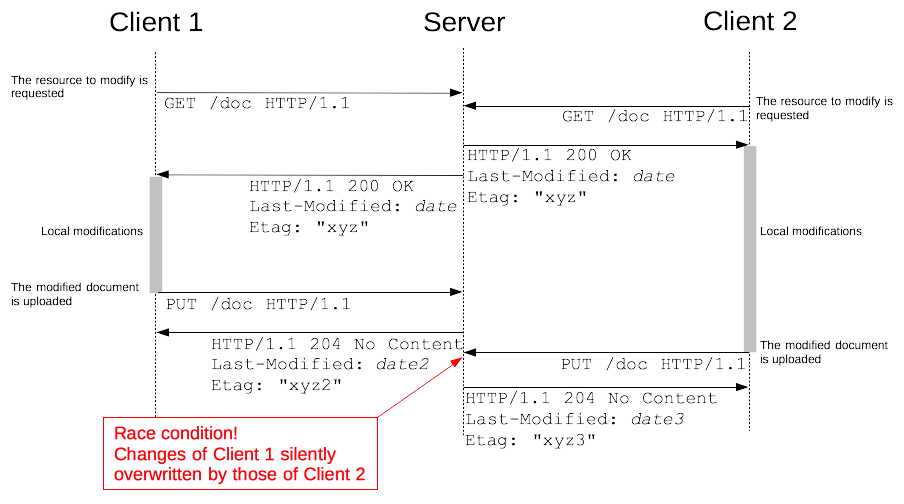
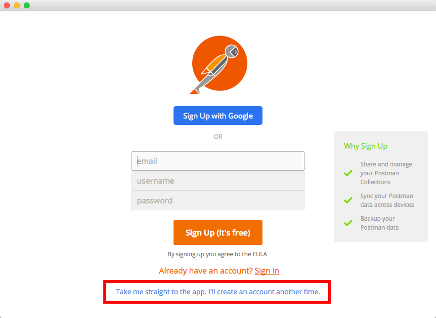
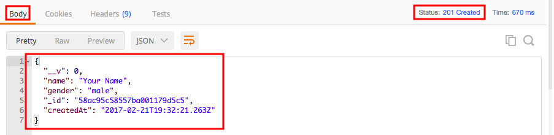
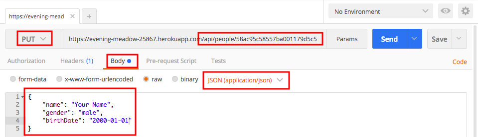
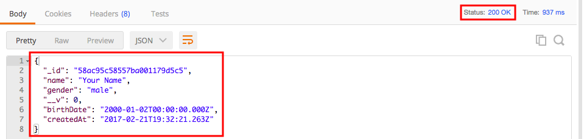
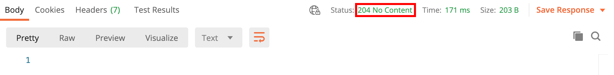

# REST Introduction & HTTP

Learn the core architectural principles of REST and how they can be applied to
make RESTful web APIs with HTTP and URLs.

**You will need**

* [Google Chrome][chrome] (recommended, any browser with developer tools will do)
* [Postman][postman]

<!-- START doctoc generated TOC please keep comment here to allow auto update -->
<!-- DON'T EDIT THIS SECTION, INSTEAD RE-RUN doctoc TO UPDATE -->

- [What is a Web Service?](#what-is-a-web-service)
- [Big web services](#big-web-services)
  - [Remote procedure call (RPC) or remote method invocation (RMI)](#remote-procedure-call-rpc-or-remote-method-invocation-rmi)
  - [Web services standards](#web-services-standards)
  - [Pros & cons](#pros--cons)
- [REST](#rest)
  - [What is REST?](#what-is-rest)
    - [REST architectural constraints](#rest-architectural-constraints)
    - [So... what is REST?](#so-what-is-rest)
  - [What is a web resource?](#what-is-a-web-resource)
  - [[Uniform Resource Locator (URL)][url]](#uniform-resource-locator-urlurl)
  - [Resource vs. representation](#resource-vs-representation)
- [HyperText Transfer Protocol (HTTP)](#hypertext-transfer-protocol-http)
  - [Evolution of HTTP](#evolution-of-http)
  - [HTTP is a request-response protocol](#http-is-a-request-response-protocol)
  - [Anatomy of an HTTP request](#anatomy-of-an-http-request)
    - [Request method](#request-method)
    - [Resource path](#resource-path)
    - [Query string](#query-string)
    - [Headers](#headers)
    - [Request body](#request-body)
  - [Anatomy of an HTTP response](#anatomy-of-an-http-response)
    - [Status code and reason phrase](#status-code-and-reason-phrase)
    - [Headers](#headers-1)
    - [Response body](#response-body)
  - [HTTP provides the [content negotiation][http-content-negotiation] mechanisms](#http-provides-the-content-negotiationhttp-content-negotiation-mechanisms)
- [But can't I just use GET and POST?](#but-cant-i-just-use-get-and-post)
  - [Standards](#standards)
  - [Common [methods][http-methods]](#common-methodshttp-methods)
  - [Common request [headers][http-request-headers]](#common-request-headershttp-request-headers)
  - [Common response [headers][http-response-headers]](#common-response-headershttp-response-headers)
  - [Common successful response [status codes][http-status-codes]](#common-successful-response-status-codeshttp-status-codes)
  - [Common client error response [status codes][http-status-codes]](#common-client-error-response-status-codeshttp-status-codes)
  - [Common server error response [status codes][http-status-codes]](#common-server-error-response-status-codeshttp-status-codes)
  - [Conditional update example](#conditional-update-example)
    - [Conditional update solution](#conditional-update-solution)
- [[Create, read, update, delete (CRUD)][crud]](#create-read-update-delete-crudcrud)
  - [Postman](#postman)
    - [Postman interface](#postman-interface)
    - [Make your first request](#make-your-first-request)
  - [Create](#create)
    - [Create request headers](#create-request-headers)
    - [Create response](#create-response)
    - [Create response headers](#create-response-headers)
  - [Read](#read)
    - [Read response](#read-response)
    - [Read a resource that does not exist](#read-a-resource-that-does-not-exist)
    - [Read a collection](#read-a-collection)
    - [Read collection response](#read-collection-response)
  - [Update](#update)
    - [Update response](#update-response)
    - [Partial update with PUT](#partial-update-with-put)
    - [Partial update response with PUT](#partial-update-response-with-put)
    - [Partial updates with PATCH](#partial-updates-with-patch)
    - [Partial update response with PATCH](#partial-update-response-with-patch)
  - [Delete](#delete)
    - [Delete response](#delete-response)
  - [CRUD summary](#crud-summary)
    - [CRUD errors summary](#crud-errors-summary)
- [Resources](#resources)

<!-- END doctoc generated TOC please keep comment here to allow auto update -->


## What is a Web Service?

<p class='center'></p>

**Clients** need access to **data** and **logic**.
How can they find each other, know what logic can be invoked, and talk to each other over the web?


## Big web services

<!-- slide-front-matter class: center, middle -->


### Remote procedure call (RPC) or remote method invocation (RMI)

<p class='center'></p>


### Web services standards

<p class='center'></p>


### Pros & cons

Many standards:

* Simple Object Access Protocol (SOAP)
* Web Services Description Language (WSDL)

<!-- slide-column 50 -->

**Benefits:**

* Very rich protocol stack:
  * support for security
  * transactions
  * reliable transfer

<!-- slide-column 50 -->

**Problems:**

* Very rich protocol stack:
  * complexity
  * verbosity
  * incompatibility issues
  * theoretical human readability


## REST

<!-- slide-front-matter class: center, middle -->


*A cat RESTing...*


### What is REST?

REST means [REpresentational State Transfer][rest]. It is an architectural style
for building distributed [web services][web-service] on the Internet. The World
Wide Web is one example that exhibits the characteristics of a REST
architecture.

> REST has been introduced in [Roy Fielding’s Ph.D. thesis][roy-fielding-thesis]
> (Roy Fielding has been a contributor to the HTTP specification, and to the
> Apache server and community).

An API or web service that follows REST's architectural constraints is said to
be a *RESTful API* or *RESTful web service*.

#### REST architectural constraints

A system is considered to follow the REST architecture if it follows [these
constraints][rest-constraints]:

* **Client-server architecture:** the separation of concerns between the user
  interface (client) and data storage (server) improves portability across
  platforms, and allows components to evolve independently.
* **Statelessness:** each request from any client contains all the information
  necessary to service the request, and the session state is held in the client.
* **Cacheability:** clients and intermediaries can cache responses indicated as
  cacheable by the server, improving scalability and performance.
* **Layered system:** a client cannot ordinarily tell whether it is connected
  directly to the end server, or to an intermediary along the way. This improves
  scalability by enabling load balancing and shared caches.
* **Uniform interface:** a uniform interface simplifies and decouples the
  architecture, which enables each part to evolve independently.

#### So... what is REST?

These are the basic principles of REST when applied to HTTP web services:

* The state of the application is captured in a set of **resources**
  * Users, photos, comments, tags, albums, etc.
* There is a **uniform interface** (**HTTP**) to manipulate those resources:
  * Resources are identified with a standard format (**URLs**).
  * Every resource can have several **representations** (e.g. HTML or JSON).
  * The client progresses through the application by applying operations (**HTTP
    methods:** GET, POST, etc) to resources and exchanging their representations
    with the server (**state transfer**).
  * The client can follow server-provided **hyperlinks** to discover available
    actions and resources ([HATEOAS][hateoas]).

> Note that REST does not mandate the use of HTTP and URLs, but it is the
> simplest and most popular way of implementing a RESTful web service.


### What is a web resource?

Something that can be uniquely identified on the web:

<!-- slide-column 50 -->

**Static content**

* An article published in the "24 heures" newspaper
* A person's birth certificate

<!-- slide-column 50 -->

**Dynamic content**

* The collection of articles published in the sport section of the newspaper
* The list of grades of the student Jean Dupont

<!-- slide-container -->

<!-- slide-column 50 -->

**Intangible things**

* The current price of the Nestlé stock quote

<!-- slide-column 50 -->

**Physical objects**

* The vending machine in the school hallway


### [Uniform Resource Locator (URL)][url]

> "A reference to a **web resource** that specifies its **location** on a computer network and a **mechanism** for retrieving it."

* http://www.24heures.ch/vaud/2008/08/04/trente-etudiants-manifestent
* http://imdb.com/movies/best?page=3&pageSize=50&orderBy=title
* http://www.smart-machines.ch/customers/heig/machines/8272#order

The syntax of an URL is:

```
scheme:[//[user:password@]host[:port]][/]path[?query][#fragment]
```


### Resource vs. representation

* In a REST API, we use the HTTP protocol to support the exchange of data (or **state transfer**) between a **client** and a **server**
* What is exchanged is not the actual resource: it is a **representation** of the resource
* The **same resource** could have:
  * An HTML representation
  * An XML representation
  * A PNG representation
  * A WAV representation


## HyperText Transfer Protocol (HTTP)

<!-- slide-front-matter class: center, middle -->

> "An [application protocol][osi-application] for distributed, collaborative,
> and [hypermedia][hypermedia] information systems. [HTTP][http] is the
> foundation of data communication for the World Wide Web."


### Evolution of HTTP

* [HTTP/1.0][http] (1996) - [RFC 1945][http10-rfc]
* HTTP/1.1 (1999) - [RFC 2616][http11-rfc]
* [HTTP/2.0][http2] (2015) - [RFC 7540][http2-rfc]

  > HTTP/2 is a more efficient expression of HTTP's semantics "on the wire",
  > which **maintains high-level compatibility with HTTP/1.1** (for example with
  > methods, status codes, URIs, and most header fields). It is now supported by
  > virtually all web browsers and major web servers.
* [HTTP/3.0][http3] ([Internet Draft][internet-draft]) - [Draft 29][http3-draft]

  > HTTP/3 is the proposed successor to HTTP/2, which is already in use on the
  > web, using [UDP][udp] instead of [TCP][tcp] for the underlying transport
  > protocol. **Like HTTP/2, it does not obsolete previous major versions of the
  > protocol.** Support for HTTP/3 was added to Cloudflare and Google Chrome in
  > September 2019, and can be enabled in the stable versions of Chrome and
  > Firefox.


### HTTP is a request-response protocol

When you visit the following page:

```
https://en.wikipedia.org/wiki/Film
```

Your browser makes an HTTP **request** and gets a **response**:

```http
GET /wiki/Film HTTP/1.1
Accept: text/html,*/*
Host: en.wikipedia.org
```

```http
HTTP/1.1 200 OK
Content-Length: 58330
Content-Type: text/html; charset=UTF-8

<!DOCTYPE html>
<html lang="en">
  <head>
    <meta charset="UTF-8"/>
    <title>Film - Wikipedia</title>
  </head>
  <body>
    ...
  &lt;/body&gt;
</html>
```


### Anatomy of an HTTP request

Get the third page of a movies list:

```http
GET /movies/best?page=3&pageSize=50&orderBy=title HTTP/1.1
Accept: text/html,*/*
Host: www.example.com
```

Register a new movie:

```http
POST /api/movies HTTP/1.1
Content-Type: application/json
Host: www.example.com

{
  "name": "The Matrix",
  "releaseYear": 1999
}
```

#### Request method

The first line of an HTTP request is the **request line**:

```
  `GET` /movies/best?page=3&pageSize=50&orderBy=title HTTP/1.1
```

The **request method** is the *desired action* to perform:

| Method | Purpose                               |
| :---   | :---                                  |
| GET    | Retrieve data                         |
| POST   | Create a new resource                 |
| PUT    | Replace an existing resource          |
| PATCH  | Partially modify an existing resource |
| DELETE | Delete a resource                     |

There are [more methods][http-methods].

#### Resource path

The second part of the request line is the **resource path**:

```
  GET `/movies/best`?page=3&pageSize=50&orderBy=title HTTP/1.1
```

It tells the server where to find the resource to perform the action on.

#### Query string

The **query string** is the third part of the request line:

```
  GET /movies/best`?page=3&pageSize=50&orderBy=title` HTTP/1.1
```

These are parameters given to the server, usually to *filter* the resource.
In this case:

* `page=3` - we want the third page
* `pageSize=50` - we want pages of 50 movies
* `orderBy=title` - we want the movies ordered by title

#### Headers

After the request line, an HTTP request has one or more **headers**:

```http
GET /movies/best?page=3&pageSize=50&orderBy=title HTTP/1.1
*Accept: application/html,*/*
*Host: www.example.com
```

This allows the client to tell the server how to serve the request:

* `Accept: application/html,*/*` - I prefer HTML, but otherwise give me any format you have
* `Host: www.example.com` - This is the domain I want the resource from

There are many [headers][headers] that can be used in requests.

#### Request body

The **body** is data that the client can ask the server to do something with:

```http
POST /api/movies HTTP/1.1
Content-Type: application/json
Host: www.example.com

*{
*  "name": "The Matrix",
*  "releaseYear": 1999
*}
```

In this case:

* It's a `POST` request, so the server should create a new resource
* The `Content-Type` header is `application/json`, so the server should
  interepret the body as a JSON payload and use that data to create the resource


### Anatomy of an HTTP response

An HTML page:

```http
HTTP/1.1 200 OK
Content-Type: text/html; charset=UTF-8

<!DOCTYPE html>
<html lang="en">
  <head><title>Film - Wikipedia</title></head>
  &lt;body&gt;...&lt;/body&gt;
</html>
```

A resource we just created:

```http
HTTP/1.1 201 Created
Content-Type: application/json
Location: https://example.com/api/movies/xo349

{
  "id": "xo349",
  "createdAt": "2017-02-08T11:05:40+01:00",
  "name": "The Matrix",
  "releaseYear": 1999
}
```

#### Status code and reason phrase

The first line of an HTTP response is the **status line**:

```
  HTTP/1.1 `201 Created`
```

The **status code** and the **reason phrase** indicate to the client whether the request was successful and how to handle it:

| Code | Reason               | Purpose                                                                                                                                 |
| :--- | :---                 | :---                                                                                                                                    |
| 200  | OK                   | The response body contains the requested resource.                                                                                      |
| 201  | Created              | The `Location` header contains the URL of the created resource; the response body may contain a representation of the created resource. |
| 401  | Unauthorized         | Authentication is required and was not provided or is invalid.                                                                          |
| 422  | Unprocessable Entity | The request body is semantically invalid.                                                                                               |

There are many [status codes][http-status-codes] a server can use to help the client handle responses.

#### Headers

Like requests, an HTTP response has one or more **headers** after the status line:

```http
HTTP/1.1 200 OK
*Content-Language: en
*Content-Type: application/json
*Last-Modified: Tue, 07 Feb 2017 02:12:22 GMT

{
  "id": "xo349",
  "name": "The Matrix",
  "releaseYear": 1999
}
```

It allows the server to give the client additional metadata about the response:

* `Content-Language: en` - The response contains information in English
* `Content-Type: application/json` - The response body is a JSON payload
* `Last-Modified: Tue, 07 Feb 2017 02:12:22 GMT` - The resource was last modified on February 7th

There are many [headers][headers] that can be used in responses.

#### Response body

The response body is the (optional) data sent by the server.
Its nature depends on what the request was and what the response status code indicates.
It could be the requested resource for a `GET` request:

```http
HTTP/1.1 200 OK
Content-Language: en
Content-Type: application/json

*{
*  "id": "xo349",
*  "name": "The Matrix",
*  "releaseYear": 1999
*}
```

Or it could be a list of errors if the body of a `POST` request was invalid:

```http
HTTP/1.1 422 Unprocessable Entity
Content-Type: application/json

*[
*  { "field": "name", "message": "Name is required" },
*  { "field": "releaseYear", "message": "Release year must be >= 1890" }
*]
```


### HTTP provides the [content negotiation][http-content-negotiation] mechanisms

Different **representations** of a resource can be exchanged at the **same URL**:

<!-- slide-column 50 -->

A JSON representation:

```http
GET /shows/game-of-thrones HTTP/1.1
*Accept: application/json
```

```http
HTTP/1.1 200 OK
*Content-Type: application/json

{
  "title": "Game of Thrones",
  "releaseYear": 2011,
  "seasons": 6,
  "episodes": 60
}
```

<!-- slide-column 50 -->

An HTML representation:

```http
GET /shows/game-of-thrones HTTP/1.1
*Accept: text/html,*/*
```

```http
HTTP/1.1 200 OK
*Content-Type: text/html

<html>
  <head>
    <title>Game of Thrones</title>
  </head>
  <body>
    <h1>Game of Thrones</h1>
    <p>A 2011 TV show.</p>
    <ul>
      <li>6 seasons</li>
      <li>60 episodes</li>
    </ul>
  &lt;/body&gt;
</html>
```


## But can't I just use GET and POST?

<!-- slide-front-matter class: center, middle -->

I'm lazy that way.


### Standards

A lot of smart people have encountered **the same problems you have** over the
years. They have come together and defined **standard solutions** to deal with
some of those problems.

HTTP has a **very rich** vocabulary of *methods*, *headers* and *status codes*
that are here to **help you** implement rich client-server interaction.

.center[
> [Standards.REST][rest-standards]
>
> A collection of standards and specifications, that help make fantastic
> HTTP/REST APIs. Don't reinvent the wheel, use fantastic wheels, hashed out by
> experts, that solve problems you hadn't even considered yet.
]


### Common [methods][http-methods]

| Method    | Purpose                                                       |
| :---      | :---                                                          |
| `GET`     | Retrieve data                                                 |
| `HEAD`    | Retrieve the response headers but no data (to save bandwidth) |
| `POST`    | Create a new resource                                         |
| `PUT`     | Replace an existing resource                                  |
| `PATCH`   | Partially modify an existing resource                         |
| `DELETE`  | Delete a resource                                             |
| `OPTIONS` | Ask the server what you can do with a resource                |


### Common request [headers][http-request-headers]

<!-- slide-front-matter class: compact-table -->

Example                              | What the client is asking
:---                                 | :---
`Accept: text/plain`                 | I want you to send me a response in **plain text**. If you **can't**, I expect you to respond with `406 Not Acceptable`
`Authorization: Basic 98aw=`         | Use the base64-encoded `user:password` string I am giving you as proof of my identity
`Authorization: Bearer 1y09`         | Use the [bearer token][auth0-tokens] I am giving you as proof of my identity
`Content-Type: application/json`     | I am sending you a request with JSON text in the body
`If-Modified-Since: Sun, 3 Jan 2017` | If the resource I am retrieving has **not changed** since January 3rd 2017, I expect you to respond with `304 Not Modified` and no response body (to save bandwidth). ([Conditional GET][http-conditional-requests])
`If-Unmodified-Since: ...`           | If the resource I am updating has **changed**, I expect you to **not update it** and respond with `412 Precondition Failed` ([Conditional update][http-conditional-requests])
`Referer: google.com`                | I am coming to you from `google.com`
`User-Agent: Mobile Safari/534.30`   | I am sending you a request from a **mobile device**


### Common response [headers][http-response-headers]

<!-- slide-front-matter class: compact-table -->

Example                                  | What the server is telling you
:---                                     | :---
`Access-Control-Allow-Origin: *`         | I am allowing you to make a [cross-origin request][http-cors] from anywhere
`Set-Cookie: UserID=JohnDoe`             | I am giving you a cookie: please send it back to me for all further requests on this domain
`Content-Type: text/html`                | I am sending you an HTML page
`Expires: Sun, 31 Dec 2017`              | The content I am sending you will not change until December 31st 2017
`Last-Modified: Sun, 3 Jan 2017`         | The content I am sending you was last modified on January 3rd 2017
`Location: http://example.com/somewhere` | The resource you requested has moved and I am telling you where, **or** the resource you just created is available at that address
`WWW-Authenticate: Basic`                | I do not know you, please re-send your request with [Basic HTTP authentication][http-auth]


### Common successful response [status codes][http-status-codes]

<!-- slide-front-matter class: compact-table -->

Code                    | What the server is telling you
:---                    | :---
`200 OK`                | Your request was successful
`201 Created`           | I have created a **new resource** and am telling you where it is in the `Location` header
`202 Accepted`          | I have received your request but will process it later
`204 No Content`        | I have processed your request but have no content to send you
`301 Moved Permanently` | The resource you are requesting has **moved permanently** and I am telling you where in the `Location` header
`302 Found`             | The resource you are requesting has **moved temporarily** and I am telling you where in the `Location` header
`304 Not Modified`      | The resource you are requesting has **not changed**, so I am not sending you its data again


### Common client error response [status codes][http-status-codes]

<!-- slide-front-matter class: compact-table -->

Code                         | What the server is telling you
:---                         | :---
`400 Bad Request`            | I cannot understand the request (e.g. invalid JSON)
`401 Unauthorized`           | I do not know you, please [authenticate][http-auth]
`403 Forbidden`              | I know you, but you do not have sufficient access rights to do that
`404 Not Found`              | The resource you are requesting does not exist
`405 Method Not Allowed`     | You can't make a `GET/POST/...` on this resource
`406 Not Acceptable`         | I can't answer in the format you asked for in the `Accept` header
`409 Conflict`               | Your request is not consistent with the resource's state
`412 Precondition Failed`    | I am denying your [conditional request][http-conditional-requests]
`415 Unsupported Media Type` | You are sending me XML/JSON/... but the resource cannot be represented in that format
`418 I'm a teapot`           | [I don't make coffee][http-teapot]
`422 Unprocessable Entity`   | The request body is syntactically correct but semantically invalid (e.g. validation error)
`429 Too Many Requests`      | Stop spamming me


### Common server error response [status codes][http-status-codes]

<!-- slide-front-matter class: compact-table -->

Unlike the errors from the previous table,
these errors indicate that there is a **problem on the server**, not with the client's request:

Code                        | What the server is telling you
:---                        | :---
`500 Internal Server Error` | Oops, I crashed and can't fulfill this request
`501 Not Implemented`       | You made a `HEAD/PATCH/...` request but I don't support that method for any resource
`502 Bad Gateway`           | I tried using a third-party service to fulfill your request, but couldn't reach it
`503 Service Unavailable`   | I'm busy or being fixed, please try again later
`508 Loop Detected`         | *To understand recursion, you must first understand recursion...*


### Conditional update example

If **two users** save a form on a website at the same time,
there is a possible *race condition* where one user's changes can be **silently overwritten** by the other's:

<p class='center'></p>


#### Conditional update solution

The `If-Match` and `If-Unmodified-Since` headers allow the client to
**conditionally update** a resource. If the resource **has changed** compared to
the specified identifier or since the specified date, the server should
**refuse** the request and respond with `412 Precondition Failed`:

<p class='center'></p>


## [Create, read, update, delete (CRUD)][crud]

Since REST deals primarily with **resources**, in a REST API you will (mostly):

* **C**reate new resources
* **R**ead (or retrieve) a resource or collection of resources
* **U**pdate resources
* **D**elete (or detroy) resources

Let's try these operations with a prepared REST API:

https://comem-rest-demo.herokuapp.com


### Postman

To make requests to the API, we will use [Postman][postman], an HTTP client with
a GUI. **Download and launch** the application now.

You don't have to sign up when it prompts you to, you can skip it:

<p class='center'></p>

#### Postman interface

Postman allows you to make any HTTP **request/response** (e.g. `POST`, `PUT`,
custom headers, etc). It also remembers your **previous requests**..


#### Make your first request


> **Hint:** the next steps will show you have to make various HTTP requests. The
> placeholder **"Your Name"** is used in several places. Replace it with your
> name to avoid collisions with other people using the API at the same time.


### Create

The API allows us to **create a person** by making a `POST` request with a
**JSON representation** of the person. This is the request we want to make:

```http
POST https://comem-rest-demo.herokuapp.com/api/people HTTP/1.1
Content-type: application/json

{ "name": "Your Name", "gender": "male" }
```

Let's make that request with Postman:


#### Create request headers

You can see and modify the request headers in the **Headers** tab:


Notice that Postman has automatically set the [`Content-Type`
header][content-type] to `application/json` when you selected JSON as the body
type.

Press the **Send** button to send the request.

#### Create response

You should see the response below the request:



> "The [**POST** method][post] is used to request that the origin server accept
> the entity enclosed in the request as a **new subordinate** of the resource
> identified by the Request-URI in the Request-Line."

> "If a resource has been **created** on the origin server, the response SHOULD
> be [`201 Created`][201] and contain an entity which describes the status of
> the request and refers to the new resource, and a [`Location`
> header][location]."

In other words: the server tells us that **a new person has been created** by
responding with the status code `201 Created` and the person's data.

#### Create response headers

You can also see the response headers in the **Headers** tab:


> "If a resource has been **created** [...] the response SHOULD [...] contain a
> **Location header**. For 201 Created responses, the Location is that of the
> new resource which was created by the request."

The server tells us where to find the new resource in the **Location** header.


### Read

Let's make a request to **read** (or **retrieve**) the person we created. This
time we need a simple `GET` request to the path given to us in the **Location**
header of the previous response:

```http
GET https://comem-rest-demo.herokuapp.com/api/people/5f5...037 HTTP/1.1
```

Configure that request in Postman:


#### Read response

Press **Send** and you should retrieve the person in the response:


> "The [**GET** method][get] means retrieve whatever information (in the form of
> an entity) is identified by the Request-URI."

Basically, the server is sending us the **JSON representation** of the
`/api/people/5f5...037` resource. The [`200 OK`][200] status code indicates that
the request was **successful**.

#### Read a resource that does not exist

Configure the same request but change the last few characters of the URL path so
that the person identifier is invalid:


Press **Send** and you will see that the server responds with an error message:


By sending a response with the [`404 Not Found`][404] status code, the server
tells us that **no resource exists at that URL**.

#### Read a collection

The API also has a resource that represents the **collection of people** that have been created.
Let's make a `GET` request to **read** that.
We simply have to remove the person's ID from the URL path:

```http
GET https://comem-rest-demo.herokuapp.com/api/people HTTP/1.1
```

Configure that request in Postman:


#### Read collection response

Press **Send** and you should receive a response with several people in it:


Again, the server is sending us the **JSON representation** of the `/api/people`
resource. Since that represents multiple people, we receive a **JSON array**,
where each element is a **JSON object** representing a person.


### Update

The API also allows us to **update** a person by making a `PUT` request to the
person's resource with a **JSON representation** of the updated person. Let's
make a request to add your birthdate:

```http
PUT https://comem-rest-demo.herokuapp.com/api/people/5f5...037 HTTP/1.1
Content-type: application/json

{ "name": "Your Name", "gender": "female", "birthDate": "2000-01-01" }
```

Configure that request with Postman:



#### Update response

Press **Send** and you should receive the updated person in the response:


> "The [**PUT** method][put] requests that the enclosed **entity** be stored
> under the supplied Request-URI. If the Request-URI refers to an **already
> existing resource**, the enclosed entity SHOULD be considered as a **modified
> version** of the one residing on the origin server."

> "If an existing resource is modified, either the [`200 OK`][200] or [`204 No
> Content`][204] response codes SHOULD be sent to indicate successful completion
> of the request."

Basically, we **replaced** the person's data with the representation we sent.
Since no new resource was created, the server simply responds with `200 OK`.

#### Partial update with PUT

Now, configure the same request but **without the gender**, and press **Send**:


#### Partial update response with PUT

The server is responding with the status code [`422 Unprocessable Entity`][422]
and telling you that the person representation you sent is invalid because it is
missing the gender property:


According to the HTTP specification, the `PUT` method is used to store the
**entire representation** you are sending as the **new state of the resource**,
which it cannot do in this case because it is **invalid**. API operations using
**`PUT` should not support partial updates**.

#### Partial updates with PATCH

The `PATCH` method was later added to the HTTP specification to support
**partial updates**. The API also supports it, so let's make a PATCH request to
update your birthdate:

```http
PATCH https://comem-rest-demo.herokuapp.com/api/people/5f5...037 HTTP/1.1
Content-type: application/json

{ "birthDate": "2001-02-03" }
```

Configure that request with Postman:


#### Partial update response with PATCH

This time the request was accepted:



> "The [`PATCH` method][patch] requests that a **set of changes** described in
> the request entity be **applied to the resource** identified by the
> Request-URI."

Instead of a replacement of the entire resource, our JSON representation is
interpreted as a **partial update** to the resource, in this case an update of
the `birthDate` property.

Like with `PUT`, no new resource was created, so the server responds with [`200
OK`][200].


### Delete

Finally, let's **delete** the person. We simply need to make a `DELETE` request
with no request body:

```http
DELETE https://comem-rest-demo.herokuapp.com/api/people/5f5...037 HTTP/1.1
```

Configure that request with Postman:


#### Delete response

Press **Send** and you should get a response from the server with no response
body:



> "The [`DELETE` method][delete] requests that the origin server **delete the
> resource** identified by the Request-URI."

> "A successful response SHOULD be [`200 OK`][200] if the response includes an
> entity describing the status, [`202 Accepted`][202] if the action has not yet
> been enacted, or [**`204 No Content`**][204] if the action has been enacted
> but **the response does not include an entity**."

The server has **successfully deleted the person resource** and is not sending
us any additional data as indicated by the `204 No Content` status code.

As you can see in the method's documentation, the server could also respond
differently (e.g. `200 OK` with a representation of the deleted resource), but
`204 No Content` was chosen for this API implementation.


### CRUD summary

<!-- slide-front-matter class: compact-table -->

Collection (`/people` - plural name)                                                                                                 | Single resource (`/people/:id` - one person in the collection)
:---                                                                                                                                 | :---
`POST /api/people`<br/>**Create a new resource** in the collection, `201 Created` and `Location` header (and optional response body) | -
`GET /api/people`<br/>**Read a list of resources** (with optional pagination, sorting and filtering), `200 OK`                       | `GET /api/people/:id`<br/>**Read one resource**, `200 OK`
*(Batch update)*                                                                                                                     | `PUT /api/people/:id`<br/>**Fully update one resource**, `200 OK` (with body) or `204 No Content` (without body)
*(Batch partial update)*                                                                                                             | `PATCH /api/people/:id`<br/>**Partially update one resource**, `200 OK` (with body) or `204 No Content` (without body)
*(Batch delete)*                                                                                                                     | `DELETE /api/people/:id`<br/>**Delete one resource**, `200 OK` (with body) or `204 No Content` (without body)

#### CRUD errors summary

<!-- slide-front-matter class: compact-table -->

Collection errors                                                                                                                  | Resource errors
:---                                                                                                                               | :---
`POST /api/people`<br/>`400 Bad Request` (JSON malformed), `404 Not Found`, `422 Unprocessable Entity` (Data semantically invalid) | -
`GET /api/people`<br/>`400 Bad Request` (Query parameters invalid)                                                                | `GET /api/people/:id`<br/>`404 Not Found`
-                                                                                                                                  | `PUT /api/people/:id`<br/>`400 Bad Request` (JSON malformed), `404 Not Found`, `422 Unprocessable Entity` (Data semantically invalid)
-                                                                                                                                  | `PATCH /api/people/:id`<br/>`400 Bad Request` (JSON malformed), `404 Not Found`, `422 Unprocessable Entity` (Data semantically invalid)
-                                                                                                                                  | `DELETE /api/people/:id`<br/>`404 Not Found`, `409 Conflict` (Cannot be deleted)


## Resources

**Documentation**

* [HTTP request methods][http-methods] ([RFC][http-methods-rfc], [PATCH RFC][patch-rfc])
* [HTTP headers (request/response)][http-headers]
* [HTTP status codes][http-status-codes] ([RFC][http-status-codes-rfc])

**Further reading**

* [Architectural Styles and the Design of Network-based Software Architectures (Roy Fielding)][roy-fielding-thesis]
* [A brief introduction to REST][rest-intro]
* [REST Cheat Sheet][rest-cheat-sheet]
* [Using HTTP Methods for RESTful Services][http-methods-rest]
* [Best Practices for Designing a Pragmatic RESTful API][rest-pragmatic]


[200]: https://httpstatuses.com/200
[201]: https://httpstatuses.com/201
[202]: https://httpstatuses.com/202
[204]: https://httpstatuses.com/204
[404]: https://httpstatuses.com/404
[422]: https://httpstatuses.com/422
[api]: https://en.wikipedia.org/wiki/Application_programming_interface
[auth0-tokens]: https://auth0.com/blog/ten-things-you-should-know-about-tokens-and-cookies/
[chrome]: https://www.google.com/chrome/
[content-type]: https://www.rfc-editor.org/rfc/rfc9110.html#name-content-type
[crud]: https://en.wikipedia.org/wiki/Create,_read,_update_and_delete
[delete]: https://www.rfc-editor.org/rfc/rfc9110.html#name-delete
[get]: https://www.rfc-editor.org/rfc/rfc9110.html#name-get
[hateoas]: https://en.wikipedia.org/wiki/HATEOAS
[headers]: https://en.wikipedia.org/wiki/List_of_HTTP_header_fields#Request_fields
[http]: https://en.wikipedia.org/wiki/Hypertext_Transfer_Protocol
[http10-rfc]: https://tools.ietf.org/html/rfc1945
[http11-rfc]: https://tools.ietf.org/html/rfc2616
[http2]: https://en.wikipedia.org/wiki/HTTP/2
[http2-rfc]: https://tools.ietf.org/html/rfc7540
[http3]: https://en.wikipedia.org/wiki/HTTP/3
[http3-draft]: https://tools.ietf.org/html/draft-ietf-quic-http-29
[http-auth]: https://developer.mozilla.org/en-US/docs/Web/HTTP/Authentication
[http-conditional-requests]: https://developer.mozilla.org/en-US/docs/Web/HTTP/Conditional_requests
[http-content-negotiation]: https://en.wikipedia.org/wiki/Content_negotiation
[http-cors]: https://developer.mozilla.org/en-US/docs/Web/HTTP/Access_control_CORS
[http-headers]: https://en.wikipedia.org/wiki/List_of_HTTP_header_fields
[http-methods]: https://developer.mozilla.org/en-US/docs/Web/HTTP/Methods
[http-methods-rfc]: https://www.rfc-editor.org/rfc/rfc9110.html#name-methods
[http-methods-rest]: http://www.restapitutorial.com/lessons/httpmethods.html
[http-request-headers]: https://en.wikipedia.org/wiki/List_of_HTTP_header_fields#Request_fields
[http-response-headers]: https://en.wikipedia.org/wiki/List_of_HTTP_header_fields#Response_fields
[http-status-codes]: https://httpstatuses.com
[http-status-codes-rfc]: https://www.rfc-editor.org/rfc/rfc9110.html#name-status-codes
[http-teapot]: https://tools.ietf.org/html/rfc2324
[hypermedia]: https://en.wikipedia.org/wiki/Hypermedia
[internet-draft]: https://en.wikipedia.org/wiki/Internet_Draft
[location]: https://www.w3.org/Protocols/rfc2616/rfc2616-sec14.html#sec14.30
[osi-application]: https://en.wikipedia.org/wiki/Application_layer
[patch]: https://tools.ietf.org/html/rfc5789#section-2
[patch-rfc]: https://tools.ietf.org/html/rfc5789
[post]: https://www.rfc-editor.org/rfc/rfc9110.html#name-post
[postman]: https://www.postman.com/downloads/
[put]: https://www.rfc-editor.org/rfc/rfc9110.html#name-put
[rest]: https://en.wikipedia.org/wiki/Representational_state_transfer
[rest-cheat-sheet]: http://51elliot.blogspot.ch/2014/03/rest-api-best-practices-rest-cheat-sheet.html
[rest-constraints]: https://en.wikipedia.org/wiki/Representational_state_transfer#Architectural_constraints
[rest-intro]: https://www.infoq.com/articles/rest-introduction
[rest-pragmatic]: http://www.vinaysahni.com/best-practices-for-a-pragmatic-restful-api
[rest-standards]: https://standards.rest
[roy-fielding-thesis]: https://www.ics.uci.edu/~fielding/pubs/dissertation/top.htm
[tcp]: https://en.wikipedia.org/wiki/Transmission_Control_Protocol
[udp]: https://en.wikipedia.org/wiki/User_Datagram_Protocol
[url]: https://en.wikipedia.org/wiki/Uniform_Resource_Locator
[web-service]: https://en.wikipedia.org/wiki/Web_service
