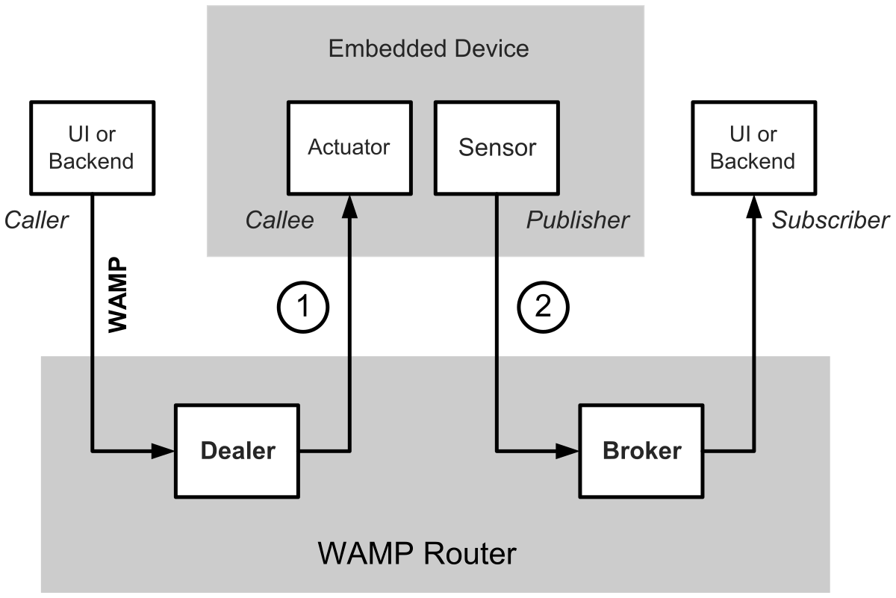
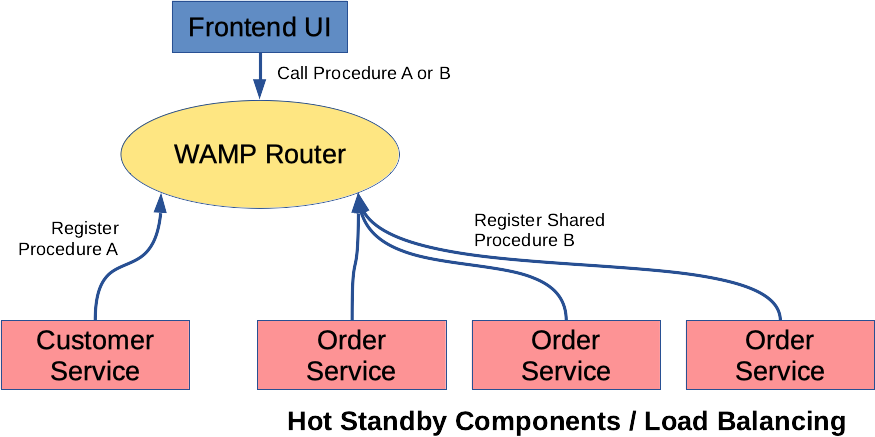

# Web Application Messaging Protocol (WAMP)

[WAMP][wamp] is a routed protocol that provides two messaging patterns: [Publish
& Subscribe][pubsub] and routed [Remote Procedure Calls][rpc]. It is intended to
connect application components in distributed applications.

**You will need**

* Something

**Recommended reading**

* [WebSockets](../ws/)

<!-- START doctoc generated TOC please keep comment here to allow auto update -->
<!-- DON'T EDIT THIS SECTION, INSTEAD RE-RUN doctoc TO UPDATE -->

- [Routed protocol](#routed-protocol)
- [Two messaging patterns](#two-messaging-patterns)
- [Roles](#roles)
- [TODO](#todo)

<!-- END doctoc generated TOC please keep comment here to allow auto update -->

## What is WAMP?

<!-- slide-front-matter class: center, middle -->

### A messaging protocol on top of WebSockets

WAMP is a **high-level messaging protocol for distributed applications**. It was
originally defined as a [subprotocol of WebSocket][ws-subprotocol].

In its current specification, it uses WebSocket as its default transport, but
can be **transmitted via any other protocol that allows for ordered, reliable,
bi-directional, and message-oriented communications**.

### Routed protocol

WAMP is a **routed protocol**, with all components connecting to a WAMP
**router**, which performs message routing between the components.

### Two messaging patterns

WAMP provides two messaging patterns:

<!-- slide-column -->

**Publish & Subscribe (PubSub)**

[Publish & Subscribe][pubsub] is a messaging pattern where messages are
published to topics that other components may subscribe to. The decouples
publishers from subscribers, as they do not require prior knowledge of each
other.

<!-- slide-column -->

**Remote Procedure Calls (RPC)**

A [Remote Procedure Call][rpc] is when a computer program causes a procedure to
execute on another computer on a shared network, without the programmer
explicitly coding the details of the remote interaction.

## Unified application routing

<!-- slide-front-matter class: center, middle -->

### The client-server world

In the client-server model, a call goes directly from the Caller (client) to the
Callee (server), whether it's an HTTP request or a remote procedure call:

**The Caller needs to know where the Callee resides and how to reach it**. This
introduces a **strong [coupling][coupling]** between Caller and Callee, which
can cause problems because it tends to make applications complex and
unmaintainable.

### Publish & Subscribe

<!-- slide-column -->

In the [Publish & Subscribe (PuSub)][pubsub] model, a **Publisher** submits
messages to an abstract **topic**, and **Subscribers** only receive messages
indirectly by announcing their interest on a respective topic:

<!-- slide-column -->

<!-- slide-container -->

<!--slide-column -->

Both do not know about each other. They are **decoupled** via the topic and an
intermediary usually called **Broker**:

<!--slide-column 50 -->

#### PubSub with WAMP

With WAMP, **Subscribers** must first ask the Broker to subscribe to a topic
(step 1). The **Broker** keeps a book of subscriptions: who is currently
subscribed on which topic. WAMP is now ready to route PubSub messages.

When a **Publisher** publishes a message to a topic (step 2), the Broker will
determine the set of Subscribers to that topic, and then forward the message to
all those Subscribers (step 3).

### Remote Procedure Calls

<!-- slide-column -->

[Remote Procedure Calls (RPCs)][rpc] can also be decoupled by introducing an
intermediary, the **Dealer**.

The **Dealer** routes calls originating from the **Caller** to the **Callee**
and routes back results or errors. Both do not know about each other; this
knowledge is encapsulated in the Dealer.

<!--slide-column -->

#### Routed RPC with WAMP

With WAMP, a **Callee** must register a procedure at a Dealer (step 1) under an
abstract name: an URI identifying the procedure.

The **Dealer** keeps a book of registered procedures: who to call for each URI.
Once procedures have been registered, WAMP is ready to route RPC calls.

To call a remote procedure, the **Caller** talks to the Dealer and provides the
URI of the procedure. The Dealer will look up the procedure in his book of
registered procedures and contact the correct Callee to execute the procedure
(step 2). When the Caller is done, the Dealer will retrieve the result and send
it back to the Caller (step 3).

### The WAMP router

What if you combine a **Broker** (for Publish & Subscribe) and a **Dealer** (for
routed Remote Procedure Calls)? You get what WAMP calls a **Router**:

A Router is capable of routing both calls and events, and hence can support
flexible, decoupled architectures that use both RPC and PubSub.

### A WAMP example

Imagine you have a small embedded device like an Arduino Yun with a temperature
sensor and an actuator like a light connected. And you want to integrate the
device into an overall system with a user-facing frontend to control the light,
and continuously process sensor values in a backend component:

### Decoupled architecture

WAMP decouples your components because Callers are no longer required to have
knowledge of Callees. There is no longer a need for a direct network connection
or path between them, since all messages are routed by WAMP.

* Calling into procedures in **components which are not reachable from outside**
  at the network level, but which can establish an outgoing network connection
  to the WAMP router.
* This decoupling of transport and application layer traffic allows a **reversal
  of command** where a cloud-based system can securely control remote devices.
* It also allows to **treat client and server or frontend and backend components
  (microservices) the same**, and it even allows to develop backend code in the
  browser ([Free Your Code - Backends in the Browser][free-your-code]).
* Since no ports on edge devices need to be opened for WAMP to work (in both
  directions), **the remote [attack surface][attack-surface] of these devices is
  completely closed** ([Security in the IoT][iot-security]).

### Microservices architecture

WAMP is one technology that can help you create a [microservices][microservices]
architecture, where your business logic is split across multiple components that
are independently developed and deployed:

> The WAMP router would function as the API gateway in this example.

### Scaling microservices

Since the Caller is not aware where, or even who is processing the call (*and it
should not care!*), it is easy to:

* Make **highly available components** using hot standby components.
* [**Scale horizontally**][scaling-microservices] by load balancing between
  components.

Both can be accomplished using the router's [shared registration
feature][crossbar-shared-registrations].

## Security

<!-- slide-front-matter class: center, middle -->

### WAMP realms and sessions

When a WAMP Client (a Caller, Callee, Subscriber or Publisher) connects to a
WAMP Router, it must establish a session in a particular **Realm**.

A **Realm** is a WAMP routing and administrative domain, **optionally protected
by authentication and authorization**. WAMP messages are only routed within a
Realm.

### TODO

* Authentication
* https://crossbar.io/docs/Authorization/

## Advanced features

* JSON/MessagePack https://wamp-proto.org/_static/gen/wamp_latest.html#messagepack
* Progressive calls https://wamp-proto.org/_static/gen/wamp_latest.html#progressive-call-results
* Event history https://wamp-proto.org/_static/gen/wamp_latest.html#event-history

## Implementations

<!-- slide-front-matter class: center, middle -->

> WAMP is a **protocol**. To use it, you need an **actual router
> implementation** that follows the specification and **client libraries that
> can connect to it**.

### Get me some WAMP

The following implementations are developed by the authors of the specification
and are (generally) the most full-featured:

* [Crossbar.io][crossbar], a WAMP router.
* Autobahn (WAMP client library), available in:
  * [C++][autobahn-cpp]
  * [Java][autobahn-java]
  * [JavaScript][autobahn-js]
  * [Python][autobahn-python]

The specification also contains a list of other [available
implementations][wamp-implementations], both for the router and client
libraries, written in languages as varied as Erlang, Go, PHP and Ruby.

## To WAMP or not to WAMP?

[WAMP compared][wamp-compared] to other technologies.

<!-- slide-column 45 -->

**Advantages**

* The protocol combines two patterns (PubSub & RPC), allowing it to be **used
  for the entire messaging requirements of an application**, reducing technology
  stack complexity.
* The use of WebSocket as a transport mechanism by default **reduces networking
  overhead**.

<!-- slide-column -->

**Disadvantages**

* **Not (yet) an official standard**. No higher level software architectural
  styles like REST (for now).
* Requires you to **deploy an additional component**: the WAMP router. This
  additional component also increases the time it takes to exchange messages
  between components compared to a direct WebSocket connection, since all
  messages have to go through the router.
* Decoupled microservices are **more complex** than classic client-server
  architectures.

## References

**Documentation**

* [The Web Application Messaging Protocol][wamp]
* [WAMP Specification][wamp-spec]
* [What is Crossbar.io?][crossbar-about]

**Further reading**

* [Scaling microservices with Crossbar.io][scaling-microservices]
* [Microservices implementation - Netflix stack](https://medium.com/@tharanganilupul/microservices-implementation-netflix-stack-ba4f4a57a79f)
* [Why Netflix, Amazon and Apple Care About Microservices](https://blog.leanix.net/en/why-netflix-amazon-and-apple-care-about-microservices)

[attack-surface]: https://en.wikipedia.org/wiki/Attack_surface
[autobahn-cpp]: https://github.com/crossbario/autobahn-cpp
[autobahn-java]: https://github.com/crossbario/autobahn-java
[autobahn-js]: https://github.com/crossbario/autobahn-js
[autobahn-python]: https://github.com/crossbario/autobahn-python
[crossbar]: https://crossbar.io
[crossbar-about]: https://crossbar.io/about/
[crossbar-shared-registrations]: https://crossbar.io/docs/Shared-Registrations/
[coupling]: https://en.wikipedia.org/wiki/Coupling_(computer_programming)
[free-your-code]: https://crossbario.com/blog/Free-Your-Code-Backends-in-the-Browser/
[iot-security]: https://crossbario.com/static/presentations/iot-security/index.html#/
[microservices]: https://en.wikipedia.org/wiki/Microservices
[pubsub]: https://en.wikipedia.org/wiki/Publish%E2%80%93subscribe_pattern
[rpc]: https://en.wikipedia.org/wiki/Remote_procedure_call
[scaling-microservices]: https://crossbario.com/static/presentations/microservices/index.html#/
[wamp]: https://wamp-proto.org
[wamp-compared]: https://wamp-proto.org/comparison.html
[wamp-implementations]: https://wamp-proto.org/implementations.html
[wamp-spec]: https://wamp-proto.org/_static/gen/wamp_latest.html
[ws-subprotocol]: https://tools.ietf.org/html/rfc6455#section-1.9